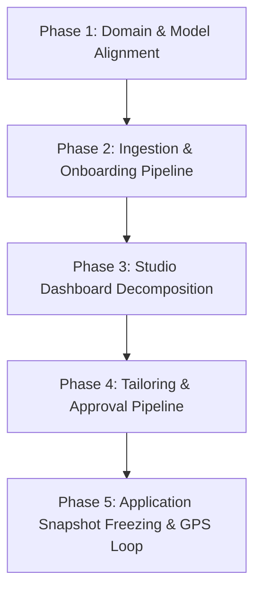

# 🗺️ SKILLEZO Game Plan: Career Profile & Resume Intelligence Integration

> **Document Type:** System Integration Game Plan & Architectural Transition Roadmap  
> **Target System:** SKILLEZO Platform (Next.js Client + Express/TypeScript Server + MongoDB)  
> **Reference Architecture:** [`SKILLEZO_Career_Profile_Resume_Architecture.md`](file:///x:/projects/next.js/office-Project/SKILLEZO.AI/doc/SKILLEZO_Career_Profile_Resume_Architecture.md)  
> **Status:** APPROVED STRATEGY / ZERO-CODE IMPLEMENTATION BLUEPRINT  

---

## 1. Architectural Review & Strategic Assessment

### 1.1 What We Think of This Idea
The paradigm shift proposed in `SKILLEZO_Career_Profile_Resume_Architecture.md`—transitioning SKILLEZO from a **standard AI resume builder** into a **Career Operating System (Career OS)**—is **architecturally sound, commercially superior, and technically essential**.

#### Key Strengths:
1. **Solves the "Single-Resume Bottleneck":** Modern job candidates do not need one static resume; they need a canonical record of everything they have ever done, projected into 5–10 tailored variants for specific job descriptions.
2. **True Source of Truth Principle:** Treating the **Career Profile as the canonical data store** and the **Resume as a presentation view / AST snapshot** completely decouples data management from page layout geometry.
3. **Evidence-Grounded AI (Hallucination Prevention):** Tying skills, achievements, and responsibilities to verified evidence records (`CareerEvidence` with `SourceReference`) prevents AI models from inventing employers, metrics, or technologies, which is the #1 reason candidates distrust AI resume tools.
4. **Historical Immutability for Applications:** Freezing submitted resumes into locked snapshots ensures that updating a candidate's profile today will never silently alter what was submitted to Stripe or Google 6 months ago.

#### Potential Pitfalls to Guard Against:
- **Over-Complication for First-Time Users:** Candidates want instant gratification. Forcing a user through a 50-step profile verification before seeing their resume will cause massive drop-offs. **Solution:** The "Upload Resume → Instant Extraction Summary → Ready to View Master Resume" fast track with progressive verification.
- **Bi-Directional Sync Ambiguity:** If a user edits a bullet point on their resume canvas, does it update the Career Profile? **Solution:** Clear rule: Canvas edits modify that specific resume variant AST; a small prompt offers: *"Do you also want to update your Career Profile with this edit?"*

---

## 2. Current Implementation Audit: What is Already Implemented

A rigorous inspection of the current SKILLEZO repository reveals that **over 60% of the underlying technical plumbing already exists**.

### 2.1 Backend (`server/src`)

| Component | Current State in Codebase | Reference File |
| :--- | :--- | :--- |
| **Profile Schema & Repository** | `ProfileModel` exists with `skills` (levels, proficiency, verification status, sources), `experience`, `projects`, `education`, `links`, `location`, `headline`, `bio`, `targetRole`. | [`Profile.model.ts`](file:///x:/projects/next.js/office-Project/SKILLEZO.AI/server/src/database/models/Profile.model.ts) |
| **Resume Extraction & Hydration** | `ProfileService.hydrateFromParsedResume()` already extracts contact info, summary, skills, experience, projects, and education from parsed resumes and merges them into the candidate profile. | [`profile.service.ts`](file:///x:/projects/next.js/office-Project/SKILLEZO.AI/server/src/modules/profile/profile.service.ts#L300-L420) |
| **Resume Storage & Upload** | `ResumeService.uploadResume()` stores raw files (PDF/DOCX) on disk/cloud, parses text using `pdf-parse`/`mammoth`, generates extracted data, and triggers profile hydration. | [`resume.service.ts`](file:///x:/projects/next.js/office-Project/SKILLEZO.AI/server/src/modules/resume/resume.service.ts#L150-L180) |
| **Resume AST Model** | Canonical `ResumeDocument` AST format with sections (`contact`, `summary`, `experience`, `skills`, `projects`, `education`, `achievements`), layout, typography, and styling. | [`resume-document.types.ts`](file:///x:/projects/next.js/office-Project/SKILLEZO.AI/server/src/modules/resume-intelligence/document/resume-document.types.ts) |
| **Scoring & Diagnostics Engine** | Section-by-section ATS scoring, keyword matching against target roles, brevity scoring, and actionable recommendations. | [`resume.ats.ts`](file:///x:/projects/next.js/office-Project/SKILLEZO.AI/server/src/modules/resume/resume.ats.ts) |
| **Application Snapshots** | `ApplicationModel` already includes `IResumeSnapshot` storing `resumeId`, `title`, `storageKey`, and `submittedAt`. | [`Application.model.ts`](file:///x:/projects/next.js/office-Project/SKILLEZO.AI/server/src/database/models/Application.model.ts#L11-L21) |
| **Career GPS / Gap Engine** | `CareerPlanModel` maps candidate skills to role requirements with readiness score, missing skills, and improvement areas. | [`CareerPlan.model.ts`](file:///x:/projects/next.js/office-Project/SKILLEZO.AI/server/src/database/models/CareerPlan.model.ts) |

### 2.2 Frontend (`client`)

| Component | Current State in Codebase | Reference File |
| :--- | :--- | :--- |
| **Profile Management Dashboard** | UI with header, completion meter, and modals for editing personal info, adding/deleting skills, projects, and education. Includes resume upload trigger & sync resume button. | [`client/app/dashboard/profile/page.tsx`](file:///x:/projects/next.js/office-Project/SKILLEZO.AI/client/app/dashboard/profile/page.tsx) |
| **Resume Studio (Canvas & Builder)** | Live A4 canvas rendering (`ResumeRenderer`), builder controls (`ResumeBuilderControls` for typography, colors, margins, templates), and PDF generator. | [`client/app/dashboard/resume-studio/page.tsx`](file:///x:/projects/next.js/office-Project/SKILLEZO.AI/client/app/dashboard/resume-studio/page.tsx) |
| **ATS Diagnostics View** | Visual ATS diagnostic panel with pillar breakdown (impact, brevity, style, keywords). | [`AtsDiagnosticsView.tsx`](file:///x:/projects/next.js/office-Project/SKILLEZO.AI/client/components/resume-studio/AtsDiagnosticsView.tsx) |
| **Section AI Workspace** | Section-level AI improvement and rewriting panel. | [`SectionAiWorkspace.tsx`](file:///x:/projects/next.js/office-Project/SKILLEZO.AI/client/components/resume-studio/SectionAiWorkspace.tsx) |
| **Vector PDF Export** | `@react-pdf/renderer` integration generating crisp, ATS-compliant PDF downloads matching screen preview. | [`ResumePdfDocument.tsx`](file:///x:/projects/next.js/office-Project/SKILLEZO.AI/client/components/resume-studio/pdf/ResumePdfDocument.tsx) |

---

## 3. What Needs to Change: Existing Application Flow vs. Target Flow

### 3.1 Flow Gap Analysis

```text
CURRENT FLOW (Loose & Disconnected):
User Registers → Lands on Dashboard → Manually enters Profile fields (or uploads resume in Studio)
→ Resume Studio treats resume as an uploaded file
→ Target Role is merely a filter for scoring
→ Resume edits stay in the local resume document
→ Applications reference the resume file ID only
```

```text
TARGET FLOW (Unified Career Operating System):
1. Ingestion: Upload Resume Once → AI Extracts & Structures → Instant Summary → Career Profile Created
2. Presentation: Career Profile generates Master Resume AST (Zero manual data entry)
3. Tailoring: Target Job / JD pasted → AI matches Evidence → User approves changes → Tailored Variant Created
4. Application: User applies to job → Exact Tailored Resume AST frozen into Application Snapshot
5. Feedback Loop: Application outcomes feed Career GPS & Profile Readiness
```

### 3.2 Specific Flow Changes Required

1. **First-Time User Onboarding Flow:**
   - **Now:** User lands on `/dashboard`, sees an empty stats grid, and must navigate to `/dashboard/profile` or `/dashboard/resume-studio` to upload a file.
   - **Change:** Introduce a clean onboarding step or modal: *"Upload your existing resume to build your Career Profile in 15 seconds"* (with a *"Start from scratch"* option).
   - Show interactive extraction progress (Personal → Experience → Skills → Projects → Education) and present an **Extraction Summary Card** before redirecting to the Master Resume Studio.

2. **Career Profile as Canonical Master:**
   - **Now:** `Profile` and `Resume` can get out of sync. Users edit resume bullets in Studio, and the profile remains stale.
   - **Change:** 
     - Clarify the hierarchy: The Profile holds the candidate's career repository.
     - The **Master Resume** is directly synthesized from the Career Profile.
     - When saving changes to the Master Resume, offer a 1-click option to sync modifications back to the Career Profile.

3. **Multi-Role Resume Tailoring Workflow:**
   - **Now:** Selecting a target role in Studio changes the ATS score weights.
   - **Change:** Implement the 3-step Tailoring Flow:
     - **Step 1:** Target Job input (Role title, Company name, paste JD).
     - **Step 2:** AI Analysis (Match %, matched keywords, missing keywords, bullet improvement proposals grounded in Profile evidence).
     - **Step 3:** Review & Approve (User clicks "Accept" on proposed tweaks → Creates a new `TAILORED` resume variant).

4. **Application Snapshot Freezing:**
   - **Now:** `Application.model.ts` stores file metadata (`fileName`, `storageKey`, `version`).
   - **Change:** Include the complete `resumeDocument` AST JSON inside the application record so that the exact document submitted to an employer can be viewed and downloaded indefinitely, regardless of subsequent profile or master resume edits.

---

## 4. Context of Existing Studio Dashboard & How to Restructure It

### 4.1 Current Studio Dashboard Problems
Currently, [`client/app/dashboard/resume-studio/page.tsx`](file:///x:/projects/next.js/office-Project/SKILLEZO.AI/client/app/dashboard/resume-studio/page.tsx) is a **monolithic 1,580-line component**. It contains:
- View mode switches (`audit`, `editor`, `builder`, `analysis`).
- Scoring calculation logic and mock analysis state.
- File upload handling and drag-and-drop zones.
- Direct resume deletion modal.
- Builder sidebar rendering and live canvas rendering.
- Section AI workspace drawers.

This leads to UI clutter, cognitive overload for the candidate, and maintenance difficulty.

### 4.2 Restructured Studio Architecture (The 4 Focused Zones)

Following Section 21 & 22 of the architectural document, we restructure the Resume Studio into **4 clear, high-contrast zones**:

```text
+-----------------------------------------------------------------------------------------------+
| ZONE A: STUDIO HEADER                                                                         |
| ← Resumes   [ Variant Selector: Senior Full-Stack — Stripe ]  [ Saved ✓ ]  [ Preview ] [ Export PDF ] |
+-----------------------+-----------------------------------------------+-----------------------+
| ZONE B: PORTFOLIO     | ZONE C: HERO A4 RESUME CANVAS                 | ZONE D: INSPECTOR     |
|                       |                                               |                       |
| ⭐ MASTER PROFILE     |              +-----------------+              | [ AI Insights | Design ]
| Master Resume         |              | John Doe        |              |                       |
| Last synced: Today    |              | Lead Engineer   |              | ATS Score: 92/100     |
|                       |              |                 |              | Role Match: 88%       |
| TARGETED VARIANTS     |              | Experience      |              | Impact Score: 84%     |
|                       |              | • Led team of 8 |              |                       |
| • Full-Stack — Stripe |              |   engineers...  |              | IMPROVEMENTS (3)      |
|   ATS: 92 | Match: 88%|              |                 |              | ⚠ Add PostgreSQL item |
|                       |              | Projects        |              | ⚠ Quantify API impact |
| • Cloud Lead — AWS    |              | • Cloud Scale.. |              |                       |
|   ATS: 89 | Match: 85%|              +-----------------+              | [Review Changes →]    |
|                       |                                               |                       |
| + Tailor New Variant  |            Page 1 of 2   [ - 100% + ]         | (Or Design Controls)  |
+-----------------------+-----------------------------------------------+-----------------------+
```

### 4.3 Component Decomposition Plan

Instead of one 1,580-line file, break down the Resume Studio into modular, testable components under `client/components/resume-studio/`:

1. **`StudioHeader.tsx` (Zone A):**
   - Clean breadcrumb navigation (`Resumes / Full-Stack — Stripe`).
   - Live synchronization indicator (`Saved to cloud`).
   - Quick actions: Undo, Redo, Print / Vector PDF Export, Share link.

2. **`ResumePortfolioSidebar.tsx` (Zone B):**
   - Collapsible left panel.
   - Pinned **Master Resume** card with badge: `⭐ Master Source`.
   - List of **Tailored Variants** with target company badge, target role, and live ATS score pills.
   - Distinct, prominent action: `+ Create Tailored Resume`.

3. **`ResumeCanvasWorkspace.tsx` (Zone C):**
   - Dedicated hero viewport with responsive scaling (A4 aspect ratio: 210mm × 297mm).
   - Floating bottom zoom toolbar (`- 100% +`, page pagination, fit-to-width).
   - In-canvas inline hover actions (`✨ Improve with AI`, `Rephrase`, `Shorten`).

4. **`StudioInspectorPanel.tsx` (Zone D):**
   - Clean segmented toggle at top: `[ 📊 AI Insights ]` | `[ 🎨 Design & Layout ]`.
   - **Tab 1: AI Insights:** ATS compatibility, Role match, Content & impact scores, and actionable recommendations.
   - **Tab 2: Design & Layout:** Typography choices, color accents, section margins, density, and template switcher (moved out of the main canvas view into this inspector).

5. **`ResumeGalleryView.tsx` (Standalone Portfolio View):**
   - Accessible via `/dashboard/resume-studio` (or Gallery mode).
   - Grid of resume cards showcasing Master vs. Tailored variants with download, edit, duplicate, and delete actions.

---

## 5. Phased Zero-Risk Implementation Game Plan



### Phase 1: Domain & Model Alignment (Additive & Non-Breaking)
- **Goal:** Equip database models to support Master vs. Tailored resumes, target jobs, and evidence verification without altering existing records.
- **Actions:**
  - Extend [`Resume.model.ts`](file:///x:/projects/next.js/office-Project/SKILLEZO.AI/server/src/database/models/Resume.model.ts) with additive fields:
    - `variantType: "MASTER" | "TAILORED"` (defaults to `"MASTER"` for existing resumes).
    - `parentResumeId?: ObjectId` (references master resume for tailored variants).
    - `targetJob?: { targetRole, targetCompany, jobDescriptionText, targetMatchScore }`.
    - `scores?: { atsScore, roleMatchScore, impactScore }`.
  - Extend [`Profile.model.ts`](file:///x:/projects/next.js/office-Project/SKILLEZO.AI/server/src/database/models/Profile.model.ts) with `profileCompleteness` score and verification flags for evidence.
  - Ensure zero database migration downtime by relying on Mongoose defaults.

### Phase 2: Ingestion & Onboarding Experience
- **Goal:** Deliver the instant "Upload → Extract → Summary → Ready" experience.
- **Actions:**
  - Enhance `profile.service.ts` to generate an extraction summary object (`{ experiencesCount, skillsCount, projectsCount, educationCount, warnings }`).
  - Create a welcoming onboarding modal / card on `/dashboard` and `/dashboard/profile` allowing candidates to drop their resume and watch the animated extraction progress.
  - Automatically synthesize the **Master Resume AST** immediately upon profile hydration so the candidate has a fully formatted resume ready to preview on minute one.

### Phase 3: Studio Dashboard Restructuring
- **Goal:** Deconstruct the 1,580-line monolithic `page.tsx` into the 4 clean zones.
- **Actions:**
  - Create `ResumePortfolioSidebar.tsx` to list the Master Resume and Tailored Variants.
  - Create `StudioHeader.tsx` for global variant switching and export actions.
  - Create `StudioInspectorPanel.tsx` with dual tabs for AI Insights vs Design controls.
  - Keep `ResumeRenderer.tsx` and `LiveResumeCanvas.tsx` as the core rendering engines.
  - Introduce `/dashboard/resume-studio?view=gallery` or a Gallery switcher for high-level resume portfolio management.

### Phase 4: 3-Step Tailoring & Approval Engine
- **Goal:** Enable users to tailor a resume to a specific job description in 3 clicks.
- **Actions:**
  - Add backend endpoint `POST /api/resumes/:id/tailor/analyze` that takes a JD, runs evidence matching against the Career Profile, and returns proposed changes.
  - Add backend endpoint `POST /api/resumes/:id/tailor/commit` that creates a new `TAILORED` resume record with the approved changes.
  - Build the frontend `TailorResumeModal.tsx` displaying:
    - Step 1: Target Role & JD input.
    - Step 2: Match score + extracted keywords.
    - Step 3: Approve / Reject diffs for summary, skills, and bullets.

### Phase 5: Application Snapshot Locking & Career GPS Integration
- **Goal:** Complete the loop from profile to application to career intelligence.
- **Actions:**
  - When submitting an application in the Job Center, store the full `ResumeDocument` AST inside `Application.model.ts` under `resumeSnapshot.resumeDocument`.
  - Connect `CareerPlan.model.ts` (Career GPS) to consume the Career Profile as its single source of truth for skill gap analysis and role benchmarks.
  - Add application outcome tracking to feed insights back into the candidate's Career GPS.

---

## 6. Summary: Architectural Comparison Table

| Feature | Legacy Approach | Restructured SKILLEZO (Career OS) |
| :--- | :--- | :--- |
| **Source of Truth** | Uploaded Resume Document | Structured Career Profile |
| **Resume Role** | Data store + Page layout combined | Pure presentation AST / Canvas view |
| **Target Roles** | Score filter only | Independent Tailored Resume Variants |
| **AI Generation** | Unconstrained re-writing | Grounded in Career Profile Evidence |
| **Studio UX** | Monolithic 1,580-line screen with cluttered drawers | 4-Zone Workspace: Header, Portfolio, Canvas, Inspector |
| **Historical Submissions** | Stored file URL reference | Immutable frozen `ResumeDocument` AST snapshot |
| **Onboarding** | Fill forms or upload file quietly | 15-second Ingestion → Profile Ready → Instant Master Resume |

---
*Game Plan created and verified against active SKILLEZO codebase.*
