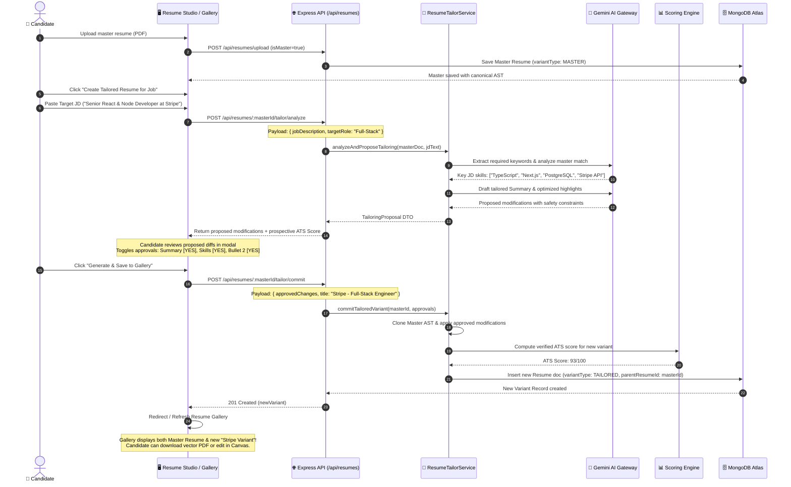

# 🌟 Master Resume & Multi-Role Variant Engine
## Architectural Blueprint & Non-Breaking System Integration Plan

> **Document Type:** System Architecture, Domain Modeling & Integration Strategy  
> **Status:** Proposed Specification & Evolution Roadmap  
> **Target Module:** Resume Studio (Module 12 / 24) & Career Intelligence Ecosystem  

---

## 📑 Table of Contents
1. [Executive Vision: Master Profile & Multi-Role Variant Generator](#1-executive-vision-master-profile--multi-role-variant-generator)
2. [Current Architecture vs. Proposed Master-Variant Model: The Gap](#2-current-architecture-vs-proposed-master-variant-model-the-gap)
3. [Domain Model & Database Schema Evolution (Zero Breaking Changes)](#3-domain-model--database-schema-evolution-zero-breaking-changes)
4. [The 5-Step Tailoring & Approval Pipeline](#4-the-5-step-tailoring--approval-pipeline)
5. [End-to-End Orchestration & Data Flow](#5-end-to-end-orchestration--data-flow)
6. [Backend API Specifications (Non-Breaking Extensions)](#6-backend-api-specifications-non-breaking-extensions)
7. [Frontend Resume Studio & Gallery UX Integration](#7-frontend-resume-studio--gallery-ux-integration)
8. [Scalability, Storage & Cost Optimization Analysis](#8-scalability-storage--cost-optimization-analysis)
9. [Phased, Zero-Risk Implementation Roadmap](#9-phased-zero-risk-implementation-roadmap)

---

## 1. Executive Vision: Master Profile & Multi-Role Variant Generator

In the modern job market, **one generic resume does not fit multiple roles**. A candidate with a versatile background might apply for:
- A **Full-Stack Engineer** role (emphasizing Next.js, Node.js, API design, database schemas).
- A **DevOps & Cloud Engineer** role (emphasizing Docker, Kubernetes, CI/CD, AWS, Terraform).
- A **Technical Product Manager / Sales Engineer** role (emphasizing stakeholder communication, ROI, conversion rates, sprint leadership).

### The Core Architectural Concept:
```text
                           ┌───────────────────────────┐
                           │    MASTER BASE RESUME     │
                           │  (Ingested Single Source) │
                           │  All Experience & Skills  │
                           └─────────────┬─────────────┘
                                         │
                 ┌───────────────────────┼───────────────────────┐
                 │ Target: Full-Stack    │ Target: DevOps        │ Target: Product / Sales
                 ▼                       ▼                       ▼
      ┌────────────────────┐  ┌────────────────────┐  ┌────────────────────┐
      │  Variant Resume A  │  │  Variant Resume B  │  │  Variant Resume C  │
      │  Tailored to JD #1 │  │  Tailored to JD #2 │  │  Tailored to JD #3 │
      │  ATS Score: 94/100 │  │  ATS Score: 91/100 │  │  ATS Score: 88/100 │
      └──────────┬─────────┘  └──────────┬─────────┘  └──────────┬─────────┘
                 └───────────────────────┼───────────────────────┘
                                         ▼
                           ┌───────────────────────────┐
                           │   CANDIDATE RESUME        │
                           │        GALLERY            │
                           │  (Organized & Downloadable│
                           │   as Clean Vector PDFs)   │
                           └───────────────────────────┘
```

### Key Principles:
1. **The Master Resume is Never Overwritten:** The candidate uploads their comprehensive master resume once. It acts as their immutable career evidence repository.
2. **Derivation via User Approvals:** When generating a targeted variant, AI proposes JD-tailored summaries, re-prioritized skills, and re-framed bullet points. The user approves each change before the variant is minted.
3. **Persistent Resume Gallery:** All created variants are stored in the user's personal **Resume Gallery** with independent ATS scores, target job tags, and instant PDF download capabilities.
4. **Zero Layout Breakage:** Because all variants share the canonical **`ResumeDocument` AST**, formatting, fonts, and A4 page geometry remain 100% deterministic.

---

## 2. Current Architecture vs. Proposed Master-Variant Model: The Gap

| Capability / Flow | Current Implemented System | Proposed Master-Variant System |
| :--- | :--- | :--- |
| **Resume Ingestion** | Uploads raw PDF/DOCX, parses to single `IResume`. | Uploads master PDF/DOCX, designates as `isMaster: true`. |
| **Role Targeting** | Role dropdown (Full-Stack, Frontend, etc.) acts only as an *analytical lens* to score the current resume. | Role or Job Description creates a **new derived child resume AST** in the gallery. |
| **Multiple Target Roles** | Overwrites bullets on the current active resume or requires manual re-upload of a new file. | Generates and saves multiple independent variants from the same master resume without re-uploading. |
| **Job Description Matching** | Job description parameter is ephemeral (query param in GET `/ats-score`). | Job description is permanently bound to the variant (`targetJob: { title, company, jdText, matchScore }`). |
| **Resume Gallery** | Simple flat dropdown list of uploaded files in the top header. | Rich Gallery Grid showcasing role badges, target companies, last modified dates, and independent ATS scores. |
| **Storage & Cost Model** | Every resume requires file upload and disk storage. | Variants store only lightweight JSON AST (~15KB) in MongoDB; PDFs are rendered vectorially on-the-fly. |

---

## 3. Domain Model & Database Schema Evolution (Zero Breaking Changes)

To implement this without breaking existing database documents or API endpoints, we use **purely additive schema extensions** on Mongoose [`server/src/database/models/Resume.model.ts`](file:///x:/projects/next.js/office-Project/SKILLEZO.AI/server/src/database/models/Resume.model.ts):

### Extended `IResume` Schema Interface:
```typescript
export enum ResumeVariantType {
  MASTER = "MASTER",     // Original uploaded root resume
  TAILORED = "TAILORED", // Child derived for a specific job profile or JD
}

export interface ITargetJobContext {
  targetRole: string;             // e.g. "Full-Stack Engineer" or "Technical Sales Lead"
  targetCompany?: string;          // e.g. "Google", "Stripe", "Local Startup"
  jobDescriptionText?: string;     // Raw JD pasted by user
  extractedKeywords?: string[];    // Keywords extracted from JD by AI
  targetMatchScore?: number;       // Match score against this specific JD (0-100)
}

export interface IResume extends Document {
  _id: Types.ObjectId;
  userId: string;
  title: string;
  originalFileName: string;
  fileName: string;
  storageKey?: string;             // Optional for derived variants (they don't need raw files!)
  fileUrl?: string;
  mimeType: string;
  fileSize: number;
  isDefault: boolean;
  status: ResumeStatus;
  version: number;

  // -------------------------------------------------------------
  // 🚀 NEW ADDITIVE FIELDS (Fully Backward-Compatible)
  // -------------------------------------------------------------
  variantType: ResumeVariantType;  // Default: MASTER (if omitted)
  parentResumeId?: Types.ObjectId; // References the Master Resume _id if tailored
  targetJob?: ITargetJobContext;   // Details of the specific job this variant targets
  tags?: string[];                 // e.g. ["Full-Stack", "Fintech", "Remote"]
  
  // Existing Canonical AST & Configuration
  extractedData?: IResumeExtractedData | null;
  resumeDocument?: ResumeDocument | null;
  builderConfig?: ResumeBuilderConfig | null;
  rawText?: string | null;
  
  createdAt: Date;
  updatedAt: Date;
}
```

### Why this guarantees ZERO breaking changes:
1. **Existing Documents Default Gracefully:** If `variantType` is missing on older records, Mongoose defaults it to `"MASTER"`.
2. **`storageKey` made optional:** Existing resumes uploaded via file have `storageKey`. Derived variants created from the master resume don't need disk storage because their single source of truth is `resumeDocument` (AST), saving disk space and eliminating orphan files.
3. **Existing Endpoints Intact:** `GET /api/resumes` continues to work. Existing clients will simply see the new metadata fields.

---

## 4. The 5-Step Tailoring & Approval Pipeline

```text
┌─────────────────────────────────────────────────────────────────────────────────────────────────────────────────┐
│                                       STEP 1: SELECT MASTER & TARGET JOB                                        │
│  Candidate selects Master Resume + Inputs Target: Role Taxonomy OR Pastes a specific Job Description (JD)       │
└───────────────────────────────────────────────────────┬─────────────────────────────────────────────────────────┘
                                                        │
                                                        ▼
┌─────────────────────────────────────────────────────────────────────────────────────────────────────────────────┐
│                                       STEP 2: SEMANTIC MATCHING & GAP ANALYSIS                                  │
│  AI extracts required skills, tools & experience metrics from JD. Cross-references with Master Resume AST:      │
│  • High-Relevance Items: Highlighted for promotion to top positions                                            │
│  • Low-Relevance Items: Demoted or deprioritized                                                                │
│  • Skill Gaps: Identified for targeted phrasing alignment without fabricating experience                       │
└───────────────────────────────────────────────────────┬─────────────────────────────────────────────────────────┘
                                                        │
                                                        ▼
┌─────────────────────────────────────────────────────────────────────────────────────────────────────────────────┐
│                                  STEP 3: CANDIDATE CONFIGURATION & APPROVAL MODAL                               │
│  Candidate is presented with an interactive tailoring workspace:                                                │
│  ┌───────────────────────────────────────────────────────────────────────────────────────────────────────────┐  │
│  │ [Summary]: "Full-Stack Dev with 3 yrs exp" ➔ "Full-Stack Engineer with React & AWS microservices focus" │  │
│  │             [ ✓ Approve ]  [ ✏️ Edit Manually ]  [ ✗ Keep Original ]                                      │  │
│  │                                                                                                           │  │
│  │ [Skills Order]: Reorder "Cloud & DevOps" to Top 1 (Matches JD requirements)                               │  │
│  │             [ ✓ Approve ]  [ ✗ Keep Original ]                                                            │  │
│  │                                                                                                           │  │
│  │ [Bullet 1]: Framed with metrics relevant to target job description                                         │  │
│  │             [ ✓ Approve ]  [ ✏️ Edit Manually ]  [ ✗ Keep Original ]                                      │  │
│  └───────────────────────────────────────────────────────────────────────────────────────────────────────────┘  │
└───────────────────────────────────────────────────────┬─────────────────────────────────────────────────────────┘
                                                        │
                                                        ▼
┌─────────────────────────────────────────────────────────────────────────────────────────────────────────────────┐
│                                        STEP 4: FORK & COMMIT NEW VARIANT                                        │
│  Server deep-clones Master AST, applies candidate-approved modifications, runs atomic ATS re-scoring,           │
│  and saves as an independent document in MongoDB with variantType: "TAILORED" and parentResumeId.               │
└───────────────────────────────────────────────────────┬─────────────────────────────────────────────────────────┘
                                                        │
                                                        ▼
┌─────────────────────────────────────────────────────────────────────────────────────────────────────────────────┐
│                                        STEP 5: PERSIST IN RESUME GALLERY                                        │
│  New resume appears in Candidate Resume Gallery alongside ATS Match Score (e.g. 94%), Target Company tag,       │
│  instant vector PDF download, and full editing access in Resume Studio!                                          │
└─────────────────────────────────────────────────────────────────────────────────────────────────────────────────┘
```

---

## 5. End-to-End Orchestration & Data Flow



---

## 6. Backend API Specifications (Non-Breaking Extensions)

We introduce three targeted endpoints in [`server/src/modules/resume/resume.routes.ts`](file:///x:/projects/next.js/office-Project/SKILLEZO.AI/server/src/modules/resume/resume.routes.ts):

### 1. `POST /api/resumes/:id/tailor/analyze`
Analyzes the master resume against a provided Job Description or role, returning prospective diffs.
- **Request Body:**
  ```json
  {
    "targetRole": "Full-Stack Engineer",
    "targetCompany": "Stripe",
    "jobDescription": "We are looking for a Full-Stack Engineer skilled in TypeScript, Next.js, and API architecture..."
  }
  ```
- **Response:**
  ```json
  {
    "success": true,
    "data": {
      "targetKeywords": ["TypeScript", "Next.js", "PostgreSQL", "API Security"],
      "matchedKeywords": ["TypeScript", "Next.js"],
      "missingKeywords": ["PostgreSQL", "API Security"],
      "proposedSummary": "Full-Stack Engineer specializing in high-performance Next.js interfaces and robust API architecture...",
      "proposedSkillReordering": ["Frameworks", "Languages", "Cloud"],
      "proposedBulletOptimizations": [
        {
          "section": "experience",
          "itemIndex": 0,
          "bulletIndex": 1,
          "original": "Built frontend components and handled APIs.",
          "proposed": "Architected resilient Next.js frontend modules and integrated RESTful endpoints with TypeScript.",
          "prospectiveScoreDelta": 7
        }
      ],
      "prospectiveOverallScore": 92
    }
  }
  ```

---

### 2. `POST /api/resumes/:id/tailor/commit`
Applies approved changes, creates a child variant document in MongoDB, and recalculates scores.
- **Request Body:**
  ```json
  {
    "title": "Full-Stack Engineer — Stripe",
    "targetRole": "Full-Stack Engineer",
    "targetCompany": "Stripe",
    "jobDescription": "...",
    "approvedSummary": "...",
    "approvedBullets": [ ... ],
    "approvedSkillOrder": [ ... ]
  }
  ```
- **Response:**
  ```json
  {
    "success": true,
    "data": {
      "_id": "66f01234abc...",
      "title": "Full-Stack Engineer — Stripe",
      "variantType": "TAILORED",
      "parentResumeId": "66f00000abc...",
      "atsScore": 92,
      "createdAt": "2026-09-19T19:00:00.000Z"
    }
  }
  ```

---

### 3. `GET /api/resumes/gallery`
Fetches grouped resume records for the candidate's gallery.
- **Response:**
  ```json
  {
    "success": true,
    "data": {
      "masterResume": { "_id": "...", "title": "Master Resume 2026", "isDefault": true, "skillsCount": 24 },
      "variants": [
        {
          "_id": "...",
          "title": "Full-Stack Engineer — Stripe",
          "targetCompany": "Stripe",
          "targetRole": "Full-Stack Engineer",
          "atsScore": 92,
          "updatedAt": "2026-09-19T18:30:00Z"
        },
        {
          "_id": "...",
          "title": "DevOps Specialist — AWS Partner",
          "targetCompany": "CloudScale",
          "targetRole": "DevOps & Cloud Engineer",
          "atsScore": 89,
          "updatedAt": "2026-09-18T14:20:00Z"
        }
      ]
    }
  }
  ```

---

## 7. Frontend Resume Studio & Gallery UX Integration

We integrate this directly into the existing Resume Studio interface via two intuitive enhancements:

### 1. The Resume Gallery Tab / View:
In [`ResumeStudioSidebar.tsx`](file:///x:/projects/next.js/office-Project/SKILLEZO.AI/client/components/resume-studio/ResumeStudioSidebar.tsx), add a new destination mode:
- **`gallery` (Resume Gallery & Roles):** Displays a visual card grid of all the user's resumes:
  - **Master Resume Card:** Distinguished with an emerald crown badge (`MASTER PROFILE`). Always preserved.
  - **Variant Cards:** Show target company logo/pill (e.g. `Stripe`, `Google`), role pill (`Full-Stack`), ATS score circle (e.g. `92%`), and action buttons (`Edit in Canvas`, `Download PDF`, `Delete`).
  - **"Create New Job Variant" Button:** Prominent dashed card with a `+` icon that triggers the Tailoring Modal.

### 2. The Tailoring & Approval Modal (`TailorResumeModal.tsx`):
- Clean, 3-step modal:
  1. **Input:** Paste Job Description or select a Target Role preset.
  2. **AI Analysis:** Displays matching keywords and proposed bullet improvements.
  3. **Approval:** Checkboxes allowing the candidate to selectively approve or reject individual AI modifications.
  4. **Finish:** Generates the new variant and opens it immediately in the live A4 Canvas.

---

## 8. Scalability, Storage & Cost Optimization Analysis

### Why this is exceptionally lightweight and cost-effective:

1. **Near-Zero Database Footprint:**
   - A raw PDF is **500KB to 3MB**.
   - A canonical `ResumeDocument` AST JSON object is **only 12KB to 20KB**.
   - Because tailored variants store **only the JSON AST** (and reference their master's raw file), saving **25 tailored resumes uses less than 400KB of MongoDB storage**!

2. **Zero Server CPU Load on PDF Export:**
   - Each variant is downloaded directly via client-side `@react-pdf/renderer` vector rendering in the browser. The server never needs to run headless Chromium instances or compile binaries.

3. **Deterministic Token Economy:**
   - In Step 2 (Tailoring Analysis), Gemini is sent only the master's summary and bullet points alongside the job description. Input tokens are capped under 1,500 tokens, resulting in sub-cent LLM execution cost per tailoring run.

---

## 9. Phased, Zero-Risk Implementation Roadmap

```text
┌──────────────────────────────────────────────────────────────────────────────────┐
│ PHASE 1: Additive Schema & Storage Readiness (Zero API Impact)                   │
│ • Update server IResume Mongoose schema with variantType and parentResumeId.    │
│ • Backfill existing resumes with variantType: MASTER.                            │
└────────────────────────────────────────┬─────────────────────────────────────────┘
                                         │
                                         ▼
┌──────────────────────────────────────────────────────────────────────────────────┐
│ PHASE 2: Backend Tailoring Engine & AST Forking Service                          │
│ • Implement ResumeTailorService (clones master AST, applies approved changes).   │
│ • Add POST /api/resumes/:id/tailor/analyze & POST /api/resumes/:id/tailor/commit.│
│ • Unit test with Vitest (100% test coverage for parent/child AST isolation).     │
└────────────────────────────────────────┬─────────────────────────────────────────┘
                                         │
                                         ▼
┌──────────────────────────────────────────────────────────────────────────────────┐
│ PHASE 3: Frontend Tailoring Modal & Approvals Flow                               │
│ • Build TailorResumeModal.tsx (JD paste, keyword extract, diff review).          │
│ • Integrate with resume.service.ts on client.                                    │
└────────────────────────────────────────┬─────────────────────────────────────────┘
                                         │
                                         ▼
┌──────────────────────────────────────────────────────────────────────────────────┐
│ PHASE 4: Resume Gallery UI in Resume Studio                                      │
│ • Add "Resume Gallery" grid view displaying Master + Target Variants.            │
│ • Provide 1-click switcher, live editing in Canvas, and instant vector PDF export│
└──────────────────────────────────────────────────────────────────────────────────┘
```

---

### Conclusion & Recommendation

The Master-Variant model is the **natural and highest-ROI evolution of Resume Studio**:
- It solves the exact real-world problem candidates face (tailoring one master resume to 10+ different job descriptions).
- It keeps the application 100% stable because it extends the existing canonical `ResumeDocument` AST rather than rebuilding the core architecture.
- It leverages our client-side vector PDF renderer, keeping infrastructure costs at virtually **$0.00**.
