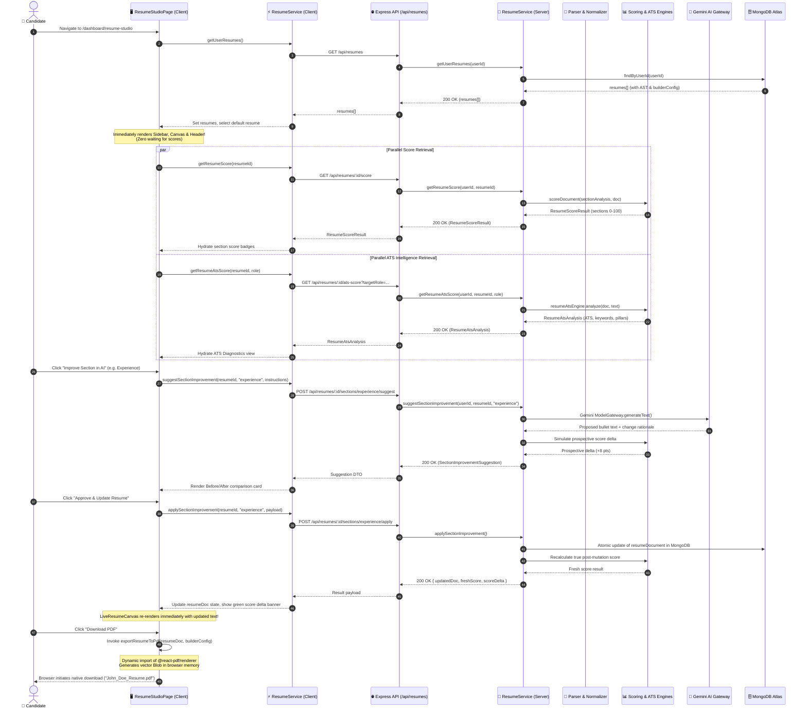

# 🏛️ SKILLEZO AI — Resume Studio Architecture & Orchestration Flow

> **Document Type:** System Architecture & Runtime Orchestration Flow  
> **Target Module:** Module 12 / 24 — Resume Studio Dashboard  
> **Source Location:** `client/app/dashboard/resume-studio` & `server/src/modules/resume`  
> **Status:** Active Production Architecture  

---

## 📑 Table of Contents
1. [Executive Overview & Design Philosophy](#1-executive-overview--design-philosophy)
2. [High-Level Architecture Block Diagram](#2-high-level-architecture-block-diagram)
3. [Frontend Component Hierarchy & State Tree](#3-frontend-component-hierarchy--state-tree)
4. [Complete End-to-End Connection Flow (Sequence Diagram)](#4-complete-end-to-end-connection-flow-sequence-diagram)
5. [The Canonical Data Model (`ResumeDocument` AST)](#5-the-canonical-data-model-resumedocument-ast)
6. [Backend Service & Scoring Engine Pipeline](#6-backend-service--scoring-engine-pipeline)
7. [Section AI Improvement & Atomic Re-Scoring Loop](#7-section-ai-improvement--atomic-re-scoring-loop)
8. [Live Canvas Rendering & Client-Side Vector PDF Engine](#8-live-canvas-rendering--client-side-vector-pdf-engine)
9. [REST API Contract Reference](#9-rest-api-contract-reference)
10. [File & Component Reference Map](#10-file--component-reference-map)

---

## 1. Executive Overview & Design Philosophy

**Resume Studio** transforms the conventional, passive resume parsing dashboard into an active, bilateral **AI workspace and publication-grade resume builder**.

### The Core Architectural Tenet:
> **"The Canonical AST is the Single Source of Truth; AI proposes structured diffs; Deterministic Engines score and render."**

Instead of treating resumes as unparsed binary files or arbitrary markdown blobs:
1. Every candidate resume is ingested and normalized into a structured **`ResumeDocument` Abstract Syntax Tree (AST)**.
2. The user is provided with **Two Human-Centered Destinations**:
   - **`audit` (ATS Audit & Intelligence):** High-level ATS match score, keyword gap detection, and diagnostic audit pillars.
   - **`editor` / `builder` (Edit & Design):** Side-by-side workspace combining section-level AI optimization, real-time typography/layout styling, and a live 60-FPS virtual A4 canvas.
3. Every AI-assisted edit triggers an **instant atomic re-score**, demonstrating a measurable, verifiable score improvement (e.g. `61 → 84 / 100`).
4. PDF generation is executed **entirely on the client** using `@react-pdf/renderer` vector primitives, completely eliminating server-side headless browser (Puppeteer) overhead and cold-start timeouts.

---

## 2. High-Level Architecture Block Diagram

```text
┌─────────────────────────────────────────────────────────────────────────────────────────────────────────────────┐
│                                             CLIENT (Next.js App Router)                                         │
│                                                                                                                 │
│  ┌───────────────────────────────────────────────────────────────────────────────────────────────────────────┐  │
│  │                                  /dashboard/resume-studio (Page Controller)                               │  │
│  │   State: resumes[], selectedResumeId, resumeDoc (AST), scoreResult, analysisData, builderConfig           │  │
│  └───────────────────────────────────────────────────────────────────────────────────────────────────────────┘  │
│         │                                        │                                           │                  │
│         ▼                                        ▼                                           ▼                  │
│  ┌──────────────┐                       ┌─────────────────┐                        ┌────────────────────┐       │
│  │ StudioSidebar│                       │  Main Workspace │                        │  LiveResumeCanvas  │       │
│  │ ├ Mode Switch│                       │  ├ AtsDiagnostic│                        │  ├ Virtual A4 View │       │
│  │ ├ Score Tier │                       │  ├ SectionAiWork│                        │  ├ ResumeRenderer  │       │
│  │ └ Section Nav│                       │  └ BuilderCtrl  │                        │  └ Highlighting    │       │
│  └──────────────┘                       └─────────────────┘                        └────────────────────┘       │
│                                                  │                                           │                  │
│                                                  │ API Fetch                                 │ Blob Export      │
│                                                  ▼                                           ▼                  │
│                                         ┌─────────────────┐                        ┌────────────────────┐       │
│                                         │  resume.service │                        │ @react-pdf/renderer│       │
│                                         │  (Axios / Fetch)│                        │ Vector PDF Engine  │       │
│                                         └─────────────────┘                        └────────────────────┘       │
└──────────────────────────────────────────────────┬──────────────────────────────────────────────────────────────┘
                                                   │ HTTPS / REST JSON
                                                   ▼
┌─────────────────────────────────────────────────────────────────────────────────────────────────────────────────┐
│                                            SERVER (Express 5.x + Node.js)                                       │
│                                                                                                                 │
│  ┌───────────────────────────────────────────────────────────────────────────────────────────────────────────┐  │
│  │                                 ResumeController & Express HTTP Boundary                                  │  │
│  │   /api/resumes [GET, POST, PATCH, DELETE, /score, /ats-score, /sections/:id/suggest, /builder-config]     │  │
│  └───────────────────────────────────────────────────────────────────────────────────────────────────────────┘  │
│         │                                        │                                           │                  │
│         ▼                                        ▼                                           ▼                  │
│  ┌──────────────────────┐              ┌──────────────────────┐                    ┌─────────────────────┐      │
│  │    ResumeService     │              │    Scoring Engines   │                    │ ModelGateway (AI)   │      │
│  │  Orchestrates parser,│              │  ├ ResumeScoringEng  │                    │  ├ Google Gemini    │      │
│  │  repositories & AST  │              │  ├ ResumeAtsEngine   │                    │  ├ Phase 7 Proof    │      │
│  │  normalization       │              │  └ ResumeSectionEng  │                    │  └ Zod Validation   │      │
│  └──────────────────────┘              └──────────────────────┘                    └─────────────────────┘      │
│         │                                        │                                                              │
│         └────────────────────────────────────────┼──────────────────────────────────────────────────────────────┘
                                                   │ Mongoose ODM
                                                   ▼
┌─────────────────────────────────────────────────────────────────────────────────────────────────────────────────┐
│                                             DATA LAYER (MongoDB Atlas)                                          │
│                                                                                                                 │
│   Collections:                                                                                                  │
│   • resumes: { userId, title, rawText, extractedData, resumeDocument (AST), builderConfig, isDefault }          │
│   • user / session: Better-Auth authenticated identity state                                                    │
└─────────────────────────────────────────────────────────────────────────────────────────────────────────────────┘
```

---

## 3. Frontend Component Hierarchy & State Tree

The frontend lives under [`client/app/dashboard/resume-studio/page.tsx`](file:///x:/projects/next.js/office-Project/SKILLEZO.AI/client/app/dashboard/resume-studio/page.tsx) and coordinates six core subsystems:

```text
ResumeStudioPage (Controller)
├── LockedOverlay (Rendered if candidate has 0 uploaded resumes; displays glassmorphic upload dropzone)
│
├── ResumeStudioSidebar (Docked left bar on Desktop / Slide-over Drawer on Mobile)
│   ├── OverallScoreBadge (Score 0-100 & Tier Pill: Exceptional, Strong, Fair, Needs Work)
│   ├── ViewModeSelector ('audit' ➔ ATS Score | 'editor' ➔ Section AI | 'builder' ➔ Layout/Design)
│   └── SectionNavList (Clickable list of all 7 sections with mini health status pips)
│
├── StudioHeader (Sticky Top Glassmorphic Navigation)
│   ├── MobileMenuToggle (Hamburger for sidebar on mobile devices)
│   ├── ModeTitle ("ATS Audit & Score" vs "Design Settings" vs "Section Content & AI")
│   ├── ResumeSwitcher (Dropdown to switch between candidate's active resumes)
│   ├── ViewRawPdfButton (Opens uploaded raw PDF in new browser tab via /api/resumes/:id/download)
│   ├── RefreshScoreButton (Invalidates cached score and triggers live re-calculation)
│   ├── DeleteResumeButton (Launches confirmation modal)
│   └── DownloadPdfButton (Triggers vector PDF generation with loading spinner)
│
└── StudioWorkspace (Main Content Canvas)
    │
    ├── [Destination 1: ATS Audit & Score] (viewMode === 'audit')
    │   └── AtsDiagnosticsView
    │       ├── TargetRoleSelector (Full-Stack, Frontend, Backend, AI/ML, DevOps, Mobile)
    │       ├── MetricScoreCards (ATS Score, Match Score, Content Score, Impact, Brevity)
    │       ├── AuditPillarSelector (Impact & Metrics, Technical Evidence, Brevity, Structure)
    │       ├── MissingKeywordsList (Keywords present in target role benchmark but missing in resume)
    │       └── PrioritySectionAlert (Highlights weakest section with 1-click "Fix with AI" CTA)
    │
    └── [Destination 2: Edit & Design Workspace] (viewMode === 'editor' | 'builder')
        ├── SubModeSwitcher (Pill toggle: "Section Content & AI" vs "Design & Layout Settings")
        ├── Left Column:
        │   ├── Case A: ResumeBuilderControls (viewMode === 'builder')
        │   │   ├── TemplateGallery (Modern, Classic, Minimal, Executive, Tech, Compact)
        │   │   ├── TypographyControls (Font family, base size, line height, letter spacing)
        │   │   ├── ColorPalettePicker (Primary accent, header background, divider colors)
        │   │   └── LayoutOptions (Page margins, section order, icon toggles, photo toggle)
        │   │
        │   └── Case B: SectionAiWorkspace (viewMode === 'editor')
        │       ├── SectionScoreSummary (Local section health: 0-100 score + weaknesses)
        │       ├── CustomInstructionInput ("Make this more senior", "Add Docker & AWS metrics")
        │       ├── AiSuggestionDiffView (Before vs After bullet diff with confidence indicator)
        │       └── ActionButtons (Approve & Apply to Resume, Try Another Suggestion, Dismiss)
        │
        └── Right Column:
            └── LiveResumeCanvas (Interactive Virtual A4 Paper)
                ├── DocumentContainer (A4 aspect-ratio constraint with zoom and pan controls)
                ├── ResumeRenderer (Maps ResumeDocument AST to DOM using active builderConfig styles)
                │   ├── ContactHeaderNode
                │   ├── SummaryNode
                │   ├── SkillsNode
                │   ├── ExperienceNode (Interactive bullet nodes with click-to-edit)
                │   ├── ProjectsNode
                │   ├── EducationNode
                │   └── CertificationsNode
                └── HighlightOverlay (Subtle animated outline wrapping the currently active section)
```

---

## 4. Complete End-to-End Connection Flow (Sequence Diagram)

This diagram details the runtime network traffic and state transitions across Client, Express Server, MongoDB, and Gemini AI:



---

## 5. The Canonical Data Model (`ResumeDocument` AST)

The core architecture treats the resume not as raw text, but as a strongly-typed JSON tree defined in [`client/types/resume-document.ts`](file:///x:/projects/next.js/office-Project/SKILLEZO.AI/client/types/resume-document.ts) and [`server/src/database/models/Resume.model.ts`](file:///x:/projects/next.js/office-Project/SKILLEZO.AI/server/src/database/models/Resume.model.ts):

```typescript
export interface ResumeDocument {
  id: string;
  userId: string;
  version: number;
  metadata: {
    targetRole?: string;
    templateId: 'modern' | 'classic' | 'minimal' | 'executive' | 'tech' | 'compact';
    updatedAt: string;
  };
  contact: {
    fullName: string;
    email: string;
    phone?: string;
    location?: string;
    linkedinUrl?: string;
    githubUrl?: string;
    portfolioUrl?: string;
  };
  summary: {
    content: string;
    verifiedSkills: string[];
  };
  skills: {
    categories: Array<{
      categoryName: string; // e.g. "Languages", "Frameworks", "Cloud & DevOps"
      skills: string[];
    }>;
  };
  experience: Array<{
    id: string;
    company: string;
    role: string;
    location?: string;
    startDate: string;
    endDate?: string;
    isCurrent: boolean;
    highlights: string[]; // Bullet points evaluated individually by AI
  }>;
  projects: Array<{
    id: string;
    name: string;
    description: string;
    technologies: string[];
    liveUrl?: string;
    githubUrl?: string;
    highlights: string[];
  }>;
  education: Array<{
    id: string;
    institution: string;
    degree: string;
    fieldOfStudy: string;
    startDate?: string;
    endDate?: string;
    gpa?: string;
  }>;
  certifications: Array<{
    id: string;
    name: string;
    issuer: string;
    date?: string;
    credentialUrl?: string;
  }>;
}
```

### Why this is superior to Markdown or HTML editing:
1. **Zero Layout Distortion:** Changing text in a bullet cannot break CSS styling, wrap tables inappropriately, or introduce invalid HTML tags.
2. **Deterministic PDF Mapping:** The exact same JSON tree feeds both the web renderer (`LiveResumeCanvas`) and the PDF generator (`ResumePdfDocument`).
3. **Targeted AI Scoping:** Gemini receives only the specific section or bullet being edited, preventing hallucinated mutations in unrelated sections.

---

## 6. Backend Service & Scoring Engine Pipeline

When an ATS or section score is requested, `server/src/modules/resume` executes a 4-engine diagnostic pipeline:

```text
Incoming Request
      │
      ▼
┌──────────────────────────────────────┐
│       ResumeDocument Normalizer      │  Guarantees canonical AST structure even if resume
│      (resumeDocumentNormalizer)      │  was originally uploaded from legacy PDF/DOCX
└──────────────────┬───────────────────┘
                   │
                   ▼
┌──────────────────────────────────────┐
│         Resume Section Engine        │  Extracts semantic metrics per section:
│         (resumeSectionEngine)        │  • Word count & brevity thresholds
└──────────────────┬───────────────────┘  • Action-verb strength ratio
                   │                      • Quantified metric density (% and $ counts)
                   │                      • Technical evidence references
                   ▼
┌──────────────────────────────────────┐
│         Resume Scoring Engine        │  Calculates normalized scores (0-100) across all 7 sections:
│         (resumeScoringEngine)        │  score = 0.35(Impact) + 0.30(Skills) + 0.20(Brevity) + 0.15(Clarity)
└──────────────────┬───────────────────┘  Assigns Tier: EXCEPTIONAL (≥85), STRONG (70-84), FAIR (50-69), POOR (<50)
                   │
                   ▼
┌──────────────────────────────────────┐
│           Resume ATS Engine          │  Benchmarks against target role keyword taxonomies:
│          (resumeAtsEngine)           │  • Missing high-frequency role keywords
└──────────────────┬───────────────────┘  • ATS format parsing safety check
                   │                      • Computes 4 Audit Pillars: Impact, Evidence, Brevity, Structure
                   ▼
       Return Unified DTO to Client
```

---

## 7. Section AI Improvement & Atomic Re-Scoring Loop

When the candidate requests an improvement for a specific bullet point:

1. **AI Instruction Formulation:**
   The backend retrieves the candidate's existing text, section weaknesses, target role benchmarks, and verified skills.
2. **Constrained Prompt Execution:**
   The prompt instructs Gemini:
   - *Must start with an active power verb.*
   - *Must preserve candidate's verified skills and project context.*
   - *Must NEVER fabricate employment history, unverified metrics, or false claims.*
3. **Safety Validation:**
   The backend response validator verifies that the generated text contains no prompt leakage, maintains professional tone, and adheres to ATS formatting.
4. **Prospective Delta Simulation:**
   Before the user even accepts, the system runs `resumeScoringEngine.scoreSection()` on the draft, showing the prospective improvement (e.g. `+14 pts`).
5. **Atomic Commit:**
   Upon clicking "Approve", the server updates the document in MongoDB and immediately returns the verified post-mutation score.

---

## 8. Live Canvas Rendering & Client-Side Vector PDF Engine

### The Problem with Server-Side PDF Generation:
Traditional resume builders run headless Chromium (Puppeteer/Playwright) on the server. In serverless/cloud containers:
- Puppeteer requires 300MB+ memory spikes.
- Cold starts take 5 to 10 seconds.
- Concurrent PDF generation easily exhausts server CPU.

### The Skillezo Dual-Renderer Solution:

```text
                          ResumeDocument (JSON AST)
                                     │
                 ┌───────────────────┴───────────────────┐
                 ▼                                       ▼
       [Live Web Preview]                      [PDF Download Engine]
       LiveResumeCanvas.tsx                    pdf-export.service.ts
                 │                                       │
                 ▼                                       ▼
       HTML5 / Tailwind DOM                    @react-pdf/renderer
       • Immediate DOM updates                 • Dynamic client-only import
       • CSS transform zoom (50%-150%)         • True vector text & glyphs
       • Real-time section highlights          • 100% ATS selectable text
       • Interactive click-to-edit             • Zero server load / No latency
```

* **Live Web Preview:** Renders standard React elements styled with dynamic CSS variables from `builderConfig`. Fast, responsive, and instantly re-renders as the candidate types.
* **Vector PDF Engine:** When the user clicks "Download", `@react-pdf/renderer` and [`ResumePdfDocument.tsx`](file:///x:/projects/next.js/office-Project/SKILLEZO.AI/client/components/resume-studio/pdf/ResumePdfDocument.tsx) are dynamically loaded in browser memory. The AST is mapped to PDF vector primitives (`<Document>`, `<Page>`, `<Text>`, `<View>`), compiled into a binary `Blob`, and downloaded directly by the browser in **under 800 milliseconds**.

---

## 9. REST API Contract Reference

All endpoints are authenticated using session cookies verified by Better-Auth:

| Method | Endpoint | Description | Payload / Query Params | Response |
| :--- | :--- | :--- | :--- | :--- |
| `GET` | `/api/resumes` | Fetch all resumes for current user | None | `{ success: true, data: ResumeRecord[] }` |
| `GET` | `/api/resumes/:id/score` | Compute full section score breakdown | None | `{ success: true, data: ResumeScoreResult }` |
| `GET` | `/api/resumes/:id/ats-score` | Compute ATS compatibility & keywords | `?targetRole=Full-Stack+Engineer` | `{ success: true, data: ResumeAtsAnalysis }` |
| `GET` | `/api/resumes/:id/builder-config` | Fetch saved layout, fonts & colors | None | `{ success: true, data: ResumeBuilderConfig }` |
| `PUT` | `/api/resumes/:id/builder-config` | Persist updated styling preferences | `{ templateId, fontFamily, ... }` | `{ success: true, data: ResumeBuilderConfig }` |
| `POST` | `/api/resumes/:id/sections/:secId/suggest` | Generate AI bullet improvement | `{ userInstruction?: string }` | `{ success: true, data: SectionImprovementSuggestion }` |
| `POST` | `/api/resumes/:id/sections/:secId/apply` | Commit suggestion to resume AST | `{ approvedText, bulletIndex }` | `{ success: true, data: { resumeDocument, scoreDelta } }` |
| `GET` | `/api/resumes/:id/download` | Stream raw uploaded PDF from disk | `?inline=true` | Binary Stream (`application/pdf`) |
| `DELETE` | `/api/resumes/:id` | Delete resume and storage file | None | `{ success: true, data: { message: string } }` |

---

## 10. File & Component Reference Map

```text
SKILLEZO.AI
├── client/
│   ├── app/dashboard/resume-studio/
│   │   ├── page.tsx                             # Master Resume Studio Page Controller
│   │   └── dev/page.tsx                         # Isolated Sandbox for component testing
│   ├── components/resume-studio/
│   │   ├── ResumeStudioSidebar.tsx              # Left navigation, mode switcher & score tier
│   │   ├── LiveResumeCanvas.tsx                 # Responsive A4 paper canvas wrapper
│   │   ├── SectionAiWorkspace.tsx               # Dedicated section AI copilot workspace
│   │   ├── AtsDiagnosticsView.tsx               # Full ATS diagnostics & audit pillar view
│   │   ├── builder/
│   │   │   └── ResumeBuilderControls.tsx        # Template, font, color & spacing controls
│   │   ├── renderer/
│   │   │   ├── ResumeRenderer.tsx               # Web HTML canvas renderer
│   │   │   └── templates/                       # Template layouts (Modern, Classic, etc.)
│   │   └── pdf/
│   │       └── ResumePdfDocument.tsx            # @react-pdf/renderer vector layout
│   ├── services/
│   │   ├── resume.service.ts                    # Client API communication service
│   │   └── pdf-export.service.ts                # Client-side dynamic PDF compilation
│   └── types/
│       ├── resume.ts                            # General resume API types
│       ├── resume-document.ts                   # Canonical ResumeDocument AST interface
│       ├── resume-scoring.types.ts              # Section scores, tier ratings & formulas
│       └── resume-builder.types.ts              # BuilderConfig (templates, typography, palette)
│
└── server/
    └── src/modules/resume/
        ├── resume.routes.ts                     # Express route declarations & validation
        ├── resume.controller.ts                 # HTTP request handler & status codes
        ├── resume.service.ts                    # Business orchestration service
        ├── resume.parser.ts                     # PDF/DOCX buffer and raw text parsing
        ├── resume.ats.ts                        # ATS algorithm & keyword scoring
        ├── document/
        │   └── resume-document.normalizer.ts    # Transforms raw parse into canonical AST
        └── scoring/
            ├── resume-scoring.engine.ts         # Multi-factor section scoring engine
            └── resume-section.engine.ts         # Section-level content & metric analyzer
```
