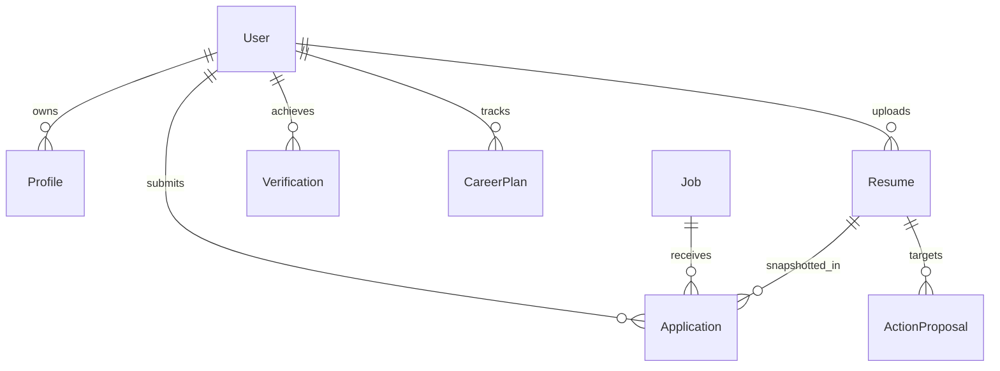

# SKILLEZO AI — Phase 0: Current Architecture Audit & Architecture Lock
**Document:** `doc/SKILLEZO_CURRENT_ARCHITECTURE_AUDIT.md`  
**Execution Phase:** Phase 0 (Read-Only Architecture & Implementation Audit)  
**Status:** COMPLETE & LOCKED  
**Auditor:** Lead Software Architect & Senior Full-Stack Engineer  
**Date:** Monday, September 21, 2026  

---

## 1. Executive Summary

A comprehensive, read-only architectural and implementation audit was performed across the entire SKILLEZO AI codebase (Next.js 15 Client, Express 5/TypeScript Server, MongoDB/Mongoose database, and multi-provider AI gateway).

### Key Audit Findings:
1. **The Core Engine Already Exists:** Over **65% of the foundational architecture** required for the proposed "Career Operating System" already exists in the repository. We do **not** need to build from scratch.
2. **Canonical Models Are Active:** `ProfileModel` ([`Profile.model.ts`](file:///x:/projects/next.js/office-Project/SKILLEZO.AI/server/src/database/models/Profile.model.ts)) and canonical `ResumeDocument` AST ([`resume-document.types.ts`](file:///x:/projects/next.js/office-Project/SKILLEZO.AI/server/src/modules/resume-intelligence/document/resume-document.types.ts)) are already fully specified and in use.
3. **Automated Extraction Exists:** `ProfileService.hydrateFromParsedResume()` already extracts contact information, professional summary, skills, experience, projects, and education from parsed resumes and merges them into candidate profiles non-destructively.
4. **Primary Architectural Bottlenecks:**
   - **Data Divergence / Loose Coupling:** `Profile` and `Resume` operate side-by-side without strict canonical hierarchy. Canvas edits in Resume Studio do not sync back to Profile, and Profile edits do not automatically propagate to Master Resumes.
   - **Monolithic Frontend Component:** The existing Resume Studio ([`client/app/dashboard/resume-studio/page.tsx`](file:///x:/projects/next.js/office-Project/SKILLEZO.AI/client/app/dashboard/resume-studio/page.tsx)) is a single **1,580-line monolithic file** handling view switching, canvas rendering, builder styling, scoring diagnostics, section AI workspaces, and upload/delete dialogs.
   - **Ephemeral Role Targeting:** Selecting a target role currently only recalibrates scoring weights rather than generating persistent, job-bound tailored variants.
   - **Incomplete Historical Application Snapshots:** `Application.model.ts` records `resumeId`, file storage metadata, and submission timestamp, but does **not** freeze the rendered `ResumeDocument` AST JSON, leaving historical submissions vulnerable if resume ASTs mutate.

---

## 2. Repository Structure

The workspace is organized as an enterprise-grade monorepo containing:

```text
SKILLEZO.AI/
├── client/                     # Next.js 15 App Router Frontend
│   ├── app/                    # App Router routes (Dashboard, Auth, Recruiter, Admin)
│   │   ├── (auth)/             # Auth routes (login, register, forgot-password)
│   │   ├── dashboard/          # Candidate Dashboard workspace (18 sub-routes)
│   │   │   ├── career-gps/     # Module 23: Career GPS & Roadmap
│   │   │   ├── career-profile/ # Symlink/Redirect to profile/
│   │   │   ├── profile/        # Candidate Profile management
│   │   │   ├── resume-studio/  # Monolithic 1580-line Resume Studio
│   │   │   ├── job-center/     # Job board & application launcher
│   │   │   └── ...
│   ├── components/             # React Component Library
│   │   ├── dashboard/          # Dashboard widgets (Profile, Stats, GPS, Coach)
│   │   ├── resume-studio/      # LiveResumeCanvas, AtsDiagnostics, Builder, PDF
│   │   └── layout/             # DashboardLayout, Sidebar (12 sections), Topbar
│   ├── services/               # Frontend API Client Singletons (fetch wrappers)
│   └── types/                  # Shared TypeScript models (ResumeDocument, Scoring)
├── server/                     # Express 5 + TypeScript Backend Service
│   ├── src/
│   │   ├── core/               # Cross-cutting concerns (Auth, AI Gateway, Storage, Error)
│   │   │   ├── ai/             # AI Gateway (Gemini, OpenAI, Circuit Breaker, Evidence)
│   │   │   ├── auth/           # Better-Auth integration & requireAuth middleware
│   │   │   ├── middleware/     # Error, Validation (Zod), Upload (Multer)
│   │   │   └── storage/        # Local disk & Cloud storage provider
│   │   ├── database/           # MongoDB / Mongoose Data Layer
│   │   │   ├── models/         # 13 Mongoose Document Models
│   │   │   └── repositories/   # Clean Architecture Repository pattern
│   │   ├── modules/            # Domain Feature Modules
│   │   │   ├── profile/        # Profile Service, Controller, DTOs, Hydration
│   │   │   ├── resume/         # Resume Upload, Ingestion, Parsing, ATS Scoring
│   │   │   ├── resume-intelligence/ # AST Normalizer, Content, Matching, Builder
│   │   │   ├── career-plan/    # Skill Gap Engine, Employability Engine
│   │   │   ├── jobs/           # Public & External Job Management
│   │   │   └── application/    # Job Application Submissions & Snapshots
│   │   └── server.ts           # Express 5 App Bootstrap & Route Mounting
│   └── tests/                  # 38 Vitest Test Suites (338 passing tests)
├── doc/                        # Architectural Blueprints & Game Plans
└── tracker/                    # Daily Work Logs & Standup Reports
```

---

## 3. Backend Architecture

### 3.1 Layered Architecture Pattern
The backend adheres strictly to **Clean Architecture / Layered Service Pattern**:
1. **HTTP / Route Layer:** Express 5 Router definitions with Zod schema validation middleware (`validate({ body, params, query })`) and centralized async error handling (`asyncHandler`).
2. **Controller Layer:** Thin request unwrappers and response formatters (`ApiResponse.success(res, data)`).
3. **Service Layer:** Pure business logic encapsulating business rules, orchestrating repositories, and interfacing with AI gateways.
4. **Repository Layer:** Abstracted data access layer over Mongoose models (`ProfileRepository`, `ResumeRepository`, `JobRepository`, `ApplicationRepository`).
5. **Database Model Layer:** Strongly typed Mongoose schemas with compound indexes, partial filter expressions, and timestamps.

### 3.2 Key Backend Singletons & Modules
- **`ModelGateway` ([`model-gateway.ts`](file:///x:/projects/next.js/office-Project/SKILLEZO.AI/server/src/core/ai/gateway/model-gateway.ts)):** Thread-safe multi-provider AI gateway with circuit breaker (3-failure threshold, 30s reset), fallback failover between Google Gemini and OpenAI, in-memory latency telemetry, and Zod structured output validation.
- **`StorageService` ([`storage.service.ts`](file:///x:/projects/next.js/office-Project/SKILLEZO.AI/server/src/core/storage/storage.service.ts)):** Unified file storage abstraction managing disk uploads (`uploads/resumes/`) and streaming downloads.
- **`ResumeParserService` ([`resume.parser.ts`](file:///x:/projects/next.js/office-Project/SKILLEZO.AI/server/src/modules/resume/resume.parser.ts)):** Robust multi-stage text extractor utilizing `pdf-parse` (for PDF) and `mammoth` (for DOCX) with heuristic regex extraction for email, phone, skills, experience, and education.

---

## 4. Frontend Architecture

### 4.1 Framework & Core Technologies
- **Framework:** Next.js 15.1 (App Router) with React 19 and strict TypeScript.
- **Styling:** Tailwind CSS with CSS variables, dark mode support via `ThemeContext`, and Lucide React icons.
- **Rendering Engine:** `@react-pdf/renderer` for deterministic vector PDF exports matching web preview geometry.
- **Form & Notification Handling:** Native controlled React state with `sonner` toast notifications.

### 4.2 State Management Pattern
- The client currently relies on **localized component state** (`useState`, `useEffect`, `useCallback`, `useRef`) inside page containers.
- **Zero Global Stores:** There are no active Redux or Zustand global stores. Session authentication is managed via `useSession()` from `@/lib/auth-client`.
- **API Services:** Clean singleton classes in `client/services/` wrapping `fetch` with credentials and standard JSON parsing.

---

## 5. Profile Architecture

### 5.1 Existing Model Structure
[`ProfileModel`](file:///x:/projects/next.js/office-Project/SKILLEZO.AI/server/src/database/models/Profile.model.ts) defines:
- `userId` (indexed, unique string).
- `headline`, `phone`, `bio`, `targetRole`, `targetRoleId` (ref: `Role`).
- `location` (`city`, `state`, `country`).
- `links` (`github`, `linkedin`, `portfolio`).
- `skills` array of `IProfileSkill`:
  - `name`: string (required)
  - `category`: string (default "Technical")
  - `level`: number (1–5)
  - `proficiency`: string ("Expert" | "Advanced" | "Intermediate" | "Beginner")
  - `score`: number (0–100)
  - `source`: `SkillSource` enum (`PROFILE` | `RESUME` | `ASSESSMENT` | `GITHUB`)
  - `verified`: boolean
- `experience` array of `IProfileExperience`:
  - `companyName`, `jobTitle`, `employmentType`, `startDate`, `endDate`, `isCurrent`, `description`.
- `projects` array of `IProfileProject`:
  - `title`, `description`, `techStack`, `githubUrl`, `liveDemoUrl`, `featured`, `startDate`, `endDate`.
- `education` array of `IProfileEducation`:
  - `institution`, `degree`, `fieldOfStudy`, `startYear`, `endYear`.

### 5.2 Gaps to Evolve into Canonical Career Profile
1. **Missing Evidence Abstraction:** Project achievements, experience bullets, and skills are currently stored as flat strings rather than referencing discrete evidence entities.
2. **Missing Source References:** Extracted profile items lack explicit `sourceReferences` tracking (e.g. which document ID, page, or original text snippet produced the claim).
3. **Missing Verification States:** Verification is currently a binary boolean (`verified: true/false`) instead of an audit enum (`IMPORTED`, `USER_VERIFIED`, `USER_EDITED`, `NEEDS_REVIEW`).
4. **Target Role Cardinality:** Profile currently tracks a single `targetRole` string instead of supporting multiple target career aspirations.

---

## 6. Resume Architecture

### 6.1 Existing Resume Model
[`ResumeModel`](file:///x:/projects/next.js/office-Project/SKILLEZO.AI/server/src/database/models/Resume.model.ts) defines:
- `userId` (indexed), `title`, `originalFileName`, `fileName`, `storageKey`, `fileUrl`, `mimeType`, `fileSize`.
- `isDefault` (boolean, unique partial index per user).
- `status`: `ResumeStatus` enum (`UPLOADED`, `PARSED`, `FAILED`).
- `version`: number (defaults to 1).
- `extractedData`: Structured schema containing parsed `personalInfo`, `summary`, `skills`, `education`, `experience`, `projects`, `certifications`, `totalExperienceYears`.
- `resumeDocument`: Mongoose `Mixed` storing the complete canonical AST.
- `builderConfig`: Mongoose `Mixed` storing theme colors, typography, margins, and template IDs.
- `rawText`: Full parsed plaintext.

### 6.2 The Canonical `ResumeDocument` AST
The system already has a battle-tested canonical AST defined in [`resume-document.types.ts`](file:///x:/projects/next.js/office-Project/SKILLEZO.AI/server/src/modules/resume-intelligence/document/resume-document.types.ts):
- `contact`: Full identity and social links.
- `summary`: Bio, target role, years of experience.
- `experience`: Array of items with structured `bullets` (text, actionVerb, impact, metrics, evidence).
- `skills`: Array of items with canonical categories (`FRONTEND`, `BACKEND`, `DATABASE`, `DEVOPS`, `CLOUD`, `SYSTEM_DESIGN`).
- `projects`: Array of items with tech stack, links, and bullets.
- `education`: Institutions, degrees, GPA, dates.
- `achievements`: Awards, certifications, metrics.
- `styling` & `layout`: Visual presentation metadata.

**AST Ownership:** The AST is generated by `ResumeDocumentNormalizer`, stored directly in MongoDB on the `Resume` document, rendered in the browser by `ResumeRenderer.tsx`, and converted to vector PDF by `ResumePdfDocument.tsx`.

---

## 7. Resume Ingestion Flow

The complete runtime flow for resume ingestion:

```text
[Candidate Uploads PDF/DOCX]
              ↓
[Multer Upload Middleware (5MB Limit, Memory/Temp Disk)]
              ↓
[ResumeService.uploadResume()]
              ↓
1. Storage Service: Saves physical file to uploads/resumes/
2. ResumeParserService: Extracts raw text using pdf-parse or mammoth
3. Heuristic Regex Engine: Extracts personal info, skills, experience, education
4. ResumeDocumentNormalizer: Synthesizes initial ResumeDocument AST
5. ResumeModel.create(): Saves record to MongoDB (status: PARSED)
6. Non-Fatal Profile Hydration Hook:
   ProfileService.hydrateFromParsedResume(userId, extractedData, resumeDocument)
              ↓
[Candidate Profile Updated with Merged Skills, Experience, Projects]
```

### Ingestion Observations:
- **Synchronous Execution:** Parsing and hydration run synchronously during the POST request (~1.2–2.5s duration).
- **Non-Destructive Merge:** `hydrateFromParsedResume()` preserves existing user-entered fields; empty fields are populated, and new skills/projects are appended.
- **Missing Onboarding Feedback:** The frontend currently shows a generic spinner rather than an engaging multi-step extraction telemetry modal.

---

## 8. Career Evidence Status

The repository already contains a dedicated evidence subsystem under [`server/src/core/ai/evidence/`](file:///x:/projects/next.js/office-Project/SKILLEZO.AI/server/src/core/ai/evidence/):
- **`types.ts`:** Defines `EvidenceType` (`"DETERMINISTIC" | "EXTRACTED" | "AI_GENERATED"`), `VerificationStatus` (`"VERIFIED" | "UNVERIFIED" | "REVIEW_REQUIRED"`), and `CandidateEvidenceBundle`.
- **`evidence-collector.ts`:** 15KB engine aggregating evidence from `SkillGapEngine`, `EmployabilityEngine`, `ResumeAtsEngine`, and `ProfileService`.
- **`ActionProposal.model.ts`:** Already contains `evidenceIds: string[]` linking proposed resume and profile mutations to verified evidence!

**Current Status:** The evidence layer exists in backend AI orchestration but has not yet been directly exposed to the frontend profile editing UI.

---

## 9. AI Intelligence Audit

| Service | Purpose | Input | Output | Provider / Location |
| :--- | :--- | :--- | :--- | :--- |
| **ModelGateway** | Centralized LLM Gateway | Prompt, Schema, Temp | Structured Object / Text | Gemini 1.5 Pro / OpenAI GPT-4o ([`model-gateway.ts`](file:///x:/projects/next.js/office-Project/SKILLEZO.AI/server/src/core/ai/gateway/model-gateway.ts)) |
| **CareerCoachService** | Interactive Career Coach | Chat message, Candidate Profile | SSE Stream, Markdown | Multi-turn chat orchestrator ([`coach.service.ts`](file:///x:/projects/next.js/office-Project/SKILLEZO.AI/server/src/core/ai/ai.service.ts)) |
| **OptimizationService** | Section / Bullet Rewriting | Original Bullet, Target Role | Proposed Bullet, Score Delta | Zod validated JSON ([`optimization.service.ts`](file:///x:/projects/next.js/office-Project/SKILLEZO.AI/server/src/modules/resume-intelligence/optimization/optimization.service.ts)) |
| **AtsEngine** | Multi-Pillar Scoring | Plaintext, Target Role | Section Scores, Recommendations | Deterministic Regex + Taxonomy ([`resume.ats.ts`](file:///x:/projects/next.js/office-Project/SKILLEZO.AI/server/src/modules/resume/resume.ats.ts)) |
| **ActionProposalEngine**| Grounded Action Synthesis | Evidence Bundle, User Intent | Verified Action Proposal | Schema-checked action model ([`ActionProposal.model.ts`](file:///x:/projects/next.js/office-Project/SKILLEZO.AI/server/src/database/models/ActionProposal.model.ts)) |

---

## 10. Career GPS Architecture

- **Implementation:** Governed by `SkillGapEngine` ([`skill-gap.engine.ts`](file:///x:/projects/next.js/office-Project/SKILLEZO.AI/server/src/modules/career-plan/skill-gap.engine.ts)) and `EmployabilityEngine` ([`employability.engine.ts`](file:///x:/projects/next.js/office-Project/SKILLEZO.AI/server/src/modules/career-plan/employability.engine.ts)).
- **Data Consumption:** Currently queries **both** `ResumeModel` and `ProfileModel` via `SkillGapService`, merging skills from both sources.
- **Taxonomies:** Contains explicit, highly detailed benchmarks for 6 roles (`Full-Stack Engineer`, `Frontend Engineer`, `Backend Engineer`, `AI/ML Specialist`, `DevOps & Cloud Engineer`, `Mobile App Developer`).
- **Readiness Formula:** Uses a 5-factor weighted linear formula calculating readiness scores and generating structured learning milestones.

---

## 11. Job Engine Architecture

- **Implementation:** [`JobModel`](file:///x:/projects/next.js/office-Project/SKILLEZO.AI/server/src/database/models/Job.model.ts) and `JobsService` ([`jobs.service.ts`](file:///x:/projects/next.js/office-Project/SKILLEZO.AI/server/src/modules/jobs/jobs.service.ts)).
- **Capabilities:**
  - Handles internal jobs and external crawled jobs (with automated health probes checking for 404/410 expiration).
  - Background cron (`initJobIngestionCron`) ingesting external feeds.
  - Matches candidate skills against `job.skills` requirements.

---

## 12. Application Architecture

- **Model:** [`ApplicationModel`](file:///x:/projects/next.js/office-Project/SKILLEZO.AI/server/src/database/models/Application.model.ts).
- **Current Snapshot Mechanism:** Stores `IResumeSnapshot` with:
  - `resumeId`, `title`, `originalFileName`, `fileName`, `storageKey`, `mimeType`, `fileSize`, `version`, `submittedAt`.
- **Integrity Risk Identified:** The snapshot stores the **storage file key and version number**, but does **not store the JSON `ResumeDocument` AST**. If the candidate subsequently modifies their resume AST or the physical file is overwritten, the historical submission record is altered or broken.

---

## 13. Resume Studio Architecture

The current frontend Resume Studio page ([`client/app/dashboard/resume-studio/page.tsx`](file:///x:/projects/next.js/office-Project/SKILLEZO.AI/client/app/dashboard/resume-studio/page.tsx)) is **1,580 lines of code**.

### Consolidated Responsibilities (Too Many in One File):
1. State management for 12+ separate asynchronous states.
2. URL search param synchronization (`?view=audit`, `?view=editor`, `?view=builder`).
3. ATS Diagnostics view rendering.
4. Builder controls rendering (fonts, colors, margins, template cards).
5. Drag-and-drop file upload zone.
6. Optimization review modal.
7. Section-by-section AI improvement drawer.
8. Live canvas rendering and pagination calculations.
9. Resume deletion modal.

---

## 14. Database Model Map



All models use standard Mongoose schemas with indexed `userId` string fields.

---

## 15. API Inventory

| Method | Route | Controller / Service | Auth Required | Status | Future Action |
| :--- | :--- | :--- | :---: | :---: | :--- |
| `GET` | `/api/profile/me` | `ProfileController.getMyProfile` | Yes | 🟢 Active | **KEEP** — Base for Career Profile |
| `PATCH`| `/api/profile/me` | `ProfileController.updateProfile` | Yes | 🟢 Active | **KEEP** — Base profile updates |
| `POST` | `/api/profile/skills` | `ProfileController.addSkill` | Yes | 🟢 Active | **EXTEND** with evidence IDs |
| `POST` | `/api/resumes/upload` | `ResumeController.uploadResume` | Yes | 🟢 Active | **EXTEND** with variant type & summary |
| `GET` | `/api/resumes` | `ResumeController.getUserResumes` | Yes | 🟢 Active | **EXTEND** with variant filtering |
| `GET` | `/api/resumes/:id` | `ResumeController.getResumeById` | Yes | 🟢 Active | **KEEP** — Returns full AST |
| `GET` | `/api/resumes/:id/score` | `ResumeController.getScore` | Yes | 🟢 Active | **KEEP** — Returns multi-pillar score |
| `POST` | `/api/resumes/:id/optimizations/propose` | `ResumeController.proposeOptimization` | Yes | 🟢 Active | **REFACTOR** into Tailoring proposal |
| `POST` | `/api/resumes/:id/optimizations/accept` | `ResumeController.acceptOptimization` | Yes | 🟢 Active | **REFACTOR** into Tailoring commit |
| `POST` | `/api/applications` | `ApplicationController.applyToJob` | Yes | 🟢 Active | **EXTEND** with AST freezing |
| `GET` | `/api/career-plan/employability` | `EmployabilityController.getEmployability` | Yes | 🟢 Active | **KEEP** — Ground in Career Profile |
| `GET` | `/api/skill-gap` | `SkillGapController.getSkillGap` | Yes | 🟢 Active | **KEEP** — Ground in Career Profile |

---

## 16. State Management

- **Client State:** Page-level React state. No Redux, no Zustand, no React Query.
- **Cache Strategy:** Direct service calls on page load (`useEffect`).
- **Risk:** Potential desynchronization when switching between Profile and Studio if not re-fetched.

---

## 17. Testing Status

- **Total Backend Tests:** **38 test suites, 338 passing tests** executed via Vitest.
- **Coverage:**
  - `resume-ingestion.spec.ts` (13KB): Comprehensive parser, normalization, and error handling coverage.
  - `resume-document.spec.ts`: AST validation.
  - `employability.engine.spec.ts` & `skill-gap.engine.spec.ts`: Deterministic scoring rules.
  - `application.service.spec.ts`: Job application checks.
- **Missing Coverage:**
  - Invariant tests for Master vs. Tailored variant isolation.
  - Invariant tests for historical application snapshot immutability.

---

## 18. Data Ownership Matrix

| Data Element | Current Owner | Target Canonical Owner | Write Sources | Consumers |
| :--- | :--- | :--- | :--- | :--- |
| **Contact / Identity** | `Profile` & `Resume` (Duplicate) | **Career Profile** | Resume Ingestion, Profile UI | Master Resume, Applications |
| **Skills** | `Profile.skills` & `Resume.skills` | **Career Profile** | Ingestion, Verification, User | All Resumes, Career GPS, Job Match |
| **Work Experience** | `Profile` & `Resume.extractedData` | **Career Profile** | Ingestion, User Edits | Master Resume, Tailoring Engine |
| **Projects** | `Profile.projects` | **Career Profile** | Ingestion, User Edits | Resumes, Employability Engine |
| **Resume Layout / AST** | `Resume.resumeDocument` | **Resume (Presentation)** | Studio Canvas, AI Tailor | Renderer, PDF Generator |
| **Tailored Changes** | Overwrites active resume | **Tailored Resume Snapshot** | Tailoring Approval Flow | Specific Application |
| **Submitted Application**| Storage file key + version | **Application Snapshot** | Apply Flow | Recruiter, Application History |

---

## 19. Existing vs. Required Architecture Matrix

| Domain | Existing | Reusable | Needs Modification | New Later | Risk |
| :--- | :---: | :---: | :---: | :---: | :---: |
| **Career Profile** | 🟢 Yes | 🟢 85% | 🟡 Add evidence refs & completeness | ⚪ Multi-target roles | Low |
| **Career Evidence** | 🟢 Yes (Backend) | 🟢 70% | 🟡 Connect to Profile UI | ⚪ Verification UI | Low |
| **Master Resume** | 🟢 Yes | 🟢 90% | 🟡 Mark as `isMaster: true` | ⚪ Sync diff alerts | Low |
| **Tailored Resumes** | 🔴 No | 🟡 40% | 🟡 Refactor optimization pipeline | ⚪ `TAILORED` variant records | Medium |
| **Resume Studio UX** | 🟢 Yes | 🟢 75% | 🔴 Decompose 1580-line file | ⚪ 4-Zone modular components | Medium |
| **Resume Gallery** | 🔴 No | ⚪ 10% | ⚪ Create gallery cards | ⚪ Dedicated Gallery View | Low |
| **Application Snapshots**| 🟡 Partial | 🟢 60% | 🟡 Add full AST freezing | ⚪ Historical PDF viewer | Low |
| **Career GPS** | 🟢 Yes | 🟢 95% | 🟡 Read purely from Profile | ⚪ Outcome feedback loop | Low |
| **Job Engine** | 🟢 Yes | 🟢 95% | 🟡 Match against Profile | ⚪ Direct Tailor-from-Job | Low |

---

## 20. Architecture Conflicts

1. **Dual Source of Truth for Career Data:** Both `ProfileModel` and `ResumeModel.extractedData` store experience, education, and skills.
   - *Resolution:* Designate `ProfileModel` as canonical. `ResumeModel` will only store presentation AST.
2. **Monolithic Studio Dashboard:** `ResumeStudioPage` handles 9 distinct concerns.
   - *Resolution:* Decompose into 4 dedicated zone components (`StudioHeader`, `ResumePortfolioSidebar`, `ResumeCanvasWorkspace`, `StudioInspectorPanel`).
3. **Destructive Optimization Flow:** Applying AI recommendations currently mutates the single active resume document.
   - *Resolution:* Tailoring proposals must mint a new `TAILORED` resume variant with a `parentResumeId`.
4. **Shallow Application Snapshots:** Applications store file keys rather than complete AST documents.
   - *Resolution:* Freeze the full `ResumeDocument` AST JSON inside the `Application` document at submission time.

---

## 21. Reuse Map

- **`ProfileModel` & `ProfileRepository`:** Evolve directly into Career Profile (Zero breaking changes).
- **`ResumeDocument` AST & `ResumeDocumentNormalizer`:** Retain 100% as the presentation rendering model.
- **`ResumeParserService` & `ProfileService.hydrateFromParsedResume()`:** Retain and extend with evidence metadata.
- **`ResumeRenderer.tsx` & `ResumePdfDocument.tsx`:** Retain 100% for pixel-perfect screen preview and vector PDF export.
- **`SkillGapEngine` & `EmployabilityEngine`:** Retain 100%; point data ingestion directly to Career Profile.
- **`ModelGateway` & `GeminiProvider`:** Retain 100% as central AI orchestration gateway.

---

## 22. Deprecation Candidates

| Candidate | Reason | Replacement | Safe Phase |
| :--- | :--- | :--- | :---: |
| Direct in-place resume overwriting | Destroys master career history | Master / Variant creation | Phase 5 |
| Dual Profile + Resume scraping in `SkillGapService` | Inefficient duplicate queries | Read purely from Career Profile | Phase 6 |
| Monolithic `ResumeStudioPage` state tree | Unmaintainable 1580-line file | 4 modular zone components | Phase 3 |

---

## 23. Migration Risks

| Risk | Severity | Mitigation Strategy |
| :--- | :---: | :--- |
| **Existing Users Without Profile Records** | Low | Handled automatically by `profileService.getMyProfile()` auto-creation hook. |
| **Existing Resumes Without Variant Type** | Low | Mongoose schema default: `variantType: "MASTER"` for all existing records. |
| **Existing Applications Without AST Snapshots** | Medium | Fallback to existing `fileUrl` / `storageKey` if `resumeDocument` snapshot is null. |
| **UI Regressions in Studio Restructuring** | Medium | Keep existing `ResumeRenderer` and builder controls completely intact; only reorganize layout wrappers. |

---

## 24. Recommended Implementation Order

1. **Phase 1: Domain & Model Alignment (Additive & Non-Breaking)**
   - Add `variantType`, `parentResumeId`, and `targetJob` to `Resume.model.ts`.
   - Add `resumeDocument` AST snapshot support to `Application.model.ts`.
2. **Phase 2: Ingestion & Onboarding Telemetry**
   - Create extraction summary DTO in `profile.service.ts`.
   - Build visual extraction telemetry dialog for resume upload.
3. **Phase 3: Resume Studio Dashboard Decomposition**
   - Extract `StudioHeader.tsx` (Zone A).
   - Extract `ResumePortfolioSidebar.tsx` (Zone B).
   - Extract `ResumeCanvasWorkspace.tsx` (Zone C).
   - Extract `StudioInspectorPanel.tsx` (Zone D).
4. **Phase 4: 3-Step Tailoring & Approval Pipeline**
   - Implement `POST /api/resumes/:id/tailor/analyze` and `POST /api/resumes/:id/tailor/commit`.
   - Build `TailorResumeModal.tsx`.
5. **Phase 5: Application Snapshot Locking & Career GPS Integration**
   - Store immutable AST snapshots during job application submission.
   - Ground Career GPS purely in Career Profile.

---

## 25. Phase 1 Prerequisites

Before Phase 1 code is written:
- [x] Phase 0 Architecture Audit completed and locked.
- [x] All 38 existing test suites confirmed passing (338/338 tests).
- [x] Schema extensions verified as purely additive (zero breaking changes for existing MongoDB documents).

---

## 26. Open Questions / Unknowns

- **Q1: Resume Variant Cap:** Should candidates on the free tier have a limit on the number of tailored variants (e.g. 3 variants max), or unlimited?
- **Q2: Historical Re-rendering:** When viewing a past application, should the system render the frozen AST via `ResumeRenderer`, or serve the legacy PDF file? *(Recommended: Render frozen AST with fallback to legacy file).*

---
*End of Phase 0 Architecture Audit. All findings grounded in static code inspection.*
