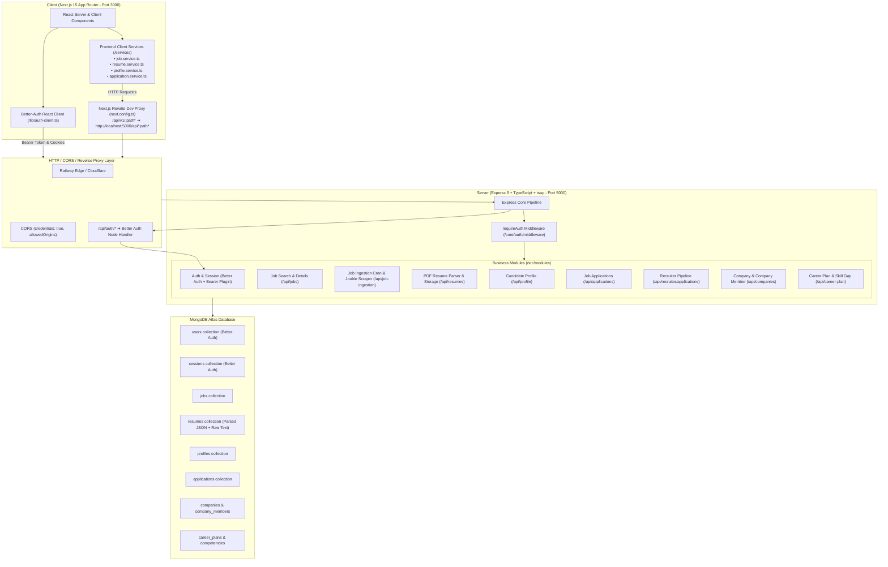

# 🌐 SKILLEZO AI — End-to-End System Master Architecture & Linkage Map

> **Generated:** September 03, 2026  
> **Status:** Sprint 1 Complete (Live Jobs + Resume Upload + Better Auth Core Wired)  
> **Architecture Style:** Monorepo with Decoupled `client/` (Next.js 15 App Router) and `server/` (Express 5 + TypeScript + MongoDB)

---

## 🏛️ 1. High-Level Master Architecture



---

## 🔗 2. Full Frontend-to-Backend Integration Matrix

| Domain / Feature | Client Location | API Endpoint | Server Module | DB Collection | Integration Status |
| :--- | :--- | :--- | :--- | :--- | :---: |
| **Authentication & OAuth** | `client/app/(auth)/login`<br>`client/app/(auth)/register` | `/api/auth/*` | `server/src/core/auth/` | `users`<br>`sessions` | 🟢 **100% Live**<br>(Better Auth) |
| **Job Center & Search** | `client/app/dashboard/job-center` | `GET /api/jobs`<br>`GET /api/jobs/:id` | `server/src/modules/jobs` | `jobs` | 🟢 **100% Live**<br>(Real Database) |
| **External Job Ingestion** | Background 12h Cron & Admin Trigger | `POST /api/job-ingestion/trigger` | `server/src/modules/job-ingestion` | `jobs` | 🟢 **100% Live**<br>(Jooble + Dedupe) |
| **Resume Upload & Parsing** | `client/app/dashboard/resume-intelligence` | `POST /api/resumes/upload`<br>`GET /api/resumes/me` | `server/src/modules/resume` | `resumes` | 🟢 **100% Live**<br>(PDF text + Skills) |
| **Candidate Profile** | `client/app/dashboard/profile` | `GET /api/profile/me`<br>`PUT /api/profile/me` | `server/src/modules/profile` | `profiles`<br>`users` | 🟢 **100% Live** |
| **Job Applications** | `client/services/application.service.ts` | `POST /api/applications`<br>`GET /api/applications/my-applications` | `server/src/modules/application` | `applications` | 🟡 **Backend Live**<br>(Frontend Modal in Sprint 2) |
| **Recruiter Kanban** | `client/app/recruiter/` (Planned) | `GET /api/recruiter/applications`<br>`PATCH /api/recruiter/applications/:id` | `server/src/modules/recruiter-application` | `applications` | 🟡 **Backend Live**<br>(UI in Sprint 4) |
| **Skill Gap Analysis** | `client/app/dashboard/skill-gap-analysis` | `GET /api/career-plan/skill-gap` (Planned) | `server/src/modules/career-plan` | `competencies` | ⚪ **UI Mock**<br>(Sprint 3) |
| **Employability Index** | `client/app/dashboard/employability-index` | `GET /api/career-plan/employability` (Planned) | `server/src/modules/career-plan` | `career_plans` | ⚪ **UI Mock**<br>(Sprint 3) |
| **Career GPS Roadmap** | `client/app/dashboard/career-gps` | `GET /api/career-plan/roadmap` (Planned) | `server/src/modules/career-plan` | `career_plans` | ⚪ **UI Mock**<br>(Sprint 3) |
| **AI Career Coach** | `client/app/dashboard/ai-career-coach` | `POST /api/ai/chat` (Planned) | Planned LLM Service | TBD | ⚪ **UI Mock**<br>(Sprint 4) |

---

## ⚡ 3. How Authentication & Data Flow Works (End-to-End)

### Step 1: User Signs In (`client/app/(auth)/login/page.tsx`)
1. User enters Email & Password.
2. `authClient.signIn.email({ email, password })` sends POST request to `/api/auth/sign-in/email`.
3. Better Auth validates bcrypt hash in MongoDB `users` collection.
4. Better Auth generates a session token:
   - Sets secure HTTP-only cookie (`better-auth.session_token`).
   - Returns Bearer token in response body, stored automatically in `localStorage.setItem("skillezo_token", token)`.

### Step 2: Client Calls Protected Endpoint (`client/services/job.service.ts`)
1. User opens `/dashboard/job-center`.
2. `jobService.searchJobs({ query: "React", page: 1 })` executes.
3. In local dev: Next.js dev proxy translates `/api/v1/jobs` ➔ `http://localhost:5000/api/jobs`.
4. In production: Request goes directly to Railway backend `https://skillezoai-production.up.railway.app/api/jobs`.
5. Request carries `Authorization: Bearer <token>` and session cookies.
6. Express executes `requireAuth` middleware -> extracts candidate User ID.
7. `JobsService.searchJobs()` executes MongoDB query and returns typed jobs + pagination metadata.

### Step 3: PDF Resume Upload & Auto-Parsing (`client/app/dashboard/resume-intelligence`)
1. Candidate drops a PDF resume file.
2. `resumeService.uploadResume(file)` sends `multipart/form-data` to `POST /api/resumes/upload`.
3. Express `multer` handles file buffer in memory.
4. `resumeParserService.extractRawTextFromBuffer()` extracts text via `pdf-parse/lib/pdf-parse.js`.
5. `resumeParserService.extractSkills()` matches against technical taxonomy (Languages, Frontend, Backend, Cloud, AI).
6. MongoDB stores:
   - Raw text
   - Extracted JSON (skills, experience, education, personal info)
   - GridFS / storage reference
7. Server responds with parsed data and candidate dashboard updates live!

---

## 📂 4. Project Directory Map

```text
SKILLEZO.AI/
├── client/                              # NEXT.JS 15 FRONTEND
│   ├── app/
│   │   ├── (auth)/                      # Login, Register, Forgot Password (Live Better Auth)
│   │   ├── dashboard/                   # 17 Dashboard Sub-Pages (Job Center, Resume, Profile Live)
│   │   ├── api/health/                  # Client Health Route
│   │   └── layout.tsx & page.tsx        # Root Landing Page & Layout
│   ├── components/                      # Reusable UI (Navbar, Sidebar, Modals, Cards)
│   ├── services/                        # Typed Client Services (job, resume, profile, application)
│   ├── lib/auth-client.ts               # Better-Auth React Client with Auto-Token Injection
│   ├── types/                           # Shared Frontend Types & Interfaces
│   └── doc/                             # Client specifications and phase logs
│
├── server/                              # EXPRESS 5 + TYPESCRIPT BACKEND
│   ├── src/
│   │   ├── core/                        # Auth config, Env schema (Zod), Middleware, Types
│   │   ├── database/                    # Mongoose Models & MongoDB Connection Pool
│   │   ├── modules/                     # 12 Independent Business Domain Modules
│   │   │   ├── auth/                    # Better Auth Handler & RBAC Guards
│   │   │   ├── jobs/                    # Search, Details, CRUD, Stats
│   │   │   ├── job-ingestion/           # Cron Worker & Jooble API Fetcher
│   │   │   ├── resume/                  # PDF Parsing, ATS Scorer, Resume CRUD
│   │   │   ├── profile/                 # Candidate & Recruiter Profile Management
│   │   │   ├── application/             # Job Application Submissions
│   │   │   ├── recruiter-application/   # Recruiter Kanban & Review
│   │   │   ├── company/                 # Employer Profiles & Verification
│   │   │   └── career-plan/             # Skill Gap & Employability Logic
│   │   ├── server.ts                    # Express Bootstrap & Graceful Shutdown
│   │   └── tsup.config.ts               # Production Bundle Config (Node 20/22 CJS)
│   ├── tests/                           # 7 Vitest Unit & Integration Test Suites
│   └── doc/                             # Backend architecture, schemas, and API documentation
│
└── tracker/                             # SPRINT TRACKING & PROGRESS SCORECARDS
    ├── STATUS_DASHBOARD.md              # Live Project Scorecard & Milestones
    ├── COMPLETED_LOG.md                 # Daily Task Completion Log
    ├── BLOCKERS.md                      # Issues & Fix Resolution Log
    └── spirnt/                          # Sprint 1, 2, 3, 4 Daily Execution Plans
```
