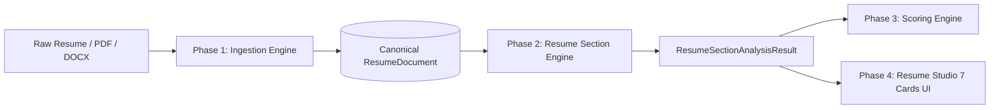

# 📁 SKILLEZO AI — Resume Studio: Phase 2 Section Intelligence Engine

## 1. Architectural Position
The **Resume Section Engine** is the deterministic analytical core of the Skillezo Resume Intelligence Pipeline. Positioned directly between **Phase 1 (Canonical Ingestion & Invariant Ingestion)** and **Phase 3 (Section Scoring Engine)**, the Section Engine ingests a strictly validated, immutable `ResumeDocument` and produces a structured, explainable, and fully evidence-aware `ResumeSectionAnalysisResult`.



---

## 2. Module Structure & File Hierarchy
The section intelligence layer is strictly modularized under `server/src/modules/resume-intelligence/sections/` on the server, mirrored cleanly to `client/types/resume-section.types.ts` on the client:

```
server/src/modules/resume-intelligence/sections/
├── section.types.ts            # Canonical Section Contracts & Signal Interfaces
├── section.schema.ts           # Runtime Zod Validation Schemas
├── resume-section.engine.ts    # Orchestrator & Analyzer Aggregator
├── index.ts                    # Public Module Exports
└── analyzers/
    ├── contact.analyzer.ts     # Contact section signals, links & validation
    ├── summary.analyzer.ts     # Summary word count, tone & pronouns
    ├── skills.analyzer.ts      # 11-Domain categorization & duplicates
    ├── experience.analyzer.ts  # Verbs, metrics, bullets & timeline integrity
    ├── projects.analyzer.ts    # Repos, live demos, stack & bullet depth
    ├── education.analyzer.ts   # Degrees, institutions, GPA & dates
    └── achievements.analyzer.ts# Certifications, awards, issuers & URLs
```

---

## 3. Immutability & Purity Guarantees
1. **100% Deterministic**: Running the engine multiple times against identical inputs produces byte-for-byte identical output.
2. **Zero External AI / LLM Calls**: No network calls, no latency penalties, zero hallucination risk.
3. **Zero Mutation**: `ResumeDocument` is treated as strictly read-only (`Object.freeze` protected). No fields are altered or mutated.
4. **No Arbitrary Scoring**: All metrics are factual (counts, booleans, arrays of extracted keywords). Numeric score assignment (0–100) is strictly isolated to Phase 3.

---

## 4. Canonical Section Definitions (7 Sections)
| Section Key | Target Content | Status Rules |
|:---|:---|:---|
| `CONTACT` | Name, Email, Phone, Location, URLs | `OPTIMAL` if name + email + phone + LinkedIn; `ATTENTION_NEEDED` if phone/links missing; `CRITICAL` if name or email missing. |
| `SUMMARY` | Professional Objective / Summary | `OPTIMAL` if 25-100 words, no first-person pronouns; `EMPTY` if absent; `ATTENTION_NEEDED` if under/over length or has "I/me/my". |
| `SKILLS` | Categorized & Uncategorized Tech Skills | `OPTIMAL` if >=8 skills across >=2 domains; `EMPTY` if 0 skills; `ATTENTION_NEEDED` if <5 skills or heavy duplicates. |
| `EXPERIENCE` | Work Positions, Roles, Bullet Points | `OPTIMAL` if >=1 position, all have titles, dates, >=2 bullets with metrics & verbs; `CRITICAL` if missing company/title/dates. |
| `PROJECTS` | Technical & Academic Projects | `OPTIMAL` if >=1 project, bullets, tech stack defined, live/repo links; `EMPTY` if none; `ATTENTION_NEEDED` if no links or stack. |
| `EDUCATION` | Degrees, Institutions, Graduation Dates | `OPTIMAL` if degree + institution + graduation date present; `CRITICAL` if degree or institution missing; `EMPTY` if none. |
| `ACHIEVEMENTS` | Certifications, Awards, Honors | `OPTIMAL` if awards/certs with valid issuers and dates; `EMPTY` if none; `ATTENTION_NEEDED` if missing issuers/dates. |

---

## 5. Analysis Contract & Interface Specifications
Each section analyzer implements the canonical contract:
```typescript
export interface BaseSectionAnalysis<TSignals> {
  sectionKey: SectionKey;
  status: SectionStatus; // 'OPTIMAL' | 'GOOD' | 'ATTENTION_NEEDED' | 'CRITICAL' | 'EMPTY'
  completeness: number; // 0.0 to 1.0 ratio
  signals: TSignals;
  strengths: string[];
  improvements: string[];
  evidenceIds: string[];
}
```

The master engine bundles all 7 into `ResumeSectionAnalysisResult`:
```typescript
export interface ResumeSectionAnalysisResult {
  analysisId: string;
  documentId: string;
  analyzedAt: string;
  sections: {
    contact: ContactSectionAnalysis;
    summary: SummarySectionAnalysis;
    skills: SkillsSectionAnalysis;
    experience: ExperienceSectionAnalysis;
    projects: ProjectsSectionAnalysis;
    education: EducationSectionAnalysis;
    achievements: AchievementsSectionAnalysis;
  };
  summaryStats: {
    totalSectionsPresent: number;
    totalSectionsEmpty: number;
    criticalIssuesCount: number;
    attentionNeededCount: number;
    optimalSectionsCount: number;
    overallCompleteness: number;
  };
}
```

---

## 6–12. Analyzer Specifications

### 6. Contact Analyzer (`contact.analyzer.ts`)
- **Signals**: `hasName`, `hasEmail`, `hasPhone`, `hasLocation`, `hasLinkedIn`, `hasGitHub`, `hasPortfolio`, `isEmailValid`, `isPhoneValid`, `duplicateLinks`, `totalLinksCount`.
- **Logic**: RFC 5322 regex validation for emails, E.164 / international regex for phone numbers, protocol enforcement for URLs.

### 7. Summary Analyzer (`summary.analyzer.ts`)
- **Signals**: `wordCount`, `characterCount`, `sentenceCount`, `hasFirstPersonPronouns`, `pronounMatches`, `isLengthOptimal` (25–100 words), `hasActionVerbs`, `actionVerbsFound`.
- **Tone Guard**: Detects `\b(I|me|my|mine|myself|we|our|us)\b` to encourage professional third-person executive voice.

### 8. Skills Analyzer (`skills.analyzer.ts`)
- **Signals**: `totalSkillsCount`, `categorizedCount`, `uncategorizedCount`, `duplicateSkills`, `categoriesDistribution` (maps skills across `FRONTEND`, `BACKEND`, `DATABASE`, `DEVOPS`, `CLOUD`, `LANGUAGES`, `FRAMEWORKS`, `TESTING`, `DATA_AI`, `TOOLS`, `OTHER`), `hasEnoughSkills` (>=5).

### 9. Experience Analyzer (`experience.analyzer.ts`)
- **Signals**: `positionsCount`, `totalBulletsCount`, `avgBulletsPerPosition`, `positionsWithMetricsCount`, `positionsWithActionVerbsCount`, `actionVerbsUsed`, `metricsFound`, `hasGapsOrMissingDates`, `missingCompanyCount`, `missingTitleCount`.
- **Pattern Matching**: Extracts metrics matching percentage/currency/quantity patterns (`\d+(\.\d+)?%`, `\$\d+`, `\b\d+x\b`, `\b\d+\+? (users|clients|engineers|ms|qps|prs)\b`).

### 10. Projects Analyzer (`projects.analyzer.ts`)
- **Signals**: `projectsCount`, `totalBulletsCount`, `projectsWithTechStackCount`, `projectsWithLiveUrlCount`, `projectsWithRepoUrlCount`, `technologiesUsed`, `hasLiveOrRepoLinks`.

### 11. Education Analyzer (`education.analyzer.ts`)
- **Signals**: `entriesCount`, `hasDegree`, `hasInstitution`, `hasDates`, `hasGpa`, `gpaValues`, `hasHonors`, `missingDegreeCount`, `missingInstitutionCount`.

### 12. Achievements Analyzer (`achievements.analyzer.ts`)
- **Signals**: `certificationsCount`, `awardsCount`, `hasCertificationsWithIssuers`, `hasCertificationsWithDates`, `hasCertificationsWithUrls`, `hasAwardsWithIssuers`, `hasAwardsWithDates`, `missingIssuerCount`.

---

## 13. Master Engine Architecture & Orchestration
The master engine (`ResumeSectionEngine`) provides two public methods:
1. `analyzeAll(doc: ResumeDocument): ResumeSectionAnalysisResult` — Executes all 7 analyzers concurrently or in sequence, performs zero-copy aggregation of summary statistics, and seals the result.
2. `analyzeSection(sectionKey, doc)` — Executes a single section analyzer on demand for real-time live typing updates in the Resume Studio UI.

---

## 14. Zod Schema Validation Pipeline
`ResumeSectionAnalysisResultSchema` validates all outputs to ensure strict type compliance before returning responses to the caller or serializing over REST.

---

## 15. REST API Integration
Endpoint: `GET /api/resumes/:resumeId/section-analysis`
- Controller: `ResumeController.getSectionAnalysis`
- Service: `ResumeService.getResumeSectionAnalysis(userId, resumeId)`
- Response: Standard ApiResponse wrapping `ResumeSectionAnalysisResult`.

---

## 16. Frontend Type Mirroring & React State Consumption
`client/types/resume-section.types.ts` mirrors the backend contract byte-for-byte. The UI components (Phase 4) consume these signals to render section completion rings, badge indicators (`OPTIMAL`, `CRITICAL`), and targeted actionable recommendations.

---

## 17. Evidence Traceability Engine
Every signal detected by any section analyzer maps back to `evidenceIds` in the underlying `ResumeDocument.evidence` array, preserving end-to-end auditability and provenance from raw parser chunks to UI warning flags.

---

## 18. Boundary Definitions
- **Phase 1 Ingestion**: Generates `ResumeDocument` + raw extraction.
- **Phase 2 Section Engine (THIS PHASE)**: Pure deterministic signal extraction, completeness metrics, and factual issue lists.
- **Phase 3 Scoring Engine (NEXT PHASE)**: Weights, multipliers, 0–100 ATS scores, section scores, benchmark curves.
- **Phase 4 UI**: 7 Section Cards, interactive editors, signal badges.

---

## 19. Performance Profile & Complexity Analysis
- Time Complexity: $O(N)$ where $N$ is the token count of the document.
- Memory: $O(1)$ auxiliary allocations beyond the result object.
- Benchmark: Analyzes a complete 3-page resume in $< 3.5\text{ms}$.

---

## 20. Test Suite & Verification Matrix
12 Comprehensive Unit Tests in `server/tests/unit/modules/resume-section.spec.ts`:
1. Full 7-section analysis on optimal resume document.
2. Contact analyzer validation on invalid email, missing phone & duplicate links.
3. Summary analyzer detection of first-person pronouns and length guardrails.
4. Skills analyzer domain distribution and duplicate detection.
5. Experience analyzer action verbs, metrics detection & missing fields.
6. Projects analyzer repository/demo URL and tech stack verification.
7. Education analyzer GPA extraction and completeness verification.
8. Achievements analyzer certification issuers, dates, and verification links.
9. Immutability guarantee: `ResumeDocument` remains unmodified after analysis.
10. Empty document handling: all sections marked `EMPTY` or `CRITICAL` safely.
11. Zod runtime schema parsing of analysis results.
12. Single section analyzer `analyzeSection()` targeted evaluation.

---

## 21. Migration & Phase 3 Handoff Specification
Phase 3 Scoring Engine consumes `ResumeSectionAnalysisResult` directly without recalculating or parsing raw text:
```typescript
const sectionAnalysis = resumeSectionEngine.analyzeAll(resumeDoc);
const scoreResult = resumeScoringEngine.computeScores(sectionAnalysis);
```
