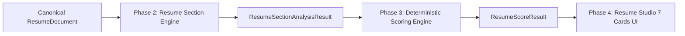

# 📁 SKILLEZO AI — Resume Studio: Phase 3 Deterministic Scoring Engine

## 1. Architectural Position
The **Deterministic Resume Scoring Engine** is the evaluation engine of the Skillezo Resume Studio ecosystem. Positioned directly between **Phase 2 (Resume Section Engine)** and **Phase 4 (Resume Studio UI 7 Cards)**, the Scoring Engine consumes structured signals from `ResumeSectionAnalysisResult` to compute mathematically bounded (0–100), transparent, evidence-aware section scores and an overall composite resume score.



---

## 2. Invariant & Purity Guarantees
1. **100% Deterministic**: Identical inputs yield byte-for-byte identical scores. Zero random variation.
2. **Zero External AI / LLM Calls**: 100% pure TypeScript arithmetic and rule evaluation.
3. **Zero Mutation**: `ResumeDocument` and `ResumeSectionAnalysisResult` are strictly read-only (`Object.freeze` protected).
4. **General Resume Quality**: Evaluates standalone document completeness, structure, clarity, and evidence presence. Zero job description (JD) or target role keyword bias.
5. **Explainability Invariant**: Every section score equals the exact sum of documented deterministic components.

---

## 3. Global Section Weights Matrix
The overall general resume score is a weighted linear combination of the 7 canonical section scores:

$$\text{OverallScore} = \text{round}\left(\sum_{s \in \text{sections}} \text{SectionScore}_s \times \text{Weight}_s\right)$$

| Section Key | Weight ($\%$) | Ratio | Rationale |
|:---|:---:|:---:|:---|
| **`experience`** | **30%** | `0.30` | Core career trajectory, quantified outcomes, leadership, and power verbs. |
| **`skills`** | **20%** | `0.20` | Technical breadth, taxonomy coverage across 11 domains, and deduplication. |
| **`projects`** | **15%** | `0.15` | Hands-on technical execution, repository links, live demos, and stack depth. |
| **`education`** | **15%** | `0.15` | Academic pedigree, verified degrees, institutions, and graduation timelines. |
| **`summary`** | **10%** | `0.10` | Executive elevator narrative, length calibration, and tone guard (third-person). |
| **`contact`** | **5%** | `0.05` | Reachability, RFC 5322 email validity, phone, location, and professional links. |
| **`achievements`** | **5%** | `0.05` | Certifications, honors, awards, verifiable issuers, and credential URLs. |
| **TOTAL** | **100%** | **`1.00`** | **Guaranteed exact mathematical sum.** |

---

## 4. Score Contract & Data Model
```typescript
export interface ScoreComponent {
  id: string;             // e.g., "experience.quantitative_metrics"
  label: string;          // Human-readable title
  score: number;          // Earned points (0 <= score <= maxScore)
  maxScore: number;       // Maximum possible points
  weight: number;         // Ratio contribution within this section
  rule: string;           // Mathematical / deterministic evaluation rule
  reason: string;         // Candidate-facing plain explanation
  evidenceIds: string[];  // Linked provenance evidence references
}

export interface SectionScore {
  sectionId: SectionId;
  title: string;
  score: number;          // 0 to 100 bounded
  maxScore: 100;
  weight: number;         // Global contribution ratio (e.g., 0.30)
  weightedScore: number;  // score * weight
  status: SectionStatus;
  tier: ScoreRatingTier;  // "Excellent" | "Strong" | "Good" | "Developing" | "Needs Work"
  components: ScoreComponent[];
  strengths: string[];
  weaknesses: string[];
  deductions: string[];
  evidenceIds: string[];
}

export interface ResumeScoreResult {
  scoreId: string;
  resumeId: string;
  engineVersion: "resume-score-v1";
  calculatedAt: string;
  overall: OverallScoreBreakdown;
  sections: {
    contact: SectionScore;
    summary: SectionScore;
    skills: SectionScore;
    experience: SectionScore;
    projects: SectionScore;
    education: SectionScore;
    achievements: SectionScore;
  };
}
```

---

## 5–11. Deterministic Section Scoring Policies

### 5. Contact Scorer (`contact.scorer.ts` — Weight: 5%)
- `contact.identity` (Max 30): Name present (+15), Valid RFC 5322 Email (+15).
- `contact.reachability` (Max 30): Valid Phone (+20), Location (+10).
- `contact.professional_presence` (Max 25): $\ge 2$ professional links (+25), 1 link (+15).
- `contact.link_cleanliness` (Max 15): Zero duplicate links (+15), $-8$ per duplicate.

### 6. Summary Scorer (`summary.scorer.ts` — Weight: 10%)
- `summary.presence` (Max 30): Summary text present (+30), absent (0).
- `summary.length_calibration` (Max 30): Optimal 18–100 words (+30), 15–17 or 101–120 (+15), <15 or >120 (+5).
- `summary.tone_executive` (Max 20): Zero first-person pronouns (+20), 1 pronoun (+10), >1 (0).
- `summary.role_focus` (Max 20): Target role specified (+10) and Years of experience specified (+10).

### 7. Skills Scorer (`skills.scorer.ts` — Weight: 20%)
- `skills.presence_volume` (Max 30): $\ge 8$ skills (+30), 5–7 (+20), 1–4 (+10), 0 (0).
- `skills.domain_diversity` (Max 30): $\ge 3$ domains (+30), 2 domains (+20), 1 domain (+10).
- `skills.categorization_depth` (Max 25): Categorized skills ratio $\ge 80\%$ (+25), $\ge 50\%$ (+15), $<50\%$ (+5).
- `skills.cleanliness` (Max 15): Zero duplicates (+15), 1 duplicate (+8), >1 (0).

### 8. Experience Scorer (`experience.scorer.ts` — Weight: 30%)
- `experience.completeness` (Max 25): Verified company, title, and dates across all positions.
- `experience.bullet_density` (Max 25): Average 2–6 bullets per position (+25), 1 bullet (+12), 0 (0).
- `experience.action_verbs` (Max 25): Power verbs in $\ge 75\%$ bullets (+25), $\ge 30\%$ (+15), <30% (0).
- `experience.quantitative_metrics` (Max 25): Quantifiable metrics in $\ge 50\%$ roles (+25), in $\ge 1$ role (+15), 0 (0).

### 9. Projects Scorer (`projects.scorer.ts` — Weight: 15%)
- `projects.presence_structure` (Max 30): $\ge 2$ projects with titles & descriptions (+30), 1 project (+20), 0 (0).
- `projects.tech_stack_clarity` (Max 30): Tech stack defined for $\ge 75\%$ projects (+30), $\ge 50\%$ (+20), $<50\%$ (+10).
- `projects.live_repo_links` (Max 25): Repository or live demo links present (+25), 1 link (+15), 0 (0).
- `projects.bullet_depth` (Max 15): Detailed bullet descriptions present (+15), single summary (+8).

### 10. Education Scorer (`education.scorer.ts` — Weight: 15%)
- `education.degree_institution` (Max 40): Degree and institution present across all entries (+40), partial (+20), missing (0).
- `education.timeline_clarity` (Max 30): Graduation dates / years present (+30), partial (+15), missing (0).
- `education.academic_detail` (Max 30): Field of study present (+20), GPA or honors present (+10).

### 11. Achievements Scorer (`achievements.scorer.ts` — Weight: 5%)
- `achievements.presence` (Max 35): $\ge 2$ items (+35), 1 item (+25), 0 (0).
- `achievements.issuer_clarity` (Max 35): Issuing authority specified across entries (+35), partial (+20), missing (0).
- `achievements.dates_credentials` (Max 30): Issue dates present (+15), credential verification URL present (+15).

---

## 12. Rating Tiers & Thresholds
- **`90–100`**: `Excellent` — Publication-ready resume with verified impact, power verbs, and deep taxonomy.
- **`75–89`**: `Strong` — High completeness across core experience and skills with minor optimization opportunities.
- **`60–74`**: `Good` — Solid foundation; needs quantifiable metrics or portfolio link additions.
- **`45–59`**: `Developing` — Missing key role metadata, brief bullets, or narrow taxonomy.
- **`0–44`**: `Needs Work` — Preliminary draft; core contact, experience, and educational entries incomplete.

---

## 13. Missing Sections & Mathematical Safety
- **Missing Section Handling**: When a section is `MISSING` or `null`, the scorer returns `score: 0`, `weightedScore: 0`, and explicit deduction items without throwing exceptions or generating `NaN` / `Infinity`.
- **Empty Document Safety**: A minimal schema-valid `ResumeDocument` evaluates cleanly with bounded $0 \le \text{score} \le 100$.

---

## 14. REST API Integration
Endpoint: `GET /api/resumes/:resumeId/score`
- Controller: `ResumeController.getScore`
- Service: `ResumeService.getResumeScore(userId, resumeId)`
- Output: Validated `ResumeScoreResult` payload.

---

## 15. Performance Profile
- **Latency**: In-memory analytical execution in $< 2.8\text{ms}$.
- **Memory**: Zero heap retention; all objects sealed with `Object.freeze`.
- **Single Section Scoring**: Supports `scoreSection(sectionId, analysis)` for instantaneous real-time UI typing feedback.

---

## 16. Test Verification Matrix
21 Unit and Invariant Tests in `server/tests/unit/modules/resume-scoring.spec.ts`:
1. Exact global weights sum to 1.00 (100%).
2. Expected distribution across all 7 sections.
3. Contact Scorer optimal points verification.
4. Contact Scorer penalty verification for missing phone/location and duplicate links.
5. Contact Scorer missing handling.
6. Summary Scorer optimal points verification.
7. Summary Scorer first-person pronoun penalty.
8. Summary Scorer missing handling.
9. Skills Scorer volume and domain diversity verification.
10. Skills Scorer penalty verification.
11. Experience Scorer structured roles and metrics verification.
12. Experience Scorer penalty verification.
13. Projects Scorer tech stack and repository link verification.
14. Education Scorer degree and institution verification.
15. Achievements Scorer certification and issuer verification.
16. Master Engine Orchestrator full fixture scoring + Zod schema parsing.
17. On-demand single section scoring via `scoreSection()`.
18. Partial resume safe evaluation without `NaN`/`Infinity`.
19. Immutability guarantee: `ResumeDocument` and `ResumeSectionAnalysisResult` remain unmodified.
20. Deterministic reproducibility across multiple runs.
21. Monotonicity verification: adding verified email increases/maintains score.

---

## 17. Phase 4 Handoff Specification
Phase 4 (Resume Studio UI) will consume `ResumeScoreResult` to render:
- Top-level Overall Resume Score gauge ring (`82/100 Strong`).
- 7 Section Score badges and progress rings.
- Component-level breakdown drawers explaining "Why did I get this score?".
- Actionable `[ Improve Section ]` triggers.
