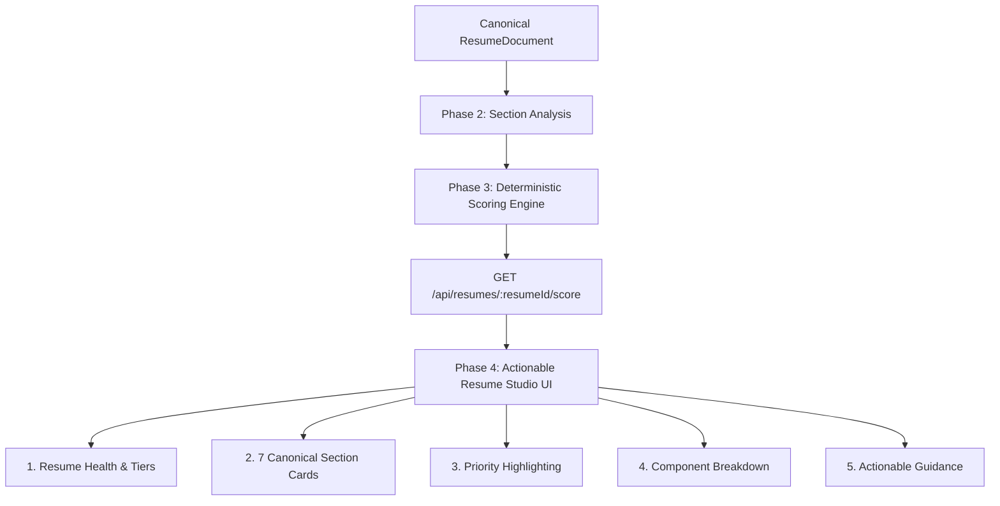

# 📁 SKILLEZO AI — Resume Studio: Phase 4 UX Foundation & Actionable Analysis

## 1. Architectural Position
**Phase 4** delivers the candidate-facing **Actionable Analysis User Experience** for Skillezo Resume Studio. Consuming the frozen contracts of **Phase 2 (Section Engine)** and **Phase 3 (Deterministic Scoring Engine)** via `GET /api/resumes/:resumeId/score`, Phase 4 organizes raw diagnostic metrics into an intuitive, calm, and actionable diagnostic workflow.

---

## 2. Invariant & Phase Boundary Guarantees
1. **Zero Scoring Engine Changes**: All scores, weights, component breakdowns, and rating tiers are 100% computed on the backend and consumed via API. No client-side recalculation.
2. **Zero AI / LLM Calls**: Presentation layer relies strictly on deterministic signals and rule reasons.
3. **Zero Content Mutation / Editing**: Read-only diagnostic view. Content editing and AI rewriting are strictly isolated to subsequent phases (Phase 5+).
4. **Zero Resume Builder / Templates / PDF Export**: Visual editing and PDF rendering belong to Phase 7+.
5. **Deterministic Presentation Derivation**: UI derives only presentation flags (e.g. `strongestSection`, `prioritySection`, `activeSectionKey`) from the verified API response.

---

## 3. Information Architecture & UX Hierarchy

### A. Header Bar
- Active resume title and metadata.
- Multi-resume switcher dropdown with instant state synchronization.
- Real-time `Re-score` trigger with active spinner.
- Clear status badges distinguishing `Live Candidate Analysis` from `Sample Preview Mode`.
- Direct link to `Developer View` (`/dashboard/resume-studio/dev`).

### B. Resume Health Banner
- Overall General Score (`0–100`) and Rating Tier badge (`Excellent`, `Strong`, `Good`, `Developing`, `Needs Work`).
- Plain-language summary reasoning generated by the scoring engine.
- Quick Insight Badges:
  - 🌟 **Strongest Section**: Derived deterministically as the highest-scoring section.
  - 🎯 **Highest Priority**: Derived deterministically as the lowest-scoring section to guide candidate review.

### C. 7 Canonical Section Cards (Master Pane)
Compact, accessible overview cards for all 7 sections:
1. `Work Experience` (Weight: 30%)
2. `Technical Skills` (Weight: 20%)
3. `Featured Projects` (Weight: 15%)
4. `Education & Academics` (Weight: 15%)
5. `Professional Summary` (Weight: 10%)
6. `Contact Information` (Weight: 5%)
7. `Achievements & Certifications` (Weight: 5%)

Each card displays section title, icon, global weight contribution, earned score (`/100`), rating tier, and a dynamic `Priority` badge if the section requires attention.

### D. Section Deep-Dive (Detail Pane)
When a section is selected, the detail pane reveals:
1. **Header**: Section title, earned score, tier badge, and exact weighted point contribution.
2. **Scoring Rules Breakdown**: Granular list of all `ScoreComponent` items with earned score / max points, percentage, rule description, and candidate-facing explanation.
3. **Actionable Guidance ("What to Improve")**: Deterministic guidance derived from low-scoring components (e.g., quantifying measurable outcomes in experience bullets, employing active power verbs, providing repository/deployment links).
4. **Verified Strengths & Deductions**: High-contrast list of positive evidence and point deduction factors.

---

## 4. Polished UI States
- **Loading State**: Lightweight animated skeleton placeholders for header, health banner, master cards, and detail pane.
- **Sample Preview Mode**: When no resume is uploaded, seamlessly displays verified sample document scores with an explicit `Sample Preview Mode` indicator.
- **Error State**: Graceful error banner with one-click `Retry` trigger if API connectivity fails.
- **Multi-Resume Isolation**: Instant state reset when switching resumes, ensuring zero stale data leaks.

---

## 5. Responsive Design & Accessibility
- **Dual-Pane Grid**: 12-column responsive layout (5 cols master / 7 cols detail) on large screens.
- **Single-Column Flow**: Collapses smoothly into stacked cards on tablet and mobile viewports.
- **Keyboard Navigation**: All cards are accessible semantic buttons with clear focus rings.
- **Theme Compatibility**: High-contrast support for both Clean Light and Cosmic Dark themes.

---

## 6. Phase 5 Handoff Specification
Phase 4 provides the structural foundation for **Phase 5: Section AI Editor with Evidence Lock (M2)**. Phase 5 will introduce interactive `[ Improve Section ]` triggers that open evidence-constrained Gemini rewrite drawers without disrupting the underlying deterministic scoring engine.
