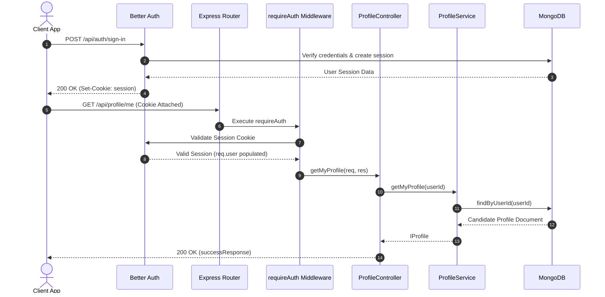
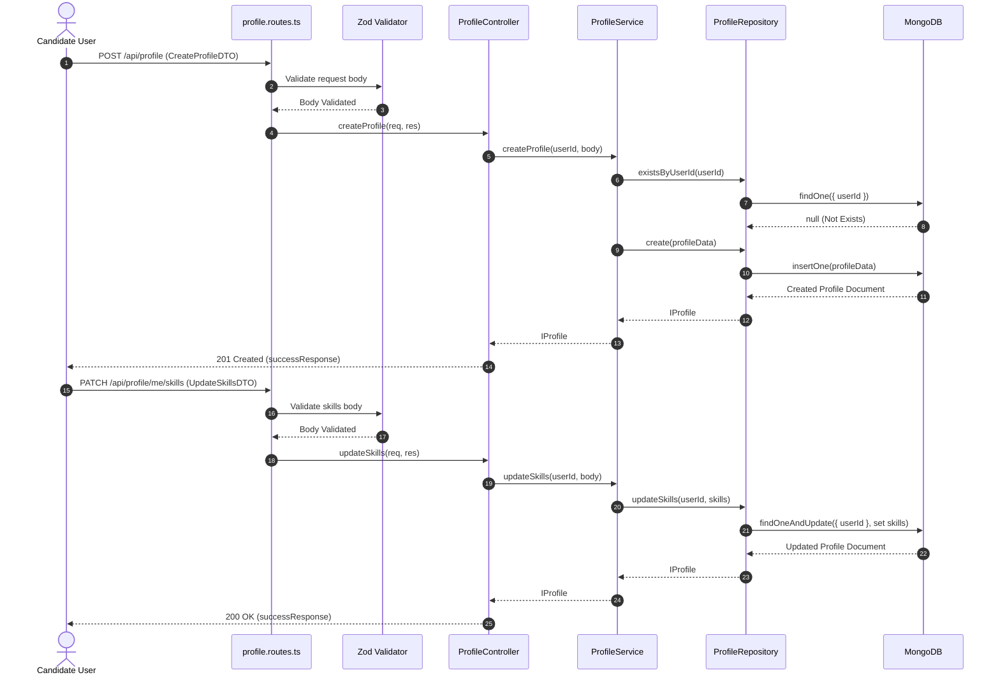
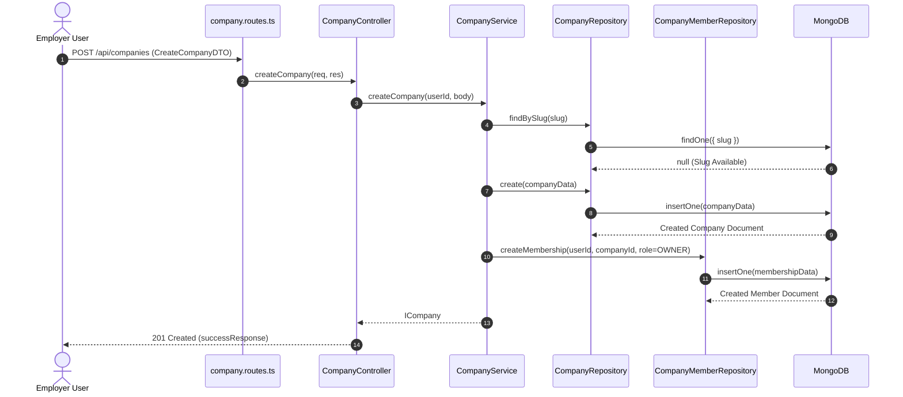
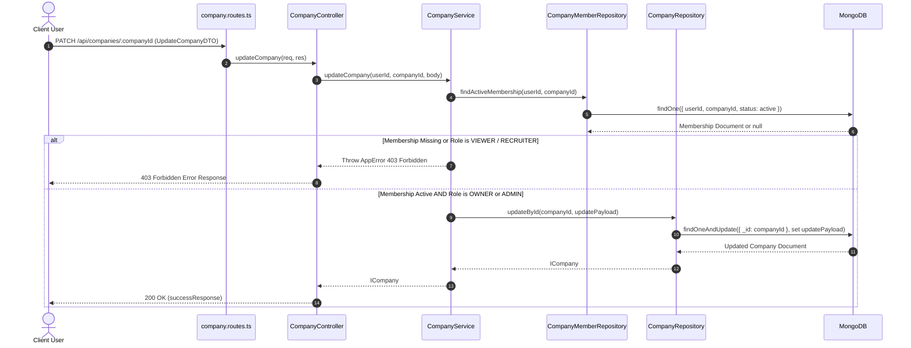

# SKILLEZO Backend — API Sequence Flows

This document contains visual Mermaid sequence diagrams illustrating end-to-end data flows across completed backend modules.

---

## 1. Authentication & Session Verification Flow

---

## 2. Candidate Profile Creation & Partial Updates Flow

---

## 3. Company Creation & Automatic Owner Membership Flow

---

## 4. Company Update Authorization Flow

