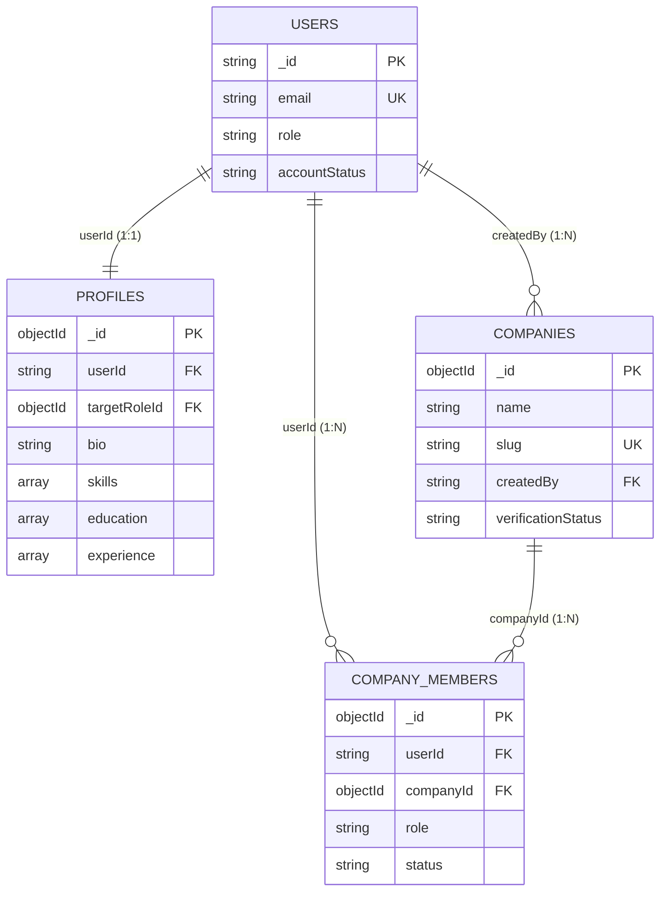

# SKILLEZO Backend — Database Architecture

This document describes the MongoDB database architecture, indexing strategies, and entity relationships implemented in SKILLEZO.

---

## 1. Database Paradigm

* **Database Engine**: MongoDB Atlas (NoSQL Document Store)
* **Object-Document Mapper**: Mongoose ODM
* **Data Access Pattern**: Repository Pattern extending `BaseRepository<T>`

---

## 2. ID Architecture Standards

| Entity Type | ID System | Data Type | Purpose | Example |
| :--- | :--- | :--- | :--- | :--- |
| **Auth User** | Better Auth | `String` | Manages identity, session cookie validation, authentication. | `"usr_987654321"` |
| **Domain Entity** | MongoDB | `ObjectId` | Identifies entity documents (`Profile`, `Company`, `CompanyMember`). | `"66b8c1f92e40123456789abc"` |

---

## 3. Entity Relationships

---

## 4. Indexing & Constraints

1. **`users`**: Unique index on `email`. Indexes on `role` and `accountStatus`.
2. **`profiles`**: Unique index on `userId` (enforces 1 Candidate Profile per user). Index on `targetRoleId` and `skills.name`.
3. **`companies`**: Unique index on `slug`. Indexes on `name`, `industry`, `verificationStatus`, and `location.city`.
4. **`company_members`**: Compound unique index `{ userId: 1, companyId: 1 }` (prevents duplicate memberships). Index on `{ companyId: 1, role: 1 }`.
