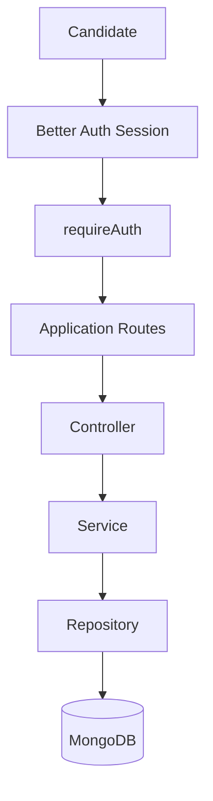
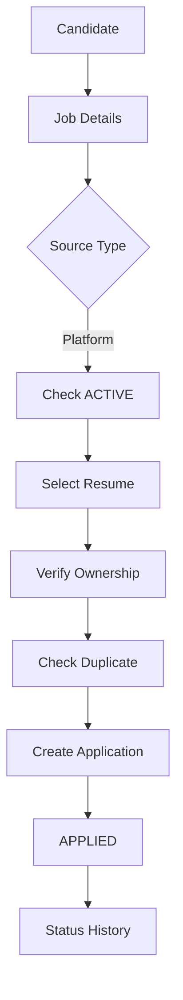
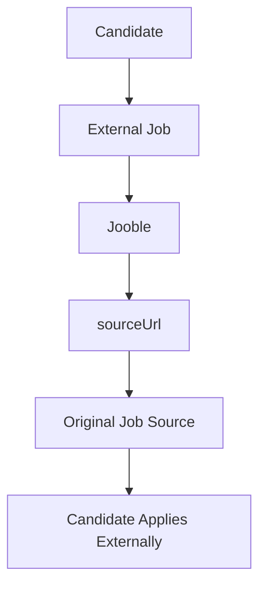

# Phase 17 — Candidate Application Management & Application Workflow

## Objective

Build the backend Candidate Application Management & Application Workflow for SKILLEZO.

This phase connects:
- Better Auth authentication
- Candidate Profile
- Resume Management
- Native Job Management
- External Job Ingestion
- Public Job Discovery
- Job Details

into:

```text
Candidate
  ↓
Authentication
  ↓
Profile
  ↓
Resume
  ↓
Job Discovery
  ↓
Job Details
  ↓
Apply
  ↓
Application
  ↓
Application Tracking
```

This is **BACKEND ONLY**. Do not create or modify frontend pages, components, hooks, API clients, state management, or UI.

---

# 1. Audit Before Implementation

Before changing anything, perform a read-only audit of:

```text
src/database/models/Application.model.ts
src/database/repositories/application/
src/database/models/Job.model.ts
src/database/repositories/job/
src/database/models/Resume.model.ts
src/database/repositories/resume/

src/core/auth/
src/core/auth/middleware/requireAuth.ts
src/core/constants/enums.ts
src/core/constants/error-codes.ts
src/core/constants/http-status.ts
src/core/validators/
src/core/middleware/

src/modules/profile/
src/modules/jobs/
src/modules/resume/
src/modules/company/
src/modules/company-member/
src/server.ts
```

Also inspect existing DTO, validator, controller, service, repository, response, error-handling, asyncHandler, validation, ObjectId, authentication, and API documentation conventions.

Rules:
- Reuse existing Application models, repositories, enums, indexes, and status history.
- Extend existing functionality rather than duplicating it.
- Do not redesign unrelated architecture.
- Do not create duplicate models, enums, repositories, or business concepts.

---

# 2. Domain Relationship

```text
Better Auth
    │ user.id
    ▼
Candidate
    │ userId
    ▼
Application
   /      jobId    resumeId
  │         │
  ▼         ▼
 Job      Resume
```

Types must remain:

```text
Application.userId   → string → Better Auth user.id
Application.jobId    → MongoDB ObjectId → Job._id
Application.resumeId → MongoDB ObjectId → Resume._id
```

Do not convert these relationships.

---

# 3. Identity and Ownership

The candidate identity MUST come only from:

```ts
req.user.id
```

Never accept `userId` from:
- body
- query
- URL
- frontend DTO

Valid request:

```json
{
  "jobId": "...",
  "resumeId": "..."
}
```

Backend derives:

```ts
const userId = req.user.id;
```

All candidate application queries must be scoped to that identity.

---

# 4. Business Objective

Candidates must be able to:

1. Apply to eligible native SKILLEZO jobs.
2. Select one of their own resumes.
3. Prevent duplicate applications.
4. View their applications.
5. View application details.
6. View status history.
7. Withdraw applications where permitted.
8. Distinguish native and external jobs.
9. Continue to the original source for external jobs.

---

# 5. Native vs External Jobs

## Native Job

```text
sourceType = platform
```

Flow:

```text
Candidate
  ↓
SKILLEZO Job
  ↓
Apply
  ↓
Select Resume
  ↓
Validate Ownership
  ↓
Create Application
  ↓
APPLIED
```

Create a real Application document.

## External Job

Example:

```text
sourceType = external
sourceProvider = jooble
```

Flow:

```text
Candidate
  ↓
External Job
  ↓
sourceUrl
  ↓
Original Source
  ↓
Candidate applies externally
```

Do NOT create an internal Application for external jobs.

Do NOT claim SKILLEZO submitted the application.

Return:

```json
{
  "type": "external_application",
  "sourceType": "external",
  "sourceProvider": "jooble",
  "externalId": "...",
  "sourceUrl": "...",
  "message": "Continue the application on the original job source."
}
```

If `sourceUrl` is missing or invalid, return a controlled error.

---

# 6. Application Status

First inspect existing enums.

If missing, create ONE canonical enum:

```text
APPLIED
SHORTLISTED
INTERVIEW
SELECTED
REJECTED
WITHDRAWN
```

Do not create duplicate status definitions.

---

# 7. Status State Machine

```text
                    ┌──────────────┐
                    │    APPLIED   │
                    └──────┬───────┘
                           │
             ┌─────────────┼──────────────┐
             ▼             ▼              ▼
       SHORTLISTED     REJECTED       WITHDRAWN
             │
             ▼
         INTERVIEW
             │
        ┌────┴─────┐
        ▼          ▼
    SELECTED    REJECTED
```

Candidate-controlled:
- APPLIED → WITHDRAWN
- SHORTLISTED → WITHDRAWN
- INTERVIEW → WITHDRAWN

Recruiter-controlled:
- SHORTLISTED
- INTERVIEW
- SELECTED
- REJECTED

Do NOT implement recruiter status APIs in Phase 17.

---

# 8. Initial Status and History

Every new native application starts:

```text
APPLIED
```

Create initial history:

```json
{
  "status": "APPLIED",
  "changedBy": "req.user.id",
  "changedAt": "current timestamp"
}
```

Reuse existing `statusHistory` if present.

Candidates cannot create arbitrary history records.

---

# 9. Error Codes

Audit existing codes first. Add only missing codes:

```text
APPLICATION_NOT_FOUND
APPLICATION_ALREADY_EXISTS
APPLICATION_JOB_NOT_FOUND
APPLICATION_JOB_NOT_ACTIVE
APPLICATION_RESUME_NOT_FOUND
APPLICATION_RESUME_NOT_OWNED
APPLICATION_EXTERNAL_JOB
APPLICATION_ALREADY_WITHDRAWN
APPLICATION_CANNOT_WITHDRAW
APPLICATION_INVALID_STATUS
```

Reuse existing generic errors where appropriate.

---

# 10. Application Model and Indexes

Audit `Application.model.ts`.

Verify:

```text
userId
jobId
resumeId
status
statusHistory
createdAt
updatedAt
```

Preserve or create the unique compound index:

```text
{ userId: 1, jobId: 1 }
```

This is required for duplicate protection.

Do not remove existing indexes.

---

# 11. Duplicate Protection

Implement BOTH:

### Service-level protection

```text
findByUserAndJob(userId, jobId)
```

If existing:

```text
409 APPLICATION_ALREADY_EXISTS
```

### Database-level protection

Unique:

```text
userId + jobId
```

Handle MongoDB duplicate-key errors and convert them to the standard conflict response.

This must protect against concurrent requests.

---

# 12. Repository

Create or extend:

```text
src/database/repositories/application/ApplicationRepository.ts
```

Implement as required:

```ts
createApplication()
findById()
findByUserId()
findByUserAndJob()
existsByUserAndJob()
updateStatus()
addStatusHistory()
withdrawApplication()
```

Candidate-specific operations must enforce user scope.

Prefer:

```ts
findByIdAndUserId(applicationId, userId)
```

or equivalent.

---

# 13. DTO Layer

Create or extend:

```text
src/modules/application/application.dto.ts
```

Define:

```text
CreateApplicationDTO
ApplicationResponseDTO
ApplicationListItemDTO
ApplicationStatusHistoryDTO
PaginatedApplicationsResponseDTO
```

Create request:

```json
{
  "jobId": "mongodb-object-id",
  "resumeId": "mongodb-object-id"
}
```

Do NOT accept:

```text
userId
status
statusHistory
createdAt
updatedAt
```

---

# 14. Validation

Create or extend:

```text
src/modules/application/application.validator.ts
```

Use existing `objectIdSchema` for:

```text
jobId
resumeId
applicationId
```

Do not validate Better Auth `userId` as ObjectId.

Validate:
- required fields
- ObjectId formats
- pagination
- status filters
- route params

Use existing Zod conventions.

---

# 15. Service

Create or extend:

```text
src/modules/application/application.service.ts
```

Implement:

```text
applyToJob()
getMyApplications()
getMyApplication()
getApplicationStatusHistory()
withdrawApplication()
```

All business rules belong here.

---

# 16. Apply Flow

Implement:

```text
POST /api/applications
        ↓
requireAuth
        ↓
req.user.id
        ↓
Validate jobId + resumeId
        ↓
Find Job
        ↓
Job exists?
   ┌────┴────┐
   NO       YES
   ↓         ↓
  404    sourceType?
             │
       ┌─────┴─────┐
       ▼           ▼
   external     platform
       │           │
       ▼           ▼
   sourceUrl   ACTIVE?
                   │
                   ▼
             Find Resume
                   │
                   ▼
          Verify Ownership
                   │
                   ▼
          Check Duplicate
                   │
                   ▼
         Create Application
                   │
                   ▼
                APPLIED
                   │
                   ▼
            Status History
```

---

# 17. Native Job Rules

For:

```text
sourceType = platform
```

require:

```text
Job exists
AND
Job.status = ACTIVE
```

Reject:

```text
DRAFT
CLOSED
ARCHIVED
```

Do not allow applications to inactive jobs.

---

# 18. Resume Ownership

Never trust the supplied `resumeId`.

Verify:

```text
Resume._id === resumeId
AND
Resume.userId === req.user.id
```

Reuse existing:

```ts
findUserResumeById(userId, resumeId)
```

If not owned, reject without leaking another user's data.

---

# 19. Create Application

For valid native jobs:

```text
userId = req.user.id
jobId = validated jobId
resumeId = validated resumeId
status = APPLIED
```

Create the Application and initial status history.

Return a normalized response.

---

# 20. Candidate Application List

Implement:

```http
GET /api/applications
```

Protected by `requireAuth`.

Only return:

```text
Application.userId === req.user.id
```

Support:

```text
page
limit
status
```

Recommended:

```text
page = 1
limit = 20
max limit = 50
```

Default sort:

```text
createdAt DESC
```

Use existing Jobs pagination conventions where possible.

---

# 21. Application Details

Implement:

```http
GET /api/applications/:applicationId
```

Require authentication and ownership.

Return normalized:

```text
applicationId
status
job summary
resume summary
createdAt
updatedAt
statusHistory
```

Do not return raw Mongoose documents or sensitive internal fields.

---

# 22. Status History

Implement:

```http
GET /api/applications/:applicationId/status-history
```

Require application ownership.

Return chronological entries:

```json
[
  {
    "status": "APPLIED",
    "changedBy": "...",
    "changedAt": "..."
  }
]
```

---

# 23. Withdrawal

Implement:

```http
PATCH /api/applications/:applicationId/withdraw
```

Require authentication and ownership.

Recommended allowed transitions:

```text
APPLIED → WITHDRAWN
SHORTLISTED → WITHDRAWN
INTERVIEW → WITHDRAWN
```

Reject:

```text
REJECTED → WITHDRAWN
SELECTED → WITHDRAWN
WITHDRAWN → anything
```

Double withdrawal:

```text
409 APPLICATION_ALREADY_WITHDRAWN
```

When successful:

```text
status = WITHDRAWN
```

Append:

```json
{
  "status": "WITHDRAWN",
  "changedBy": "req.user.id",
  "changedAt": "current timestamp"
}
```

---

# 24. Candidate Status Security

Do NOT create a generic candidate status-update endpoint.

Reject attempts to submit:

```json
{
  "status": "SELECTED"
}
```

or:

```json
{
  "status": "SHORTLISTED"
}
```

Candidates cannot promote themselves through the recruiter pipeline.

---

# 25. Controller

Create or extend:

```text
src/modules/application/application.controller.ts
```

Controller responsibilities:

1. Extract authenticated identity.
2. Extract validated input.
3. Call service.
4. Return `successResponse()`.
5. Pass errors to existing error handling.

No business logic in controllers.

---

# 26. Routes

Create or extend:

```text
src/modules/application/application.routes.ts
```

Routes:

```http
POST   /api/applications
GET    /api/applications
GET    /api/applications/:applicationId
GET    /api/applications/:applicationId/status-history
PATCH  /api/applications/:applicationId/withdraw
```

All require:

```text
requireAuth
```

Use:

```text
validate(...)
asyncHandler(...)
```

according to existing project conventions.

---

# 27. Route Registration

Mount:

```text
/api/applications
```

in the existing server routing structure.

Do not break:

```text
/api/auth
/api/profile
/api/companies
/api/company-members
/api/jobs
/api/job-ingestion
/api/resumes
/api/health
/api/health/ready
```

---

# 28. Response Contract

Use existing SKILLEZO response format:

```json
{
  "success": true,
  "data": {}
}
```

Paginated:

```json
{
  "success": true,
  "data": {
    "items": [],
    "meta": {
      "page": 1,
      "limit": 20,
      "total": 100,
      "totalPages": 5,
      "hasNextPage": true,
      "hasPreviousPage": false
    }
  }
}
```

Do not introduce a second response format.

---

# 29. Response Normalization

Do not return raw Mongoose documents.

Example:

```json
{
  "id": "...",
  "job": {
    "id": "...",
    "title": "...",
    "companyName": "...",
    "location": "...",
    "workplaceType": "...",
    "employmentType": "..."
  },
  "resume": {
    "id": "...",
    "title": "...",
    "isDefault": true
  },
  "status": "APPLIED",
  "createdAt": "...",
  "updatedAt": "..."
}
```

Never expose:
- physical resume paths
- filesystem paths
- secrets
- password/authentication fields
- unnecessary internal MongoDB fields

---

# 30. API Documentation

Create:

```text
server/doc/03-api/application/APPLICATIONS_API.md
```

Document every endpoint with:

- Purpose
- Method
- URL
- Authentication
- Headers
- Request body
- Query parameters
- Path parameters
- Validation
- Success response
- Error responses
- Ownership rules
- Business rules
- Example request
- Example response

Endpoint table:

| Method | Endpoint | Auth | Purpose |
|---|---|---|---|
| POST | `/api/applications` | Required | Apply to native job |
| GET | `/api/applications` | Required | List candidate applications |
| GET | `/api/applications/:applicationId` | Required | Application details |
| GET | `/api/applications/:applicationId/status-history` | Required | Status history |
| PATCH | `/api/applications/:applicationId/withdraw` | Required | Withdraw application |

Document external-job behavior separately.

---

# 31. Frontend Integration Contract

No frontend code should be written, but documentation must clearly explain:

```text
if job.sourceType === "platform"
    → POST /api/applications

if job.sourceType === "external"
    → use/open job.sourceUrl
```

Candidate application list:

```http
GET /api/applications
```

Details:

```http
GET /api/applications/:applicationId
```

History:

```http
GET /api/applications/:applicationId/status-history
```

Withdraw:

```http
PATCH /api/applications/:applicationId/withdraw
```

The frontend must not need to understand MongoDB internals.

---

# 32. Architecture Documentation

Create:

```text
server/doc/application/application-management.md
```

Include:

1. Purpose
2. Business problem
3. Domain relationships
4. Architecture
5. Candidate workflow
6. Native job flow
7. External job flow
8. Resume ownership
9. Duplicate protection
10. Application state machine
11. Status history
12. Withdrawal rules
13. Security model
14. Database model
15. Repository behavior
16. Service behavior
17. API routes
18. Error handling
19. Testing
20. Future recruiter boundary

Architecture diagram:



Native flow:



External flow:



Explicitly document:

```text
No internal Application document is created for external jobs.
```

---

# 33. Security Model

Document:

```text
Authentication
    ↓
req.user.id
    ↓
Ownership Scope
    ↓
Application.userId
```

Candidate can:

```text
CREATE own application
READ own applications
READ own application history
WITHDRAW own application
```

Candidate cannot:

```text
READ another candidate's application
READ another candidate's history
USE another candidate's resume
CHANGE recruiter-controlled status
CREATE fake status history
```

---

# 34. Database Integrity

Verify:

```text
Application.userId → String
Application.jobId → ObjectId
Application.resumeId → ObjectId
```

Verify:

```text
{ userId: 1, jobId: 1 }
```

is unique.

Verify status history and timestamps.

Do not remove existing indexes.

---

# 35. Consistency / Transaction Strategy

Application creation involves:

```text
Create Application
+
Create Initial Status History
```

Inspect existing MongoDB/Mongoose infrastructure.

If transactions are already safely supported, use them appropriately.

If not, avoid introducing a large infrastructure rewrite. Implement a safe consistency strategy consistent with the current project and document it.

---

# 36. API Tests

Perform actual HTTP/API tests.

### Test 1 — Unauthenticated

```http
POST /api/applications
```

Expected:

```text
401
```

### Test 2 — Valid Native Application

Use:
- authenticated candidate
- ACTIVE platform job
- candidate-owned resume

Expected:

```text
201
status = APPLIED
```

Verify MongoDB.

### Test 3 — Duplicate

Apply again.

Expected:

```text
409
APPLICATION_ALREADY_EXISTS
```

Verify exactly one record.

### Test 4 — Wrong Resume

Use another candidate's resume.

Expected:

```text
403 or 404
```

No application created.

### Test 5 — Invalid Resume ID

Expected:

```text
400 VALIDATION_ERROR
```

### Test 6 — Invalid Job ID

Expected:

```text
400 VALIDATION_ERROR
```

### Test 7 — Missing Job

Expected:

```text
404 APPLICATION_JOB_NOT_FOUND
```

or existing equivalent.

### Test 8 — Inactive Job

Try DRAFT/CLOSED/ARCHIVED.

Expected rejection.

No application created.

### Test 9 — External Jooble Job

Use:

```text
sourceType = external
sourceProvider = jooble
```

Expected:

```text
No Application document created.
```

Response contains:

```text
sourceProvider
externalId
sourceUrl
```

### Test 10 — My Applications

```http
GET /api/applications
```

Only authenticated candidate's applications.

### Test 11 — Ownership

Use another candidate's application ID.

Expected:

```text
404 or 403
```

according to existing security convention.

### Test 12 — Status History

Only owner can access.

### Test 13 — Withdraw

Expected:

```text
status = WITHDRAWN
```

History:

```text
APPLIED
WITHDRAWN
```

### Test 14 — Double Withdraw

Expected:

```text
409 APPLICATION_ALREADY_WITHDRAWN
```

### Test 15 — Candidate Cannot Set Recruiter Status

Attempt:

```json
{
  "status": "SELECTED"
}
```

Expected rejection and no status modification.

---

# 37. Race Condition Test

Simulate two simultaneous applications for:

```text
same user
same job
```

Expected:

```text
Exactly ONE Application document.
```

One request succeeds and the other receives the standardized duplicate/conflict response.

---

# 38. Regression Testing

Verify existing functionality remains operational:

```text
Better Auth
Profile
Company
Company Members
Job Discovery
Jooble Job Ingestion
Resume Management
Health
Readiness
```

No unrelated regression.

---

# 39. Build Verification

Run:

```bash
npm run type-check
npm run build
```

Expected:

```text
0 TypeScript errors
Clean production build
```

Do not claim tests passed unless actually executed.

---

# 40. Security Audit Checklist

Before completion:

- [ ] userId never accepted from client
- [ ] req.user.id is the identity source
- [ ] Resume ownership enforced
- [ ] Application ownership enforced
- [ ] Job status checked
- [ ] Duplicate protection exists
- [ ] Unique DB constraint exists
- [ ] External jobs cannot create fake applications
- [ ] Candidate cannot set recruiter statuses
- [ ] Candidate cannot manipulate history
- [ ] Other candidates' applications cannot be accessed
- [ ] Other candidates' resumes cannot be used
- [ ] Sensitive fields are not exposed
- [ ] Filesystem paths are not exposed
- [ ] Authentication secrets are not exposed

---

# 41. Non-Goals

Do NOT implement:

- Frontend
- Candidate dashboard UI
- Recruiter dashboard
- Recruiter application list
- Recruiter application details
- Recruiter status updates
- Company application management
- Interview scheduling
- Notifications
- Email notifications
- WhatsApp notifications
- AI resume matching
- AI candidate ranking
- AI application scoring
- Automatic external application submission
- Browser automation
- Scraping
- New authentication system
- JWT
- Custom sessions
- Payments

These belong to future phases.

---

# 42. Future Recruiter Boundary

Future recruiter functionality will use:

```text
Company
    ↓
CompanyMember
    ↓
OWNER / ADMIN / RECRUITER
    ↓
Job
    ↓
Application
```

Future recruiter workflow:

```text
APPLIED
   ↓
SHORTLISTED
   ↓
INTERVIEW
   ↓
SELECTED / REJECTED
```

Do not implement these recruiter APIs in Phase 17.

---

# 43. Expected Files

Potential new/modified files:

```text
src/database/models/Application.model.ts
src/database/repositories/application/ApplicationRepository.ts

src/modules/application/application.dto.ts
src/modules/application/application.validator.ts
src/modules/application/application.service.ts
src/modules/application/application.controller.ts
src/modules/application/application.routes.ts
src/modules/application/index.ts

src/core/constants/enums.ts
src/core/constants/error-codes.ts

src/server.ts

server/doc/application/application-management.md
server/doc/03-api/application/APPLICATIONS_API.md
```

Use actual project naming conventions.

Do not modify files unnecessarily.

---

# 44. Final Completion Checklist

Phase 17 is complete only when:

- [ ] Existing Application architecture audited
- [ ] Application model reused/extended correctly
- [ ] Repository implemented
- [ ] DTOs implemented
- [ ] Zod validators implemented
- [ ] Service implemented
- [ ] Controller implemented
- [ ] Routes implemented
- [ ] All routes protected by requireAuth
- [ ] Candidate identity comes only from req.user.id
- [ ] Native application works
- [ ] Resume ownership works
- [ ] Active job validation works
- [ ] Duplicate applications prevented
- [ ] Unique DB constraint verified
- [ ] APPLIED status created
- [ ] Status history created
- [ ] Application listing works
- [ ] Application details work
- [ ] Status history endpoint works
- [ ] Withdrawal works
- [ ] Invalid withdrawal rejected
- [ ] Candidate cannot modify recruiter statuses
- [ ] External Jooble jobs do not create fake applications
- [ ] External sourceUrl returned correctly
- [ ] API documentation created
- [ ] Architecture documentation created
- [ ] Real API tests completed
- [ ] Security tests completed
- [ ] Race-condition test completed
- [ ] Regression tests completed
- [ ] npm run type-check passes
- [ ] npm run build passes
- [ ] No frontend code changed
- [ ] No recruiter functionality implemented

Only mark Phase 17 complete after the applicable implementation and verification steps have actually been executed.

---

# 45. Final Walkthrough Report

When implementation is complete, provide a detailed final walkthrough containing:

## 1. Summary
What was implemented and why.

## 2. Existing Code Audit
What already existed and what was reused.

## 3. Files Created
Complete list.

## 4. Files Modified
Complete list.

## 5. Architecture
Show:

```text
Route
 ↓
requireAuth
 ↓
Validation
 ↓
Controller
 ↓
Service
 ↓
Repository
 ↓
Model
 ↓
MongoDB
```

## 6. Native Application Flow
Explain every step.

## 7. External Job Flow
Explain why no internal application is created.

## 8. Resume Ownership
Explain how cross-user resume usage is prevented.

## 9. Duplicate Protection
Explain:

```text
Application-level existence check
+
MongoDB unique constraint
```

## 10. Status Lifecycle
Explain candidate-controlled and recruiter-controlled statuses.

## 11. Withdrawal
Explain allowed and rejected transitions.

## 12. API Endpoint Table
Include method, URL, authentication, and purpose.

## 13. Security Audit
Explain identity and ownership enforcement.

## 14. Database Changes
Explain schema/index changes.

## 15. Testing
Report every test actually performed.

## 16. Build Verification
Report:

```text
npm run type-check
npm run build
```

## 17. Regression Verification
Report existing modules tested.

## 18. Known Limitations
List intentionally deferred functionality.

## 19. Recommended Next Backend Phase
Recommend the next backend phase based on the actual completed implementation.

Do not claim tests passed unless actually executed.

Do not claim files were created unless they actually exist.

Do not mark Phase 17 complete until implementation and verification are actually finished.
