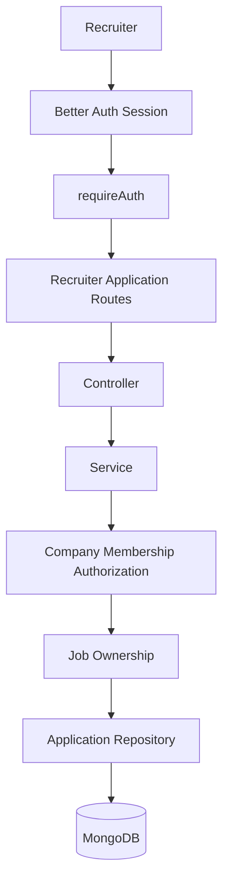
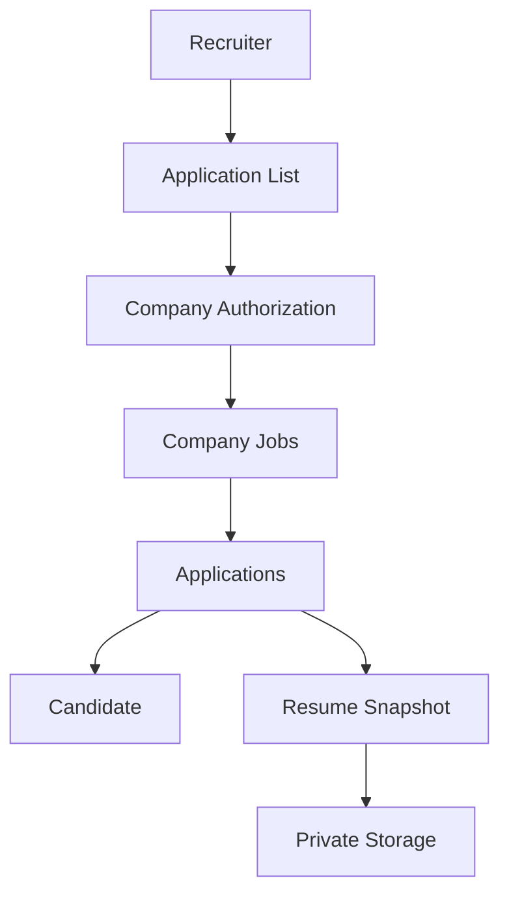
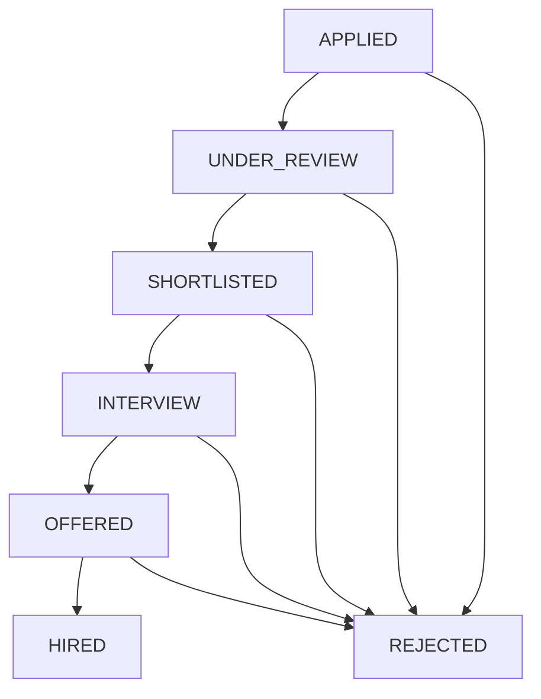

# Phase 18 — Recruiter Application Management, Candidate Review & Hiring Pipeline

## Objective

Build the backend Recruiter / Employer Application Management and Hiring Pipeline for SKILLEZO.

Phase 18 extends the completed Phase 17 Candidate Application Management workflow into the authorized company/recruiter side.

Phase 18 must allow authorized company members to:

- View applications submitted to their company's jobs.
- Filter and paginate applications.
- View application details.
- View the candidate's submitted resume snapshot.
- Securely access the submitted resume artifact when permitted.
- Review candidate application information.
- Move applications through recruiter-controlled status transitions.
- Maintain an append-only application status history.
- Enforce strict company/job/application authorization.
- Prevent recruiters from accessing applications belonging to other companies.
- Preserve the Phase 17 candidate workflow and resume snapshot architecture.
- Keep recruiter functionality backend-only.

This phase is BACKEND ONLY.

Do not create or modify frontend pages, components, hooks, frontend API clients, state management, dashboards, or UI.

Do not implement interview scheduling, notifications, AI ranking, messaging, offer management, or unrelated functionality.

---

# 1. Phase 16 + Phase 17 Dependency

Phase 18 depends on the completed architecture from:

```text
Phase 16
Resume Management & Private Storage
        ↓
Phase 17
Candidate Application Management
        ↓
Phase 18
Recruiter Application Management
```

Phase 17 established:

```text
Application
├── userId
├── jobId
├── resumeId
├── resumeSnapshot
├── status
├── statusHistory
├── createdAt
└── updatedAt
```

Phase 18 must NOT redesign this relationship.

The recruiter side consumes the existing application and its immutable `resumeSnapshot`.

Do not replace the application snapshot with a live lookup of the candidate's current resume.

---

# 2. Audit Before Implementation

Before changing anything, perform a read-only audit of:

```text
src/database/models/Application.model.ts
src/database/repositories/application/
src/database/models/Job.model.ts
src/database/repositories/job/
src/database/models/Resume.model.ts
src/database/repositories/resume/

src/database/models/Company.model.ts
src/database/models/CompanyMember.model.ts
src/database/repositories/company/
src/database/repositories/company-member/

src/core/auth/
src/core/auth/middleware/requireAuth.ts
src/core/constants/enums.ts
src/core/constants/error-codes.ts
src/core/constants/http-status.ts
src/core/validators/
src/core/middleware/

src/modules/application/
src/modules/jobs/
src/modules/resume/
src/modules/company/
src/modules/company-member/

src/server.ts
```

Also inspect:

- Existing DTO conventions.
- Existing Zod validators.
- Existing repository conventions.
- Existing controller/service architecture.
- Existing response helpers.
- Existing error handling.
- Existing authentication context.
- Existing company membership authorization.
- Existing job ownership/authorization logic.
- Existing status history implementation.
- Existing storage abstraction from Phase 16.
- Existing API documentation.
- Existing tests.

Rules:

- Reuse existing models.
- Reuse existing repositories where possible.
- Reuse existing company-member role definitions.
- Reuse existing authentication.
- Reuse existing Application status definitions.
- Reuse existing storage service.
- Extend existing functionality instead of duplicating concepts.
- Do not create duplicate company, member, job, application, status, or storage abstractions.
- Do not redesign unrelated architecture.

---

# 3. Business Objective

Phase 18 introduces the recruiter/employer application boundary.

The workflow becomes:

```text
Candidate
    ↓
Job
    ↓
Application
    ↓
Company / Job Owner
    ↓
Recruiter Review
    ↓
Application Status
```

Authorized company members should be able to manage applications for jobs belonging to their company.

The system must establish a strict security boundary:

```text
Authenticated User
        ↓
Company Membership
        ↓
Authorized Role
        ↓
Company
        ↓
Job
        ↓
Application
```

A recruiter must never gain access to an application merely by knowing its `applicationId`.

---

# 4. Company Roles

First inspect the existing `CompanyMember` role enum/model.

Use the project's existing roles.

Expected roles may include:

```text
OWNER
ADMIN
RECRUITER
```

Do NOT create duplicate role enums if they already exist.

Define recruiter authorization according to the existing company membership architecture.

Recommended permission boundary:

```text
OWNER
  → full company application management

ADMIN
  → application management

RECRUITER
  → application review/status management where permitted
```

If the existing project has a different role/permission model, follow the existing model instead of inventing a new one.

Document the actual authorization matrix discovered during the audit.

---

# 5. Identity

The authenticated user identity MUST come from:

```ts
req.user.id
```

Never accept:

```text
companyId
memberId
userId
```

as trusted authorization values from:

- Request body.
- Query parameters.
- URL parameters.
- Frontend DTOs.

The server must resolve the authenticated user's company membership.

---

# 6. Authorization Model

Every recruiter application operation must verify:

```text
req.user.id
    ↓
CompanyMember
    ↓
Company
    ↓
Job.companyId
    ↓
Application.jobId
```

A recruiter from Company A must not access Company B applications even if they know the application ID.

If the project already has a company authorization service, reuse it. Otherwise create a focused helper/service such as:

```text
assertCanManageJobApplications(userId, jobId)
```

It must verify membership, active membership, role, and job/company ownership.

---

# 7. Application List

Implement:

```http
GET /api/recruiter/applications
```

Authentication:

```text
requireAuth
```

Authorization:

```text
Authorized CompanyMember
```

Return only applications belonging to jobs managed by the authenticated user's company.

Support, where compatible with the existing architecture:

```text
jobId
status
search
page
limit
sortBy
sortOrder
```

Recommended defaults:

```text
page = 1
limit = 20
maximum limit = 50
sort = createdAt DESC
```

Use existing pagination utilities if available.

---

# 8. Application List Response

Do not return raw Mongoose documents.

Return normalized application list items, for example:

```json
{
  "id": "...",
  "status": "APPLIED",
  "job": {
    "id": "...",
    "title": "Senior Backend Engineer"
  },
  "candidate": {
    "id": "...",
    "name": "Candidate Name"
  },
  "resume": {
    "id": "...",
    "title": "Backend Engineer Resume",
    "originalFileName": "resume.pdf",
    "version": 1
  },
  "appliedAt": "...",
  "updatedAt": "..."
}
```

Do not expose passwords, authentication secrets, filesystem paths, storage credentials, or unrelated private data.

---

# 9. Application Details

Implement:

```http
GET /api/recruiter/applications/:applicationId
```

The service must:

1. Authenticate the user.
2. Resolve the application.
3. Resolve its job.
4. Resolve the job's company.
5. Verify company membership and role.
6. Return normalized application details.

Return:

```text
application
├── id
├── status
├── job
├── candidate
├── resumeSnapshot
├── createdAt
├── updatedAt
└── statusHistory
```

Use the immutable Phase 17 `resumeSnapshot` as the historical resume representation.

Never silently substitute the candidate's current resume.

---

# 10. Recruiter Resume Download

Implement:

```http
GET /api/recruiter/applications/:applicationId/resume
```

Authorization flow:

```text
Authenticated recruiter
        ↓
Verify company membership
        ↓
Resolve application
        ↓
Resolve job
        ↓
Verify job belongs to recruiter's company
        ↓
Read resumeSnapshot
        ↓
Resolve private storage artifact
        ↓
Stream file
```

Use the Phase 16:

```text
IResumeStorageService
```

or equivalent.

Do not directly access the filesystem from the controller.

Do not expose:

```text
/storage/resumes/...
```

as a public URL.

Do not allow:

```text
GET /api/recruiter/resumes/:resumeId
```

for arbitrary resume access in Phase 18. Resume access should be application-scoped.

If the historical artifact is unavailable, return a controlled error such as:

```text
APPLICATION_RESUME_FILE_NOT_FOUND
```

Do not substitute the candidate's current default resume.

---

# 11. Historical Resume Retention

Inspect the actual Phase 16 retention/deletion behavior.

The application snapshot must remain historically stable.

If the submitted artifact is retained for application review:

```text
Application.resumeSnapshot.storageKey
```

must remain resolvable according to the retention policy.

If the active resume is removed but the historical application artifact is retained, recruiter download should continue to work.

If no retention policy is actually implemented, document that limitation rather than claiming it is enforced.

---

# 12. Recruiter Status Management

Implement:

```http
PATCH /api/recruiter/applications/:applicationId/status
```

Request:

```json
{
  "status": "SHORTLISTED"
}
```

The recruiter identity must come from:

```text
req.user.id
```

Never trust client-provided:

```text
changedBy
companyId
memberId
```

---

# 13. Status Enum

Inspect the actual existing `ApplicationStatus` enum.

Do not create a duplicate enum.

Use the canonical project values. They may include:

```text
APPLIED
UNDER_REVIEW
SHORTLISTED
INTERVIEW
OFFERED
HIRED
REJECTED
WITHDRAWN
```

If the actual enum differs, use the existing canonical implementation and document it.

---

# 14. Recruiter Status State Machine

Recommended recruiter flow:

```text
APPLIED
   ↓
UNDER_REVIEW
   ↓
SHORTLISTED
   ↓
INTERVIEW
   ↓
OFFERED
   ↓
HIRED
```

Rejection may occur from appropriate review stages:

```text
APPLIED → REJECTED
UNDER_REVIEW → REJECTED
SHORTLISTED → REJECTED
INTERVIEW → REJECTED
OFFERED → REJECTED
```

Follow existing business rules if already defined.

Do not allow arbitrary status jumps unless explicitly supported.

---

# 15. Candidate vs Recruiter Status Boundary

Phase 17 handles candidate withdrawal.

Phase 18 handles recruiter pipeline statuses.

Candidate-controlled:

```text
WITHDRAWN
```

Recruiter-controlled:

```text
UNDER_REVIEW
SHORTLISTED
INTERVIEW
OFFERED
HIRED
REJECTED
```

Do not create a generic endpoint allowing any actor to set any status.

If:

```text
status = WITHDRAWN
```

do not allow the recruiter to silently reactivate it.

For Phase 18, treat `WITHDRAWN` as terminal unless the existing product rules explicitly say otherwise.

---

# 16. Status Transition Validation

Validate:

```text
applicationId
status
```

with existing Zod conventions.

Reject:

- Invalid status values.
- Invalid transitions.
- Recruiter attempts to manipulate candidate-only transitions.

Use existing error codes where possible.

If missing, add:

```text
APPLICATION_INVALID_STATUS_TRANSITION
```

---

# 17. Status History

Every recruiter status change must append a status-history record.

Example:

```json
{
  "status": "SHORTLISTED",
  "changedBy": "authenticated-user-id",
  "changedAt": "2026-08-17T15:00:00.000Z"
}
```

Do not overwrite existing history.

Do not allow clients to edit or delete history.

History must be append-only through status APIs.

---

# 18. Recruiter Status History Endpoint

Implement:

```http
GET /api/recruiter/applications/:applicationId/status-history
```

Require company authorization.

Return chronological entries.

Only authorized company members may access the history.

---

# 19. Repository Layer

Extend the existing:

```text
src/database/repositories/application/ApplicationRepository.ts
```

instead of creating a duplicate application repository.

Add recruiter-oriented methods as required:

```ts
findCompanyApplications(...)
findCompanyApplicationById(...)
findCompanyApplicationStatusHistory(...)
updateStatus(...)
addStatusHistory(...)
```

Candidate operations remain scoped to `userId`.

Recruiter operations must be scoped through:

```text
jobId → companyId → company membership
```

Review indexes for:

```text
jobId
status
createdAt
```

Do not remove existing indexes.

---

# 20. DTO Layer

Create or extend the existing application/recruiter application DTO structure.

Potential DTOs:

```text
RecruiterApplicationListItemDTO
RecruiterApplicationDetailsDTO
RecruiterApplicationStatusHistoryDTO
UpdateApplicationStatusDTO
RecruiterApplicationsQueryDTO
```

Do not accept:

```text
userId
companyId
memberId
changedBy
```

from the client.

---

# 21. Validator Layer

Use existing Zod conventions.

Validate:

```text
applicationId
jobId
status
page
limit
search
sort
```

Use the existing ObjectId validator for MongoDB IDs.

Do not validate Better Auth IDs as MongoDB ObjectIds.

---

# 22. Service Layer

Create or extend the project-appropriate recruiter application service.

Recommended methods:

```text
getCompanyApplications()
getCompanyApplication()
getApplicationResume()
getApplicationStatusHistory()
updateApplicationStatus()
```

All business logic belongs in the service.

Controllers must remain thin.

---

# 23. Controller Layer

Create or extend the recruiter application controller.

Responsibilities:

1. Extract `req.user.id`.
2. Extract validated input.
3. Call service.
4. Return `successResponse()`.
5. Pass errors to existing error handling.

No business logic.

No direct MongoDB queries.

No direct filesystem access.

---

# 24. Routes

Implement:

```http
GET   /api/recruiter/applications
GET   /api/recruiter/applications/:applicationId
GET   /api/recruiter/applications/:applicationId/status-history
GET   /api/recruiter/applications/:applicationId/resume
PATCH /api/recruiter/applications/:applicationId/status
```

All routes must use:

```text
requireAuth
```

and the existing validation/async-handler conventions.

---

# 25. Route Registration

Mount according to project conventions:

```text
/api/recruiter/applications
```

Do not break:

```text
/api/auth
/api/profile
/api/companies
/api/company-members
/api/jobs
/api/job-ingestion
/api/resumes
/api/applications
/api/health
/api/health/ready
```

---

# 26. Authorization Matrix

Inspect the actual project roles. If compatible, use:

| Action | OWNER | ADMIN | RECRUITER |
|---|---:|---:|---:|
| List company applications | ✅ | ✅ | ✅ |
| View application | ✅ | ✅ | ✅ |
| View resume snapshot | ✅ | ✅ | ✅ |
| Download submitted resume | ✅ | ✅ | ✅ |
| View status history | ✅ | ✅ | ✅ |
| Change application status | ✅ | ✅ | ✅ |

If the existing role/permission model differs, use the existing model and document the actual matrix.

Do not add company-management permissions in this phase.

---

# 27. Company/Job Authorization

Authorization must resolve:

```text
Authenticated User
       ↓
CompanyMember
       ↓
Company
       ↓
Job.companyId
       ↓
Application.jobId
```

Never authorize a recruiter based only on:

```text
applicationId
```

Never use:

```text
Application.userId
```

to determine recruiter/company authorization. That field identifies the candidate.

---

# 28. Candidate Privacy

Recruiters may receive only the candidate information required for application review.

Do not expose:

```text
passwords
authentication credentials
session tokens
unrelated private account data
storage credentials
server filesystem paths
```

Reuse existing candidate/profile structures.

Do not create a duplicate candidate model.

---

# 29. Response Contract

Use the existing:

```json
{
  "success": true,
  "data": {}
}
```

format.

Paginated:

```json
{
  "success": true,
  "data": {
    "items": [],
    "meta": {
      "page": 1,
      "limit": 20,
      "total": 100,
      "totalPages": 5,
      "hasNextPage": true,
      "hasPreviousPage": false
    }
  }
}
```

Do not introduce a second response format.

---

# 30. Error Codes

Audit existing error codes first.

Add only missing codes.

Potential codes:

```text
RECRUITER_UNAUTHORIZED
RECRUITER_COMPANY_MEMBERSHIP_NOT_FOUND
RECRUITER_FORBIDDEN
APPLICATION_INVALID_STATUS
APPLICATION_INVALID_STATUS_TRANSITION
APPLICATION_RESUME_FILE_NOT_FOUND
```

Reuse existing generic errors where appropriate.

---

# 31. Concurrency / Status Race Conditions

Inspect existing MongoDB/Mongoose infrastructure.

If transactions or optimistic concurrency/versioning are already supported, reuse them.

Otherwise implement a safe strategy consistent with the current architecture.

At minimum:

- Status history must not be lost.
- Final status must be valid.
- Concurrent updates must not corrupt the document.
- Duplicate identical history entries should be avoided where existing business rules require it.
- Document the chosen strategy.

---

# 32. API Documentation

Create:

```text
server/doc/03-api/recruiter-application/RECRUITER_APPLICATIONS_API.md
```

Document every endpoint with:

- Purpose.
- Method.
- URL.
- Authentication.
- Authorization.
- Headers.
- Request body.
- Query parameters.
- Path parameters.
- Validation.
- Success response.
- Error responses.
- Company membership requirements.
- Role requirements.
- Status transition rules.
- Resume access behavior.
- Examples.

Endpoint table:

| Method | Endpoint | Auth | Purpose |
|---|---|---|---|
| GET | `/api/recruiter/applications` | Required | List company applications |
| GET | `/api/recruiter/applications/:applicationId` | Required | Application details |
| GET | `/api/recruiter/applications/:applicationId/status-history` | Required | Application timeline |
| GET | `/api/recruiter/applications/:applicationId/resume` | Required | Secure submitted resume |
| PATCH | `/api/recruiter/applications/:applicationId/status` | Required | Update recruiter status |

---

# 33. Architecture Documentation

Create:

```text
server/doc/application/recruiter-application-management.md
```

Include:

1. Purpose.
2. Business problem.
3. Company membership model.
4. Authorization architecture.
5. Job ownership.
6. Application ownership.
7. Candidate privacy.
8. Resume snapshot.
9. Recruiter application list.
10. Application details.
11. Resume download.
12. Status state machine.
13. Status history.
14. Concurrency strategy.
15. Error handling.
16. API routes.
17. Testing.
18. Future interview boundary.

Architecture:



Application review:



Status workflow:



---

# 34. Testing Requirements

Implement automated tests and execute actual API/integration verification.

Do not claim tests passed unless executed.

Minimum tests:

### Authentication

- Unauthenticated recruiter list → 401.
- Unauthenticated details → 401.
- Unauthenticated status update → 401.
- Unauthenticated resume download → 401.

### Authorization

- Authorized recruiter can access own company's applications.
- Cross-company application access is rejected.
- Cross-company list leakage is impossible.
- Unauthorized company member role is rejected.
- Candidate cannot use recruiter status endpoints.

### Application Details

Verify:

```text
candidate
job
status
resumeSnapshot
createdAt
updatedAt
```

are returned correctly.

### Resume Snapshot

After candidate:

- changes resume title,
- changes default resume,
- uploads a newer resume,
- deletes active resume where permitted,

verify the historical `Application.resumeSnapshot` remains unchanged.

### Resume Download

- Authorized recruiter can download submitted artifact.
- Download corresponds to `resumeSnapshot.storageKey`.
- Current default resume is never substituted.
- Missing historical file returns controlled error.
- Physical filesystem paths are never exposed.

### Status

Test:

```text
APPLIED → UNDER_REVIEW
UNDER_REVIEW → SHORTLISTED
SHORTLISTED → INTERVIEW
INTERVIEW → OFFERED
OFFERED → HIRED
```

and appropriate rejection paths.

Test invalid transitions such as:

```text
APPLIED → HIRED
WITHDRAWN → SHORTLISTED
WITHDRAWN → INTERVIEW
HIRED → APPLIED
REJECTED → SHORTLISTED
```

### Status History

Verify:

- Every valid recruiter transition appends history.
- History remains chronological.
- Existing history is never overwritten.
- Unauthorized users cannot read history.
- Clients cannot modify/delete history.

### Withdrawal

Verify:

```text
WITHDRAWN → SHORTLISTED
```

is rejected.

### Pagination

Verify:

```text
page
limit
total
totalPages
hasNextPage
hasPreviousPage
```

### Filtering

Test:

```text
status
jobId
```

and search if implemented.

### Concurrency

Simulate concurrent recruiter status updates and verify no invalid/corrupt history.

### Regression

Verify Phase 17 still works:

```text
Candidate applies
Candidate lists applications
Candidate views application
Candidate views history
Candidate withdraws
```

---

# 35. Build Verification

Run:

```bash
npm run type-check
npm run build
```

Also run the project's applicable test command.

Expected:

```text
0 TypeScript errors
Clean production build
All applicable tests passing
```

Do not claim any command passed unless actually executed.

---

# 36. Regression Verification

Verify existing functionality:

```text
Better Auth
Profile
Company
Company Members
Job Management
Job Discovery
Jooble Job Ingestion
Resume Management
Candidate Applications
Health
Readiness
```

No unrelated regression.

---

# 37. Security Audit Checklist

Before completion:

```text
[ ] Authentication required on every recruiter endpoint
[ ] req.user.id is the identity source
[ ] Company membership verified
[ ] Membership role verified
[ ] Membership active status verified
[ ] Job belongs to authenticated recruiter's company
[ ] Application belongs to that job
[ ] Cross-company application access blocked
[ ] Cross-company list leakage blocked
[ ] Candidate cannot use recruiter status API
[ ] Candidate cannot modify recruiter statuses
[ ] changedBy is server-derived
[ ] companyId is server-derived
[ ] memberId is server-derived
[ ] Resume access is application-scoped
[ ] Resume snapshot is used instead of current default resume
[ ] Private storage is accessed through storage abstraction
[ ] Filesystem paths are not exposed
[ ] Storage credentials are not exposed
[ ] Authentication secrets are not exposed
[ ] Raw Mongoose documents are not returned
```

---

# 38. Non-Goals

Do NOT implement:

```text
- Frontend recruiter dashboard
- Frontend candidate dashboard
- Interview scheduling
- Calendar integration
- Email notifications
- WhatsApp notifications
- Candidate messaging
- Recruiter messaging
- AI resume ranking
- AI candidate scoring
- AI matching
- Automatic rejection emails
- Offer letter generation
- Offer management
- Payroll
- Interview feedback system
- Browser automation
- External application automation
- Scraping
- New authentication system
- JWT
- Custom sessions
- Payments
```

These belong to future phases.

---

# 39. Future Interview Boundary

Phase 18 ends at application review/status management.

A future phase may introduce:

```text
Application
    ↓
Interview
    ↓
Interview Round
    ↓
Schedule
    ↓
Feedback
    ↓
Decision
```

Do not implement this in Phase 18.

---

# 40. Expected Files

Potential files:

```text
src/database/models/Application.model.ts
src/database/repositories/application/ApplicationRepository.ts

src/modules/recruiter-application/
├── recruiter-application.dto.ts
├── recruiter-application.validator.ts
├── recruiter-application.service.ts
├── recruiter-application.controller.ts
├── recruiter-application.routes.ts
└── index.ts

src/core/constants/enums.ts
src/core/constants/error-codes.ts

src/server.ts

server/doc/03-api/recruiter-application/
└── RECRUITER_APPLICATIONS_API.md

server/doc/application/
└── recruiter-application-management.md
```

Use actual project naming conventions.

Do not modify files unnecessarily.

Do not create duplicate models, repositories, enums, or authorization concepts.

---

# 41. Final Completion Checklist

Phase 18 is complete only when:

```text
[ ] Existing company/member architecture audited
[ ] Existing roles reused
[ ] Existing Application architecture audited
[ ] Existing Job architecture audited
[ ] Existing Resume storage architecture audited
[ ] Recruiter authorization implemented
[ ] Company membership verification implemented
[ ] Job ownership verification implemented
[ ] Recruiter application repository implemented/extended
[ ] DTOs implemented
[ ] Zod validators implemented
[ ] Service implemented
[ ] Controller implemented
[ ] Routes implemented
[ ] All routes protected by requireAuth
[ ] Company applications list works
[ ] Pagination works
[ ] Status filtering works
[ ] Job filtering works
[ ] Search works if supported
[ ] Application details work
[ ] Resume snapshot displayed correctly
[ ] Recruiter resume download works securely
[ ] Cross-company access blocked
[ ] Recruiter status updates work
[ ] Valid status transitions enforced
[ ] Invalid transitions rejected
[ ] Status history appended correctly
[ ] Status history cannot be modified by clients
[ ] Withdrawn applications remain protected
[ ] Candidate cannot use recruiter status APIs
[ ] API documentation created
[ ] Architecture documentation created
[ ] Security tests completed
[ ] Cross-company tests completed
[ ] Resume access tests completed
[ ] Status transition tests completed
[ ] Status history tests completed
[ ] Pagination/filter tests completed
[ ] Race-condition strategy tested
[ ] Phase 17 candidate workflow regression tested
[ ] npm run type-check passes
[ ] npm run build passes
[ ] Relevant test suite passes
[ ] No frontend code changed
[ ] No interview functionality implemented
[ ] No notifications implemented
[ ] No AI ranking implemented
```

Only mark Phase 18 complete after implementation and verification have actually been executed.

---

# 42. Final Walkthrough Report

When implementation is complete, provide a detailed final walkthrough containing:

## 1. Summary

What was implemented and why.

## 2. Existing Code Audit

What already existed, what was reused, what was extended, and what was intentionally left unchanged.

## 3. Files Created

Complete list.

## 4. Files Modified

Complete list.

## 5. Architecture

Show:

```text
Recruiter
   ↓
Better Auth
   ↓
requireAuth
   ↓
Company Membership
   ↓
Authorization
   ↓
Recruiter Application Routes
   ↓
Controller
   ↓
Service
   ↓
Repository
   ↓
MongoDB
```

## 6. Company Authorization

Explain:

```text
User
 ↓
CompanyMember
 ↓
Company
 ↓
Job
 ↓
Application
```

## 7. Application Review Flow

Explain the complete recruiter workflow.

## 8. Resume Snapshot

Explain:

- How the Phase 17 snapshot is consumed.
- Why it is immutable.
- How historical resume access works.
- How private storage is accessed.

## 9. Resume Download Security

Explain how recruiter access is authorized before the storage layer is called.

## 10. Status State Machine

Document the actual canonical project state machine.

## 11. Status History

Explain how every recruiter status change is recorded.

## 12. API Endpoint Table

Include method, URL, authentication, authorization, and purpose.

## 13. Security Audit

Explain:

- Identity source.
- Company membership.
- Job ownership.
- Application authorization.
- Resume authorization.
- Candidate/recruiter boundary.

## 14. Database Changes

Explain schema and index changes.

## 15. Testing

Report every test actually performed:

```text
Passed
Failed
Skipped
Reason
```

Do not claim tests passed unless executed.

## 16. Build Verification

Report actual results for:

```text
npm run type-check
npm run build
```

## 17. Regression Verification

Report existing modules tested.

## 18. Known Limitations

List intentionally deferred functionality.

## 19. Recommended Next Backend Phase

Recommend the next backend phase based on the actual completed implementation.

Do not claim files were created unless they actually exist.

Do not claim tests passed unless actually executed.

Do not mark Phase 18 complete until implementation and verification are actually finished.

---

# 43. Implementation Instructions for Antigravity

Before coding:

1. Inspect the complete existing backend.
2. Audit Company, CompanyMember, Job, Application, Resume, and authentication architecture.
3. Identify existing authorization helpers and reuse them.
4. Inspect the actual Application status enum.
5. Inspect Phase 16 storage abstraction.
6. Inspect Phase 17 resume snapshot implementation.
7. Do not recreate existing infrastructure.
8. Implement recruiter application management.
9. Implement company/job authorization.
10. Implement secure recruiter resume access.
11. Implement recruiter status transitions.
12. Implement append-only status history.
13. Add automated tests.
14. Run actual API/integration tests.
15. Run type-check/build.
16. Run regression verification.
17. Update documentation.
18. Provide the final walkthrough report.

Do not implement frontend functionality.

Do not implement interview scheduling.

Do not implement notifications.

Do not implement AI matching/ranking.

Do not implement recruiter features outside application review and status management.

Focus exclusively on making Phase 18 a secure, production-ready recruiter application management and hiring pipeline foundation built on the completed Phase 16 and Phase 17 architecture.
