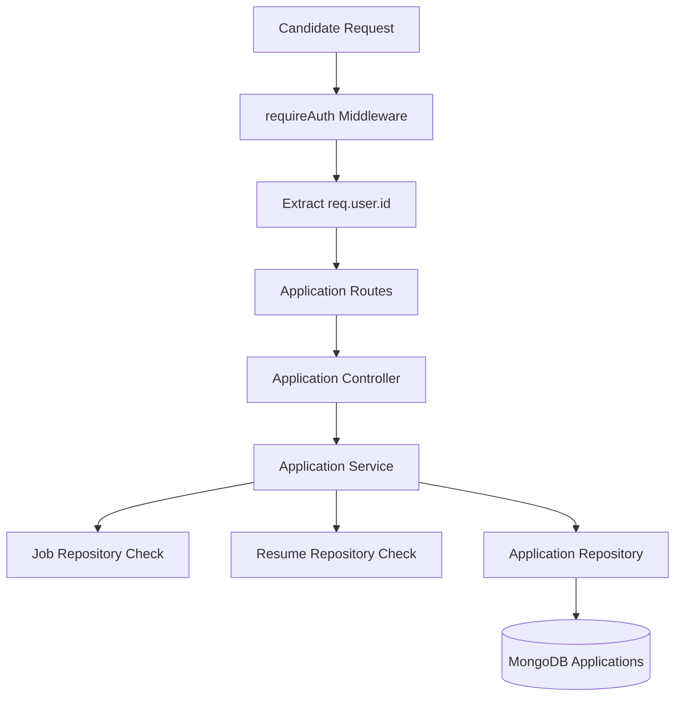
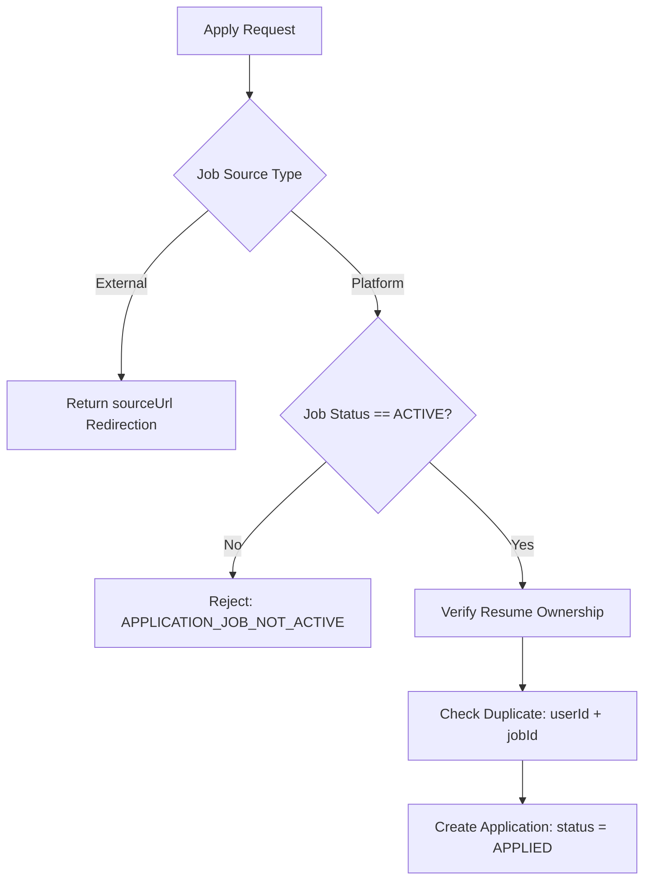
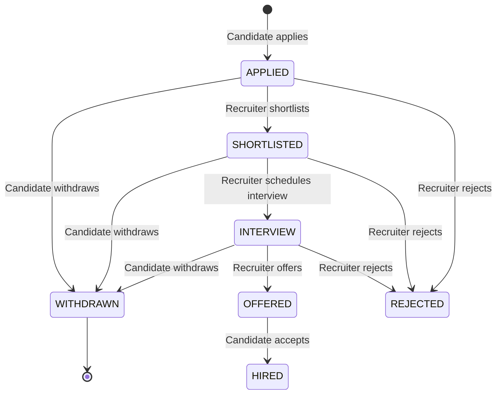

# Phase 17 — Application Management & Workflow Architecture

## 1. Overview
The **Candidate Application Management & Application Workflow** module provides candidate application lifecycle capabilities in SKILLEZO.

---

## 2. Native vs External Job Handling

---

## 3. Candidate Application State Machine

---

## 4. Security & Ownership Model

- **Identity Isolation**: `userId` is strictly set from `req.user.id`. Requests supplying `userId` in parameters or body are rejected or ignored.
- **Resume Ownership**: Verified via `findUserResumeById(userId, resumeId)`. Candidates cannot use resumes owned by other candidates.
- **Duplicate Protection**: Unique index `{ userId: 1, jobId: 1 }` on `ApplicationModel` combined with service-level `findByUserAndJob` checks prevents double submissions under concurrent requests.
