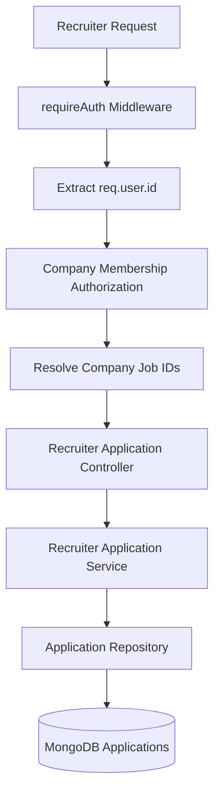
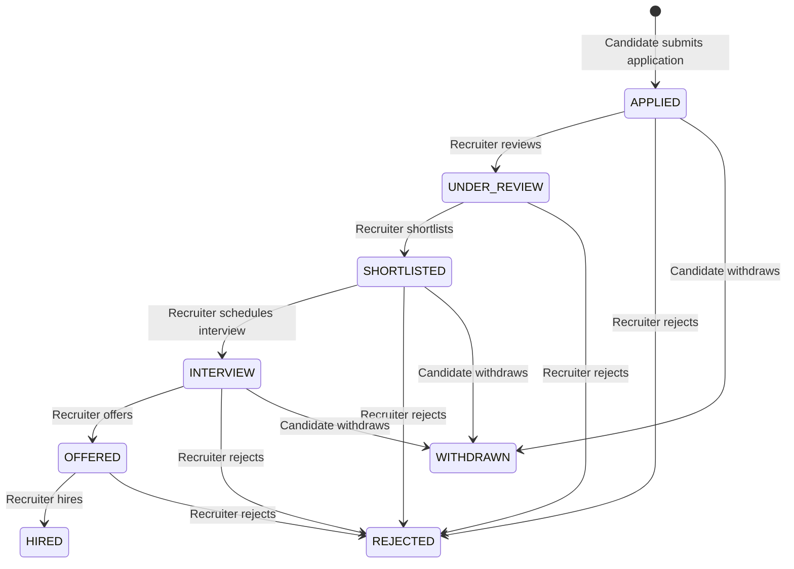

# Phase 18 — Recruiter Application Management Architecture

## 1. Overview
Phase 18 introduces authorized recruiter application management, candidate review, and hiring pipeline status state machines.



---

## 2. Recruiter Authorization Chain

```mermaid
flowchart TD
    A[req.user.id] --> B[CompanyMember Repository]
    B --> C{Active Member & Role == OWNER | ADMIN | RECRUITER?}
    C -->|No| D[Reject: 403 RECRUITER_COMPANY_MEMBERSHIP_NOT_FOUND]
    C -->|Yes| E[Find Company Job IDs]
    E --> F[Verify Application.jobId in CompanyJobIDs]
    F -->|No| G[Reject: 404 APPLICATION_NOT_FOUND]
    F -->|Yes| H[Execute Operation]
```

---

## 3. Recruiter Status State Machine



---

## 4. Security & Privacy Invariants
- **Company Access Boundary**: Applications are strictly scoped through `jobId ➔ companyId ➔ CompanyMember`. Cross-company application access or list leakage is impossible.
- **Immutable Submission Resume Snapshot**: Recruiters review the `resumeSnapshot` captured at submission time. Modifications to the candidate's active resume library do not alter application records.
- **Append-Only Status History**: Status updates append to `statusHistory` array with timestamp and recruiter `changedBy` identity.
