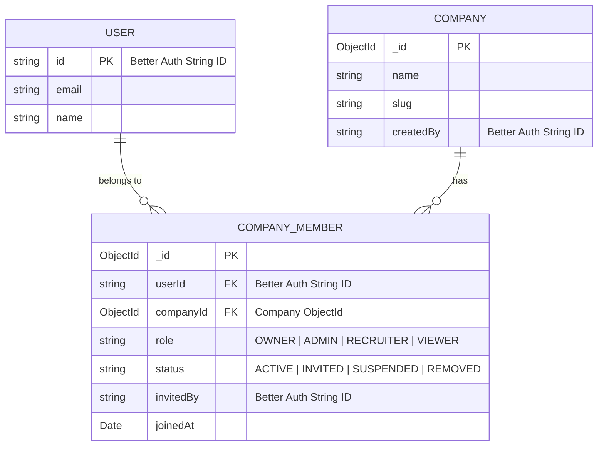
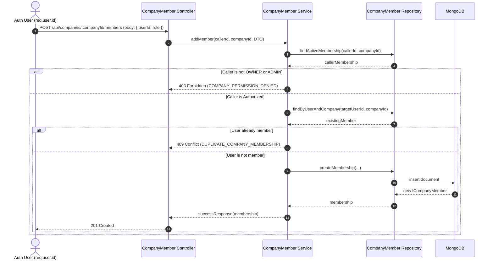
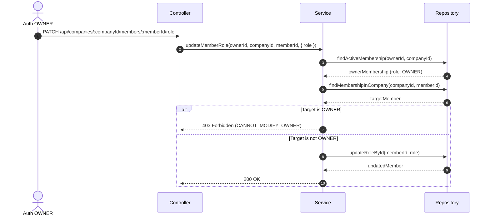

# Phase 13 — Company Member Management & Recruiter Authorization Foundation

## 1. Purpose
The purpose of Phase 13 is to establish the core authorization foundation for company memberships and recruiter operations within SKILLEZO.AI. It maps authenticated identity (`Better Auth` user) to company contexts via normalized `CompanyMember` documents, enforcing role-based permissions (`OWNER`, `ADMIN`, `RECRUITER`, `VIEWER`).

## 2. Why CompanyMember Exists
A single user may represent or belong to multiple companies (e.g. an agency recruiter managing hiring for multiple organizations, or a founder owning one venture while acting as an admin/advisor for another). Storing membership as arrays inside the User or Company model would create data redundancy, sync anomalies, and array bloat. `CompanyMember` resolves this as a clean junction model.

## 3. User ↔ Company Relationship (N:M Relationship)

## 4. Database Model & Type Strictness
- `userId`: String (Must remain Better Auth String ID; never convert to ObjectId).
- `companyId`: MongoDB `ObjectId` referencing `Company`.
- Unique Compound Index: `{ userId: 1, companyId: 1 }` (Ensures a user cannot have duplicate membership documents for the same company).

## 5. Membership Roles & Statuses
### Roles (`CompanyMemberRole`)
- `OWNER`: Full company control; created automatically when company is created. Protected against removal or role modification.
- `ADMIN`: Administrative access; can add/invite members, remove/suspend non-owner members, and update company details.
- `RECRUITER`: Operational role for future job postings, candidate evaluations, and recruitment workflows.
- `VIEWER`: Read-only access to company membership list and public details.

### Statuses (`CompanyMemberStatus`)
- `ACTIVE`: Fully authorized member.
- `INVITED`: Invitation sent, pending acceptance.
- `SUSPENDED`: Temporarily revoked access.
- `REMOVED`: Soft-deleted / deactivated membership.

## 6. Authentication vs Authorization
- **Authentication ("Who are you?")**: Managed centrally by Better Auth. Resolves `req.user.id` (String).
- **Authorization ("What are you allowed to do?")**: Enforced by SKILLEZO `CompanyMemberService`. Checks caller's active role in the specific `companyId`.

## 7. Permission Matrix

| Operation | OWNER | ADMIN | RECRUITER | VIEWER |
|---|:---:|:---:|:---:|:---:|
| **View My Memberships** | ✅ | ✅ | ✅ | ✅ |
| **View Company Members** | ✅ | ✅ | ✅ | ✅ |
| **View Member Detail** | ✅ | ✅ | ✅ | ✅ |
| **Invite / Add Member** | ✅ | ✅ | ❌ | ❌ |
| **Update Member Role** | ✅ | ❌ | ❌ | ❌ |
| **Update Member Status** | ✅ | ✅ (Non-Admin/Owner) | ❌ | ❌ |
| **Remove Member** | ✅ | ✅ (Non-Admin/Owner) | ❌ | ❌ |
| **Update Company Details** | ✅ | ✅ | ❌ | ❌ |

## 8. Workflow Diagrams

### Invite / Add Member Flow

### Role Update Flow & Owner Protection

## 9. Multi-Company Example & Data Isolation
A user with `userId: "usr_abc123"` may have memberships across companies:
- Company A (`66a1...`): `OWNER`
- Company B (`66a2...`): `ADMIN`
- Company C (`66a3...`): `VIEWER`

**Data Isolation Enforcement**: Every company operation evaluates `(req.user.id, companyId)`. User `usr_abc123` requesting `/api/companies/66a4.../members` without an active membership in Company D (`66a4...`) receives `403 Forbidden` (`COMPANY_MEMBERSHIP_REQUIRED`).

## 10. API Endpoints Summary

| Method | Endpoint | Auth | Required Role |
|---|---|---|---|
| `GET` | `/api/company-members/me` | Required | Active User |
| `GET` | `/api/companies/:companyId/members` | Required | Active Member of Company |
| `GET` | `/api/companies/:companyId/members/:memberId` | Required | Active Member of Company |
| `POST` | `/api/companies/:companyId/members` | Required | `OWNER` or `ADMIN` |
| `PATCH` | `/api/companies/:companyId/members/:memberId/role` | Required | `OWNER` |
| `PATCH` | `/api/companies/:companyId/members/:memberId/status` | Required | `OWNER` or `ADMIN` |
| `DELETE` | `/api/companies/:companyId/members/:memberId` | Required | `OWNER` or `ADMIN` |

## 11. Error Codes Reference
- `COMPANY_MEMBER_NOT_FOUND` (404): Specified member document not found in company.
- `COMPANY_MEMBERSHIP_REQUIRED` (403): Caller has no active membership in target company.
- `COMPANY_MEMBERSHIP_INACTIVE` (403): Caller membership is suspended/invited/removed.
- `COMPANY_PERMISSION_DENIED` (403): Insufficient role permissions for operation.
- `DUPLICATE_COMPANY_MEMBERSHIP` (409): Target user is already a member of the company.
- `CANNOT_MODIFY_OWNER` (403): Attempted role/status change or deletion of company `OWNER`.
- `COMPANY_NOT_FOUND` (404): Target company ObjectId does not exist.

## 12. Future Job Authorization Relationship (Phase 14 Prep)
Phase 13 establishes `verifyActiveMembership(userId, companyId)` and role checks. When Phase 14 introduces native job posting or external job ingestion management, the Job Service will invoke `CompanyMemberService` or `CompanyMemberRepository` to confirm that `req.user.id` holds `OWNER`, `ADMIN`, or `RECRUITER` status before creating or editing job postings for that company.
