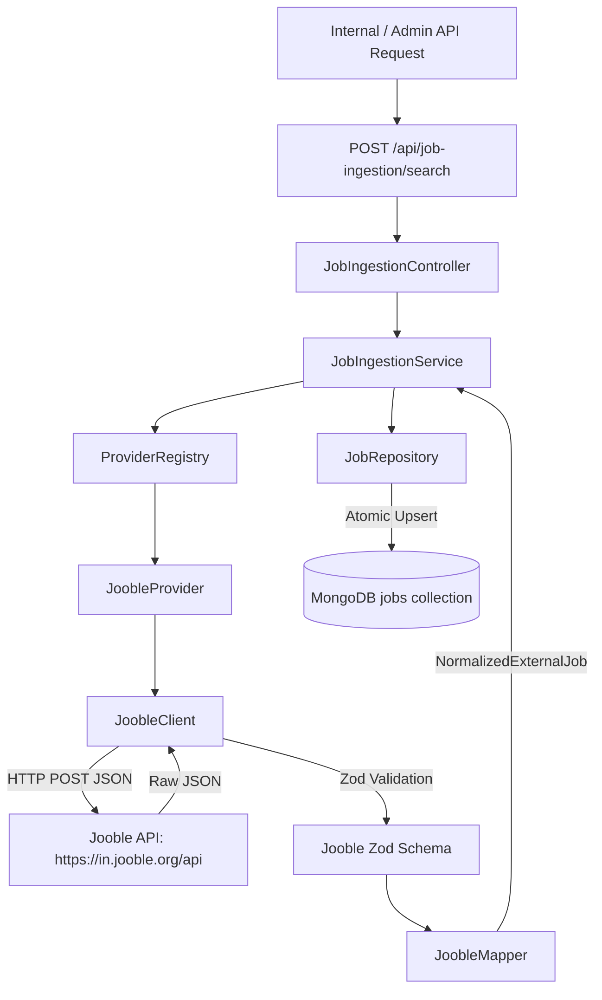

# Phase 14 — External Job Ingestion Foundation + Jooble Integration

## 1. Why External Ingestion Exists & The Cold-Start Problem
As a new startup platform, SKILLEZO cannot rely solely on native employer job postings at launch. To eliminate the cold-start problem and provide candidates with job opportunities immediately, SKILLEZO implements an external job acquisition pipeline.

Jooble is integrated as the primary external provider, structured through a provider-agnostic adapter layer so future job sources (e.g., Adzuna, Greenhouse, Lever) can be added seamlessly without breaking the system.

## 2. Ingestion Architecture Flow


## 3. Provider Architecture
All job providers implement the `JobSourceProvider` interface:
```typescript
export interface JobSourceProvider {
  readonly provider: string;
  searchJobs(query: JobSourceQuery): Promise<ExternalJobResult>;
}
```

Registered dynamically in `ProviderRegistry`:
- `registry.getProvider("jooble")`
- `registry.registerProvider(new AdzunaProvider())` (Future expansion)

## 4. Jooble API Integration Contract
- **Endpoint**: `POST https://in.jooble.org/api/{JOOBLE_API_KEY}`
- **Content-Type**: `application/json`
- **Request Body Payload**:
  ```json
  {
    "keywords": "software engineer",
    "location": "Delhi",
    "radius": "40",
    "salary": 0,
    "page": "1",
    "ResultOnPage": 20,
    "SearchMode": 0,
    "companysearch": false
  }
  ```
- **Runtime Validation**: Response is strictly parsed through Zod schema before processing. Any malformed structure throws `JOB_SOURCE_INVALID_RESPONSE`.

## 5. External vs Native Job Data Model
| Field | Native Job (`sourceType = "platform"`) | External Job (`sourceType = "external"`) |
|---|---|---|
| `sourceType` | `"platform"` | `"external"` |
| `sourceProvider` | null | `"jooble"` (or future provider) |
| `externalId` | null | String (e.g. `"12345678"`) |
| `sourceUrl` | null | External job URL |
| `companyId` | Required ObjectId | Optional null (unless linked) |
| `createdBy` | Required String (User ID) | Optional null |
| `roleId` | Required ObjectId | Optional null |
| `companyName` | Computed via Company ref | Raw external company string |
| `rawLocation` | Optional | Raw location string |
| `rawSalary` | Optional | Raw salary string |

## 6. Deduplication & Idempotency
- **Unique Constraint**: Compound index on `{ sourceProvider: 1, externalId: 1 }` with `{ unique: true, sparse: true }`.
- **Atomic Upsert**: `JobRepository.upsertExternalJob(data)` checks for existing `(sourceProvider, externalId)`. If found, it updates the existing document (`isNew: false`); otherwise it creates a new document (`isNew: true`).
- **Idempotency Guarantee**: Running the same ingestion query multiple times results in `created = 0` and `updated = N`, preventing duplicate job listings.

## 7. Security Best Practices
- `JOOBLE_API_KEY` is strictly read from environment configuration (`.env`).
- Never accepted from client headers, body, or URL query parameters.
- Never printed, logged, or returned in API responses.

## 8. Ingestion API Summary
- **Method**: `POST`
- **URL**: `/api/job-ingestion/search`
- **Authentication**: Required (`requireAuth`)
- **Payload**:
  ```json
  {
    "provider": "jooble",
    "keywords": "software engineer",
    "location": "Delhi",
    "page": 1,
    "limit": 20
  }
  ```
- **Response**:
  ```json
  {
    "success": true,
    "data": {
      "provider": "jooble",
      "requested": 20,
      "received": 20,
      "created": 15,
      "updated": 5,
      "skipped": 0,
      "failed": 0
    }
  }
  ```

## 9. Error Codes
- `JOOBLE_API_KEY_INVALID` (403): Missing or rejected Jooble API key.
- `JOB_SOURCE_UNAVAILABLE` (503): Jooble API network failure.
- `JOB_SOURCE_INVALID_RESPONSE` (500): Jooble API response failed Zod schema validation.
- `JOB_SOURCE_TIMEOUT` (504): Jooble request exceeded 10-second timeout.
- `INVALID_JOB_PROVIDER` (400): Requested provider is not registered in ProviderRegistry.
