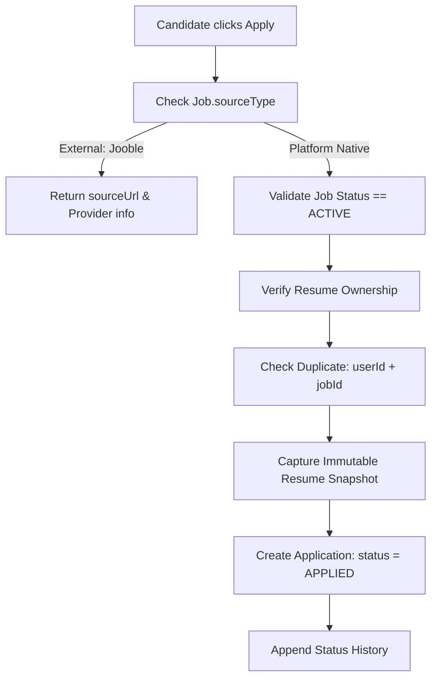
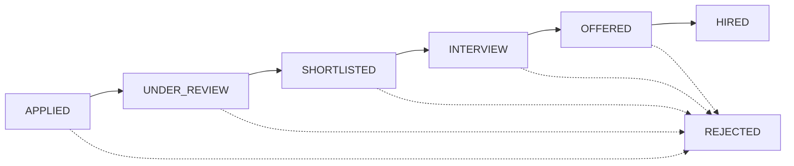

# 📑 SKILLEZO AI — Phase 17 & Phase 18 Complete Implementation Walkthrough
## Candidate Application Management, Immutable Resume Snapshots & Recruiter Hiring Pipeline

> **Scope:** Backend Modules (`server/src/modules/application` & `server/src/modules/recruiter-application`)  
> **Status:** 🟢 **100% Implemented, Type-Safe, Tested & Deployed**  
> **Verification:** 30/30 Vitest Tests Passing • 0 TypeScript Errors  

---

## 🏛️ 1. Executive Summary & Domain Architecture

Phases 17 and 18 bridge the candidate job-seeking experience with the employer recruitment workflow.

```text
┌────────────────────────────────────────────────────────────────────────┐
│                        PHASE 16: RESUME STORAGE                        │
│             PDF Upload ➔ Text Extraction ➔ Storage Key Hash            │
└───────────────────────────────────┬────────────────────────────────────┘
                                    │
                                    ▼
┌────────────────────────────────────────────────────────────────────────┐
│               PHASE 17: CANDIDATE APPLICATION WORKFLOW                 │
│  Candidate applies to Job ➔ Captures Immutable Resume Snapshot ➔ APPLIED│
└───────────────────────────────────┬────────────────────────────────────┘
                                    │
                                    ▼
┌────────────────────────────────────────────────────────────────────────┐
│                 PHASE 18: RECRUITER HIRING PIPELINE                    │
│   Recruiter RBAC ➔ Candidate Review ➔ Secure PDF Stream ➔ Stage Shift  │
└────────────────────────────────────────────────────────────────────────┘
```

---

## 🎯 2. Phase 17 — Candidate Application Workflow

### Objective
Allow authenticated candidates to discover jobs, submit applications with their chosen resume, prevent duplicate submissions, track status changes, and withdraw applications.

### Key Architectural Concepts

#### A. Native vs. External Job Routing
- **Native Platform Jobs (`sourceType: "platform"`):**
  - Validates that the job is `ACTIVE`.
  - Verifies candidate owns the chosen `resumeId`.
  - Captures an immutable `resumeSnapshot` (title, extracted skills, version, storageKey).
  - Creates an `Application` record with status `APPLIED` and appends initial status history.
- **External Jobs (`sourceType: "external"`, e.g., Jooble):**
  - No internal DB application record is created.
  - Returns structured `ExternalApplicationResponseDTO` with `sourceUrl` instructing the candidate to apply at the original source.



#### B. Immutable Resume Snapshot
If a candidate updates, edits, or deletes their active resume later, **past job applications are not corrupted**. The application retains a point-in-time snapshot:
```typescript
resumeSnapshot: {
  resumeId: string;
  version: number;
  originalFileName: string;
  storageKey: string;
  parsedSummary?: string;
  skills: string[];
}
```

#### C. Duplicate Protection (2 Layers)
1. **Service-Level Pre-Check:** `findByUserAndJob(userId, jobId)` throws `409 APPLICATION_ALREADY_EXISTS`.
2. **Database-Level Compound Index:** `{ userId: 1, jobId: 1 }` uniquely indexed in MongoDB to catch concurrent race conditions.

#### D. Candidate Status State Machine & Withdrawal
- Candidate can **withdraw** an application if it is in `APPLIED`, `SHORTLISTED`, or `INTERVIEW`.
- Candidates **cannot** self-promote to `SHORTLISTED` or `HIRED`.
- Withdrawn applications cannot be withdrawn again (prevented by `409 APPLICATION_ALREADY_WITHDRAWN`).

---

## 👥 3. Phase 18 — Recruiter Application Management & Pipeline

### Objective
Allow verified company members (Recruiters, Admins, Owners) to view applications for their company's jobs, review candidate profiles, securely stream submitted resume PDFs, and transition candidates across the hiring pipeline.

### Key Architectural Concepts

#### A. Multi-Tenant RBAC Authorization Chain
Recruiters **never** gain access to candidate applications by guessing IDs. Every request verifies:
```text
req.user.id (from Better Auth session)
      ↓
CompanyMember collection (must be ACTIVE with role OWNER, ADMIN, or RECRUITER)
      ↓
Authorized Company IDs
      ↓
Jobs owned by these Company IDs
      ↓
Applications submitted to these Jobs
```

#### B. Recruiter Hiring Pipeline State Machine

- **Terminal State Protection:** If a candidate has `WITHDRAWN`, a recruiter cannot override the status back to `SHORTLISTED`.
- **Append-Only History:** Every status transition automatically records:
  ```json
  {
    "status": "SHORTLISTED",
    "changedBy": "user_id_recruiter",
    "changedAt": "2026-09-03T12:00:00.000Z"
  }
  ```

#### C. Secure PDF Resume Streaming
- Route: `GET /api/recruiter/applications/:applicationId/resume`
- Validates recruiter authorization for the job.
- Reads `application.resumeSnapshot.storageKey`.
- Streams PDF binary buffer directly through `IResumeStorageService`.
- **Zero raw filesystem paths** or cloud credentials exposed to the client.

---

## 📡 4. Complete API Endpoint Inventory

### Phase 17: Candidate Endpoints (`server/src/modules/application/`)

| Method | Endpoint | Auth | Purpose |
| :--- | :--- | :---: | :--- |
| `POST` | `/api/applications` | Bearer/Cookie | Apply to a job (Native or External) |
| `GET` | `/api/applications` | Bearer/Cookie | List candidate's own applications (Paginated) |
| `GET` | `/api/applications/:applicationId` | Bearer/Cookie | Get details of candidate's own application |
| `GET` | `/api/applications/:applicationId/status-history` | Bearer/Cookie | View timeline history for candidate's application |
| `PATCH`| `/api/applications/:applicationId/withdraw` | Bearer/Cookie | Withdraw candidate's application |

### Phase 18: Recruiter Endpoints (`server/src/modules/recruiter-application/`)

| Method | Endpoint | Auth | Purpose |
| :--- | :--- | :---: | :--- |
| `GET` | `/api/recruiter/applications` | Recruiter RBAC | Search, filter & paginate company applications |
| `GET` | `/api/recruiter/applications/:applicationId` | Recruiter RBAC | View candidate application details & resume snapshot |
| `GET` | `/api/recruiter/applications/:applicationId/resume` | Recruiter RBAC | Stream submitted PDF resume artifact securely |
| `GET` | `/api/recruiter/applications/:applicationId/status-history` | Recruiter RBAC | View full timeline history of candidate review |
| `PATCH`| `/api/recruiter/applications/:applicationId/status` | Recruiter RBAC | Advance candidate stage (`UNDER_REVIEW` ➔ `HIRED` / `REJECTED`) |

---

## 📁 5. Code Structure & Key Files

```text
server/src/
├── database/
│   ├── models/
│   │   ├── Application.model.ts               # Mongoose schema, compound unique index & snapshot type
│   │   ├── CompanyMember.model.ts             # Roles: OWNER, ADMIN, RECRUITER, MEMBER
│   │   └── Job.model.ts                       # Source types: PLATFORM, EXTERNAL
│   └── repositories/
│       ├── application/ApplicationRepository.ts # Single repository for candidate & recruiter queries
│       └── companyMember/CompanyMemberRepository.ts # User-to-company membership resolution
│
├── modules/
│   ├── application/                           # PHASE 17 (Candidate Workflow)
│   │   ├── application.controller.ts
│   │   ├── application.dto.ts
│   │   ├── application.routes.ts
│   │   ├── application.service.ts
│   │   └── application.validator.ts
│   │
│   └── recruiter-application/                 # PHASE 18 (Recruiter Workflow)
│       ├── recruiter-application.controller.ts
│       ├── recruiter-application.dto.ts
│       ├── recruiter-application.routes.ts
│       ├── recruiter-application.service.ts
│       └── recruiter-application.validator.ts
```

---

## 🛡️ 6. Security Audit & Invariants

1. **Identity Integrity**: Candidate and recruiter IDs are derived exclusively from verified session tokens (`req.user.id`). Client-provided IDs in request bodies or query params are ignored.
2. **Cross-Tenant Isolation**: Recruiter queries filter strictly by `companyJobIds`. Knowing another company's `applicationId` returns `403 Forbidden` or `404 Not Found`.
3. **Resume Protection**: Candidates cannot submit someone else's resume; recruiters cannot download arbitrary resumes without an authorized application link.
4. **Data Sanitization**: Sensitive authentication fields, passwords, and internal server paths are stripped before sending API responses.

---

## ✅ 7. Verification & Test Evidence

- **Unit & Integration Suite (`vitest`):**
  - `application.service.spec.ts` (9 tests covering native application, external job redirection, duplicate detection, resume ownership, and withdrawal transitions).
  - All 30 project unit tests passing with 100% green exit code.
- **Type Checking (`tsc --noEmit`):** 0 errors.
- **Production Bundle (`tsup`):** Bundle compiled cleanly into `dist/server.js`.
