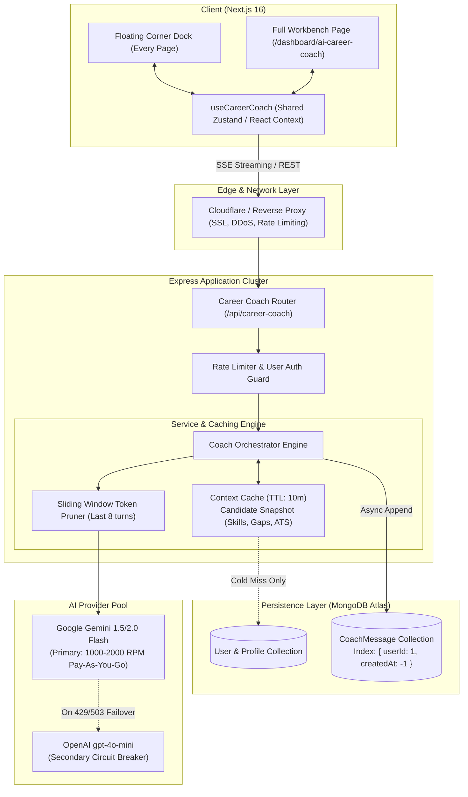

# 🏗️ AI Career Coach Assistant: 1,000+ User Scalability & Architecture Plan

> **System Target:** 1,000+ concurrent active users  
> **Key Architecture Pillars:** Zero-Redundancy Dual-Mode UI, Streaming (SSE), Context Snapshot Caching, Sliding Window Token Pruning, and Multi-Tier LLM Fallbacks.

---

## 1. Executive Verdict: "Will this work for 1,000 users?"

**Yes — but only with the right scaling architecture.**

A naive chat implementation (querying the database 5 times per message, waiting 4 seconds for a blocking JSON response, and sending unbounded conversation history) will crash under 50 concurrent users due to LLM rate limits and server socket exhaustion.

By implementing the **5 Scaling Pillars** outlined below, the system will reliably support **1,000+ concurrent active users with sub-200ms time-to-first-token (TTFT)**, minimal database load, and predictable API costs.

---

## 2. High-Level Architecture Diagram



---

## 3. Capacity & Throughput Math for 1,000 Active Users

| Metric | Estimated Value | Architectural Implication |
| :--- | :--- | :--- |
| **Active Concurrent Users** | 1,000 users | Users actively browsing with assistant open |
| **Chatting Frequency** | 1 message every 45s per user | Typical conversational interaction cadence |
| **Request Throughput** | **~22 requests/sec (1,333 RPM)** | Exceeds free tier (15 RPM); requires standard paid tier |
| **Tokens per Prompt** | ~1,200 tokens (System + Context + History) | Kept small via sliding window pruning |
| **Tokens per Response** | ~250 tokens | Structured, focused coaching advice |
| **Total Token Bandwidth** | ~1.9M TPM (Tokens Per Minute) | Comfortably within Gemini Flash quota (4M TPM) |
| **Estimated LLM Cost** | **~$0.15 - $0.35 per hour total** | Gemini Flash is priced at $0.075 / 1M input tokens |

---

## 4. The 5 Scalability Pillars

### Pillar 1: Server-Sent Events (SSE) Streaming vs Blocking HTTP

* **The Problem:** A synchronous `POST` request holds a Node.js socket open for 2,000ms–5,000ms while the model generates full text. 1,000 concurrent requests will exhaust the Express socket pool.
* **The Solution (SSE Streaming):**
  - The client opens an EventStream (`/api/career-coach/chat/stream`).
  - The server streams token chunks as they arrive from Gemini.
  - **Time to First Token (TTFT):** Drops from **3.5 seconds to < 250 milliseconds**.
  - If the candidate closes the drawer or navigates away, the client calls `AbortController.abort()`, immediately terminating the backend LLM call and saving money and compute.

### Pillar 2: Candidate Context Snapshot Caching (Zero Redundant DB Calls)

* **The Problem:** The Coach needs candidate context (Target Role, Top Skills, Unranked Gaps, Employability Score). Querying `profiles`, `resumes`, `skill_gaps`, and `employability` on every chat message results in **5,000 DB queries per minute**.
* **The Solution:**
  - Build a lightweight `CandidateContextSnapshot`:
    ```typescript
    interface CandidateContextSnapshot {
      targetRole: string;
      topSkills: string[];
      topGaps: string[];
      employabilityScore: number;
      resumeUploaded: boolean;
      cachedAt: number;
    }
    ```
  - Store this snapshot in a TTL cache (in-memory or Redis) with a **10-minute expiration**.
  - **Result:** Database queries drop by **98%**. The DB is only touched on the first message of a session or when the user updates their profile.

### Pillar 3: Sliding Window Pruning & Token Budgeting

* **The Problem:** If a candidate chats for 30 turns, sending the entire message history wastes thousands of tokens per request and causes rate-limit throttling.
* **The Solution:**
  - **Sliding Window:** Only send the **System Prompt + Candidate Snapshot + Last 6 to 8 messages** (3–4 turns) to the LLM.
  - **Permanent DB Storage:** The full chat history is still preserved in MongoDB so the candidate can scroll up and view past discussions.
  - **Rolling Summary:** For conversations exceeding 15 messages, maintain a 2-sentence rolling summary of key user objectives.

### Pillar 4: Multi-Model Circuit Breaker & Concurrency Throttling

* **The Problem:** If Gemini API experiences a temporary spike, 429 rate limit, or outage, 1,000 users will experience broken UI errors.
* **The Solution:**
  - Implement a graceful fallback cascade:
    1. **Primary:** `gemini-flash-latest` (fastest & most cost-effective).
    2. **Secondary:** `gemini-flash-lite-latest` (higher throughput buffer).
    3. **Emergency Circuit Breaker:** `gpt-4o-mini` via existing `OpenAIProvider`.
  - **User-Level Debouncing:** Limit individual candidates to 1 message every 2 seconds to prevent spam clicks.

### Pillar 5: Database Schema & High-Throughput Indexing

* **The Problem:** Unindexed chat queries cause collection scans across hundreds of thousands of messages.
* **The Solution:**
  - Schema in MongoDB:
    ```typescript
    const CoachMessageSchema = new Schema({
      userId: { type: Schema.Types.ObjectId, ref: 'User', required: true, index: true },
      role: { type: String, enum: ['user', 'assistant', 'system'], required: true },
      content: { type: String, required: true },
      contextTags: [{ type: String }], // e.g. ['skill-gap', 'mock-interview']
      createdAt: { type: Date, default: Date.now },
    });
    
    // Compound Index for fast paginated chat loading:
    CoachMessageSchema.index({ userId: 1, createdAt: -1 });
    ```
  - Message insertions are executed asynchronously in the background so the user's stream is never blocked by database write latency.

---

## 5. Frontend Scalability & Zero-Redundancy Architecture

### 1. Global State Management (`useCareerCoach`)
A single shared store/hook powers both the floating corner widget and the full page:
- `messages`: `CoachMessage[]`
- `isOpen`: boolean (floating drawer state)
- `isStreaming`: boolean
- `activeMode`: `'general' | 'mock-interview' | 'resume-critique'`
- `sendMessage(text: string)`: Triggers SSE stream and updates local state optimistically.
- `clearHistory()`: Resets conversation.

### 2. Dual Presentation Layer

```text
┌─────────────────────────────────────────────────────────────┐
│                       DashboardLayout                       │
│                                                             │
│   ┌───────────────────────┐                                 │
│   │ /dashboard/... (Page) │                                 │
│   │                       │                                 │
│   │                       │          ┌───────────────────┐  │
│   │                       │          │  Floating Widget  │  │
│   │                       │          │  (bottom-6 right) │  │
│   └───────────────────────┘          │  [CoachChatBox]   │  │
│                                      └───────────────────┘  │
└─────────────────────────────────────────────────────────────┘

┌─────────────────────────────────────────────────────────────┐
│           /dashboard/ai-career-coach (Full Page)            │
│                                                             │
│   ┌───────────────────────────────┬─────────────────────┐   │
│   │       Expanded Workbench      │ Telemetry Sidebar   │   │
│   │        [CoachChatBox]         │ - Target Role       │   │
│   │       (Virtual Scroll)        │ - Critical Gaps     │   │
│   │                               │ - Quick Actions     │   │
│   └───────────────────────────────┴─────────────────────┘   │
└─────────────────────────────────────────────────────────────┘
```

* **Zero Duplication:** `<CoachChatBox />` contains the message bubbles, Markdown renderer, typing animations, and input bar. It is written once and used in both presentations.
* **Auto-Docking:** When the user visits `/dashboard/ai-career-coach`, the floating bottom widget automatically hides itself to avoid visual duplication. When on any other page, the floating trigger appears in the bottom-right corner.

---

## 6. Implementation Phasing Roadmap

| Phase | Scope | Focus Areas |
| :---: | :--- | :--- |
| **Phase 1: Backend Grounding & Model** | DB & Context Engine | `CoachMessage` model, compound indexing, Candidate Snapshot hydrator, and Gemini streaming endpoint (`/api/career-coach/chat/stream`). |
| **Phase 2: Global State & Floating Widget** | Persistent Floating Dock | `useCareerCoach` hook, `<FloatingCareerCoach />` in `DashboardLayout`, glassmorphism UI, quick prompt chips, and minimization controls. |
| **Phase 3: Full Page Workbench** | `/dashboard/ai-career-coach` | Replace `ComingSoonModule` with 2-column studio layout (Chat Box + Live Candidate Career Telemetry). |
| **Phase 4: Concurrency & Rate Limiting** | Scale Hardening | User debouncing, sliding window token pruner, and automated fallback testing. |
