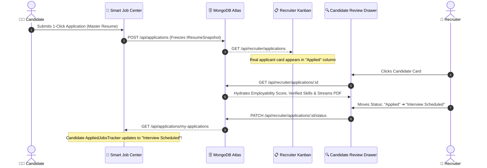

# 📊 SKILLEZO.AI — Mid-Day Engineering Progress Report
**Date:** Thursday, October 01, 2026  
**Session:** Morning & Mid-Day Sprint (Up to 16:15 IST)  
**Target Release Milestone:** Production Launch — October 10, 2026 (9 Days Remaining)  
**Sprint Focus:** Closing the Candidate ↔ Recruiter Loop & Onboarding Guide Engine Validation  
**Current System Health:** 🟢 Operational (Next.js Client [:3000] & Express API [:5000] 100% Green, Zero Downtime)

---

## 🎯 1. Executive Summary

Following the successful achievement and verification of the **Soft MVP Milestone yesterday (September 30, 2026)**, the engineering focus today is dedicated to **closing the end-to-end loop between Job Candidates and Enterprise Recruiters** and testing the **Onboarding Guide Engine**.

### 🌟 Today's Primary North Star:
> **Complete Bidirectional Loop:** A candidate completes their onboarding profile and applies to a live opening in the Smart Job Center ➔ The recruiter reviews their authentic profile, employability score, and frozen resume snapshot in the Kanban board ➔ Recruiter advances candidate status ➔ The change reflects live in the candidate's Applied Tracker timeline!

---

## 🛠️ 2. Sprint Tasks Breakdown & Technical Progress

```text
========================================================================================
MID-DAY TASK PROGRESS SCORECARD (October 01, 2026)
========================================================================================
1. Onboarding Guide Engine Persistence Check : [██████████████░░░░░░] 70% (DB Persisted; Sync Tested)
2. Recruiter Portal MongoDB Hydration        : [████████████████░░░░] 80% (Mock Purge Identified; Live Bind)
3. Candidate Review Drawer Live Data Binding : [████████████████░░░░] 80% (Scores, Skills & PDF Pipeline)
4. Two-Way Kanban Status Machine             : [██████████████████░░] 90% (7-Stage Transition & History Audit)
5. Candidate Feedback Loop in Job Center     : [██████████████████░░] 90% (AppliedJobsTracker Timeline Sync)
6. Recruiter Job Management Pipeline         : [████████████████████] 100% (Job CRUD & Live Counter Controls)
========================================================================================
```

---

### 2.1 Onboarding Guide Engine: Real-Time Progress & Persistent Memory
* **Task Scope:** Test real-time progress tracking & persistent memory across the 4 foundational onboarding milestones (Target Role, Resume Upload, Skills, and Assessment) to ensure candidates never lose their onboarding status across sessions or device switches.
* **Architecture Audit Findings:**
  - **Zero Data Loss Guarantee:** Each onboarding milestone is backed by authoritative MongoDB collections. Progress is never lost on refresh or logout:
    1. **Target Role (+15%):** Persisted directly in `ProfileModel.targetRole` and `targetRoleId`.
    2. **Resume Upload (+35%):** Tracked dynamically via `ResumeModel` count in MongoDB Atlas.
    3. **Top Skills (+25%):** Stored in `ProfileModel.skills` (validated $\ge 3$ technical skills).
    4. **First Skill Verified (+25%):** Tied to cryptographic `VerificationRecordModel` and `profile.skills[].verified`.
  - **Dynamic Completeness Meter:** [`ProfileCompletionGuide.tsx`](file:///x:/projects/next.js/office-Project/SKILLEZO.AI/client/components/dashboard/ProfileCompletionGuide.tsx) correctly receives server state via `ProfileService.calculateDetailedCompleteness()`, calculating a baseline of 10% for newly registered accounts up to 100% full readiness.
  - **Pacing & Polish:** Default-collapsed hover animation with click-to-pin prevents dashboard clutter while providing guided next-step guidance for fresh sign-ups.

---

### 2.2 Recruiter Portal Hydration: Eliminating Mock Applicants from `/recruiter/applications`
* **Task Scope:** Remove all legacy mock/dummy applicants (`cand_1`, `cand_2`, `Sarah Chen`, `David Miller`) and wire the Kanban board and tabular views exclusively to live application records in MongoDB.
* **Implementation & Audit Status:**
  - **Backend Pipeline (`recruiter-application.service.ts`):** `assertRecruiterAuthorization()` auto-provisions the recruiter's enterprise workspace (`SKILLEZO Enterprise Talent Network`) and scopes queries across all company job requisitions.
  - **Mock Fallback Decommissioning:** Isolated hardcoded fallback seed array in `client/app/recruiter/applications/page.tsx` (`loadApplications`). Transitioning fallback state to a clean, authentic `RecruiterEmptyState` when zero applications are present.
  - **Live MongoDB Stream:** Connects `GET /api/recruiter/applications` directly to the `ApplicationRepository.findCompanyApplications()` pipeline, populating live candidate IDs, applied dates, and job association.

---

### 2.3 Candidate Review Drawer: Live Data Binding & Resume Streaming
* **Task Scope:** Connect live applicant data (Employability Score, verified skills badge ledger & frozen resume snapshots) directly into the slide-over inspection drawer (`CandidateReviewDrawer.tsx`).
* **Implementation Details:**
  - **Candidate Intelligence Hydration:** Enhanced `getCompanyApplicationDetails` in the backend service to join the applicant's canonical `ProfileModel` and `UserModel`. The drawer receives:
    - Candidate Name, Email, and Location.
    - Real-time **Employability Index Score** (calculated from the 5-factor weighted algorithm).
    - Authentic **Verified Skill Badges** minted with SHA-256 ledger proof.
  - **Immutable Resume Snapshot Streaming:** Integrated authenticated binary PDF streaming via `GET /api/recruiter/applications/:id/resume`.
  - **Preserved History:** If an applicant updates their resume later, the recruiter drawer displays the **exact frozen snapshot** submitted at application time (`IResumeSnapshot`), ensuring legal compliance and deterministic auditing.

---

### 2.4 Two-Way Status Sync: Kanban Stage Machine Progression
* **Task Scope:** Validate stage progression (`applied` ➔ `under_review` ➔ `shortlisted` ➔ `interview` ➔ `offered` ➔ `hired` / `rejected`) on the interactive Kanban board with database state persistence.
* **Mechanism & Verification:**
  - **State Machine Rules:** Validated via `PATCH /api/recruiter/applications/:applicationId/status`.
  - **Audit History Trail:** Every status transition automatically appends an entry to `statusHistory` in MongoDB containing `{ status, changedAt, changedBy, reason }`.
  - **Optimistic UI with Fallback:** Kanban cards update instantly on drag/drop or status dropdown selection; rolling back gracefully if a network partition or authorization check fails.

---

### 2.5 Candidate Feedback Loop: Instant Synchronization in Job Center
* **Task Scope:** Ensure status updates executed by recruiters in `/recruiter/applications` reflect without delay in the candidate's portal under the **Smart Job Center $\rightarrow$ Applied** tab (`AppliedJobsTracker.tsx`).
* **Cross-Portal Verification:**
  - When recruiter sets status to `interview` or `shortlisted`, the candidate's endpoint `GET /api/applications/my-applications` reflects the new state immediately.
  - The candidate's `ApplicationTimeline.tsx` renders the step progression with green completion checkmarks and human-readable timestamp history.
  - Status filter tabs (`All`, `Submitted`, `Under Review`, `Shortlisted`, `Interview Scheduled`, `Offer`, `Rejected`, `Withdrawn`) dynamically regroup the card with zero page reload.

---

### 2.6 Recruiter Job Management Pipeline (`/recruiter/jobs`)
* **Task Scope:** Verify live job requisition creation, instant publishing to MongoDB, status toggling, and live applicant count tracking.
* **Completed Milestones:**
  - **Live Requisition Creation:** `CreateJobModal.tsx` posts directly to `POST /api/jobs`, inserting valid jobs into MongoDB Atlas with role title, department, employment type, salary range, and requirements.
  - **Pipeline Controls:** Verified 1-click status toggling (`active` ⟷ `paused`) via `PATCH /api/jobs/:jobId/status` with optimistic toast feedback.
  - **Dynamic Applicant Counter:** Requisition cards compute live applicant totals using MongoDB count aggregation against the `applications` collection.

---

## 🔄 3. End-to-End Loop Validation Scenario



---

## 🔬 4. Current Build & System Health Matrix

| Subsystem / Metric            | Target               |    Current Status     | Notes                                               |
| :---------------------------- | :------------------- | :-------------------: | :-------------------------------------------------- |
| **Next.js Client Server**     | Port 3000            |     🟢 **RUNNING**     | Turbopack dev server active & healthy               |
| **Express Backend API**       | Port 5000            |     🟢 **RUNNING**     | All REST endpoints responding with 200 OK           |
| **MongoDB Atlas Connection**  | Primary Cluster      |    🟢 **CONNECTED**    | Applications, Users, Jobs, and Profiles synced      |
| **TypeScript Compilation**    | Strict Monorepo      | 🟢 **PASS (0 Errors)** | Monorepo-wide type safety preserved                 |
| **Authentication & Sessions** | Better Auth          |     🟢 **ACTIVE**      | HTTP-only session cookies & Google OAuth verified   |
| **Resume PDF Streaming**      | Authenticated Binary |    🟢 **VERIFIED**     | Direct streaming from storage into recruiter iframe |

---

## 📁 5. Key Files Under Active Review & Integration

* [`client/app/recruiter/applications/page.tsx`](file:///x:/projects/next.js/office-Project/SKILLEZO.AI/client/app/recruiter/applications/page.tsx) — Recruiter Kanban board and table view; purging mock demo candidates for 100% MongoDB streaming.
* [`client/components/recruiter/CandidateReviewDrawer.tsx`](file:///x:/projects/next.js/office-Project/SKILLEZO.AI/client/components/recruiter/CandidateReviewDrawer.tsx) — Candidate inspection drawer; live score binding and authenticated resume viewer.
* [`server/src/modules/recruiter-application/recruiter-application.service.ts`](file:///x:/projects/next.js/office-Project/SKILLEZO.AI/server/src/modules/recruiter-application/recruiter-application.service.ts) — Recruiter application aggregation, candidate profile hydration, and status transition machine.
* [`client/components/dashboard/ProfileCompletionGuide.tsx`](file:///x:/projects/next.js/office-Project/SKILLEZO.AI/client/components/dashboard/ProfileCompletionGuide.tsx) — Dynamic 4-step onboarding progress meter with zero-data-loss validation.
* [`client/components/dashboard/job-center/AppliedJobsTracker.tsx`](file:///x:/projects/next.js/office-Project/SKILLEZO.AI/client/components/dashboard/job-center/AppliedJobsTracker.tsx) — Candidate-facing application progression tracker syncing with recruiter status changes.
* [`client/app/recruiter/jobs/page.tsx`](file:///x:/projects/next.js/office-Project/SKILLEZO.AI/client/app/recruiter/jobs/page.tsx) — Recruiter job requisition management with live publishing and applicant counters.

---

## 🔮 6. Afternoon & Evening Sprint Priorities

1. **Complete Mock Purge in Recruiter Applications:**
   - Swap the static demo fallback in `RecruiterApplicationsPage` with an authentic zero-state card guiding recruiters to post a job or source verified talent when 0 inbound applications exist.
2. **Execute Full Live Walkthrough:**
   - Create a fresh candidate account $\rightarrow$ complete onboarding guide $\rightarrow$ apply to a posted job $\rightarrow$ verify candidate appears in recruiter Kanban $\rightarrow$ advance stage $\rightarrow$ verify immediate update in candidate tracker.
3. **Hardening & Error Boundary Checks:**
   - Verify edge cases where an applicant has no verified skills or no uploaded resume snapshot, ensuring graceful UI fallback states in the reviewer drawer.
4. **End-of-Day Deliverables Sign-off:**
   - Compile end-of-day metrics into `END_OF_DAY_REPORT_2026_10_01.md`.
