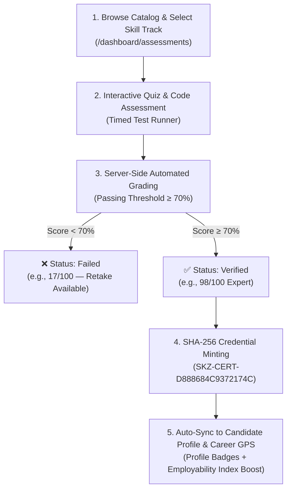

# 🚀 SKILLEZO AI — Sprint 5 Execution Plan
## User Profile & Portfolio, Skill Verification Engine, UI Polish & 7-Stage Career Path Roadmap

> **Sprint Duration:** 5 Working Days  
> **Sprint Goal:** Build the complete **User Profile & Portfolio Suite**, **Interactive Skill Verification Engine**, **7-Stage Career Path Roadmap (Career GPS)**, and elevate all candidate dashboards with high-contrast **Glassmorphic UI Polish** and automated testing.  
> **Sprint Status:** ⚪ **PLANNED & READY FOR SPRINT 5**  

---

## 🏛️ Sprint 5 Core Architecture

```text
┌─────────────────────────────────────────────────────────────────────────────┐
│                       SKILLEZO AI SPRINT 5 ARCHITECTURE                     │
└─────────────────────────────────────────────────────────────────────────────┘
                                      │
         ┌────────────────────────────┼────────────────────────────┐
         ▼                            ▼                            ▼
[USER PROFILE & PORTFOLIO]   [SKILL VERIFICATION ENGINE]   [7-STAGE CAREER GPS]
• Enterprise Verified Banner • Interactive Quiz & Code     • 7-Stage Dynamic Path
• Personal Info & Bio Grid   • Cryptographic Credential    • Automated Milestones
• Profile Completion (92%)   • Proficiency Level (98/100)  • Live Stage Progression
• Skills Grid (+ Add Skill)  • Profile Auto-Badge Sync     • Target Role Benchmarks
```

---

## 📋 Sprint 5 Task Breakdown by Day

### 🗓️ DAY 1 — User Profile & Portfolio Engine (Phase 20.1)

#### 🛠️ Developer 1 (Backend)
- [x] **`BE-501` — Enhanced Profile & Skills REST APIs** (2 hours) — *COMPLETED (05-Sep-2026)*
  - **Action:** Implemented complete profile data layer supporting:
    - User headline, bio, contact details, enterprise verified status, and target role.
    - Skills array with proficiency score (0–100), verification badge, source, and level (`Expert`, `Advanced`, `Intermediate`, `Beginner`).
    - Project repositories (GitHub URLs, live demo links) and certifications.
    - Profile completion calculation engine (`0%` to `100%`).
  - **Target Files:** `server/src/modules/profile/profile.controller.ts`, `server/src/modules/profile/profile.service.ts`, `server/src/modules/profile/profile.routes.ts`, `server/src/database/models/Profile.model.ts`.
  - **Verify:** `GET /api/profile/me`, `PATCH /api/profile/me`, `POST /api/profile/skills`, and `DELETE /api/profile/skills/:skillName` pass unit tests (46/46 green).

#### 🎨 Developer 2 (Frontend)
- [x] **`FE-501` — User Profile & Portfolio UI Layout** (2 hours) — *COMPLETED (05-Sep-2026)*
  - **Action:** Built the pixel-perfect User Profile page matching the design specification:
    - **Header Identity Card:** Avatar with active status, name (`testuser`), `Enterprise Verified` badge, headline, location, email, phone, and `Edit Profile` modal dialog.
    - **Personal Information Card:** Bio narrative + 2x2 grid (Target Role, Location, Email Address, Phone Number).
    - **Profile Completion Widget:** Readiness score circle/bar (`92%`), verification checklist, and action items (+8% GitHub URL booster).
    - **Technical Skills & Competencies Grid:** Categorized skill cards with tags (`Expert 98/100`, `Advanced 94/100`, `Intermediate`), verified checkmarks, and `+ Add Skill` modal.
  - **Target Files:** `client/app/dashboard/profile/page.tsx`, `client/components/dashboard/profile/`, `client/services/profile.service.ts`.
  - **Verify:** Live profile loads, edits save to MongoDB, and skills render with verified indicators (Next.js 28/28 routes green).

---

### 🗓️ DAY 2 — Interactive Skill Verification Engine (Phase 20.2)

#### 🛠️ Developer 1 (Backend)
- [x] **`BE-502` — Skill Verification & Assessment Engine** (2 hours) — *COMPLETED (05-Sep-2026)*
  - **Action:** Implemented verification service with:
    - Skill assessment bank (MCQ & code questions for React, TypeScript, Node.js, Cloud, Python).
    - Score evaluation & badge minting logic (`verified: true`, SHA-256 cryptographic credential hash `SKZ-CERT-...`, issue date).
    - Auto-syncing verified score into `Profile.skills` and updating candidate `EmployabilityIndex`.
  - **Target Files:** `server/src/modules/verification/verification.service.ts`, `server/src/modules/verification/verification.controller.ts`, `server/src/modules/verification/verification.routes.ts`, `server/src/database/models/Verification.model.ts`, `server/src/modules/verification/assessment-bank.data.ts`.
  - **Verify:** Submitting assessment answers validates score and returns cryptographic verification badge (51/51 Vitest unit tests green).

#### 🎨 Developer 2 (Frontend)
- [x] **`FE-502` — Skill Verification & Assessment Dashboard** (2 hours) — *COMPLETED (05-Sep-2026)*
  - **Action:** Built interactive assessment flow on `/dashboard/skill-verification` and `/dashboard/assessments`:
    - Assessment modal with countdown timer, question navigation dots, code syntax highlighting, and instant score evaluation breakdown.
    - Verified badge showcase with high-contrast cryptographic certificate preview modal (`CertificateModal.tsx`).
    - Filterable table/grid of verified credentials connected to live API.
    - Sample assessment banks with rich technical questions for React JS, TypeScript, Node.js, Cloud, Python.
  - **Target Files:** `client/app/dashboard/skill-verification/page.tsx`, `client/app/dashboard/assessments/page.tsx`, `client/components/dashboard/verification/`, `client/services/verification.service.ts`.
  - **Verify:** Live assessment quizzes execute, grade answers, mint cryptographic credentials, and auto-sync profile skills (Next.js 28/28 routes green).

---

### 🔄 Skill Verification Engine Visual Workflow



```text
┌─────────────────────────────────────────────────────────────────────────────┐
│                     SKILL VERIFICATION ENGINE WORKFLOW                      │
└─────────────────────────────────────────────────────────────────────────────┘
                                       │
                                       ▼
             [1. Browse Catalog & Choose Assessment Track]
                 (React, TypeScript, Cloud, Python, DB)
                                       │
                                       ▼
               [2. Timed Assessment Runner (Quiz + Code)]
                 (Anti-tamper timer, Question Navigator)
                                       │
                                       ▼
                 [3. Server-Side Grading & Evaluation]
                         ┌─────────────┴─────────────┐
                         ▼                           ▼
                 [Score < 70%: Failed]      [Score ≥ 70%: Verified]
                 • Retake allowed           • Expert / Advanced / Intermediate
                 • Feedback breakdown       • Earn verified status
                                                     │
                                                     ▼
                                       [4. Mint SHA-256 Credential]
                                         (Format: SKZ-CERT-...)
                                                     │
                                                     ▼
                                       [5. Auto-Sync System Ledger]
                                       • Attach badge to Profile.skills
                                       • Boost Employability Index (40%)
                                       • Advance Career GPS Stage 2
```

---

### 🗓️ DAY 3 — 7-Stage Career Path Roadmap Engine (Phase 20.3)

#### 🛠️ Developer 1 (Backend)

- [ ] **`BE-503` — 7-Stage Career GPS Lifecycle Engine** (2 hours)
  - **Action:** Implement automated 7-stage roadmap computation:
    - **Stage 1:** Foundation & Identity Setup (Profile 100% complete)
    - **Stage 2:** Technical Skill Verification (At least 3 core skills verified)
    - **Stage 3:** Real-world Portfolio & Project Building (GitHub links & demos attached)
    - **Stage 4:** Resume Optimization & ATS Calibration (ATS score $\ge 80$)
    - **Stage 5:** Technical & Behavioral Interview Prep (Assessments complete)
    - **Stage 6:** Recruiter Spotlight & Benchmark (Top 15% Employability Index)
    - **Stage 7:** Job Ready & Auto-Apply Launchpad (Top 5% candidate pool)
  - **Action:** Expose `GET /api/career-plan/gps` and `POST /api/career-plan/gps/milestones/:id/complete`.
  - **Target Files:** `server/src/modules/career-plan/career-gps.engine.ts`, `server/src/modules/career-plan/career-gps.service.ts`, `server/src/modules/career-plan/employability.routes.ts`.
  - **Verify:** Candidate stage advances automatically as profile, ATS, and verification criteria are met.

#### 🎨 Developer 2 (Frontend)
- [ ] **`FE-503` — Live 7-Stage Interactive Roadmap UI** (2 hours)
  - **Action:** Connect [`client/app/dashboard/career-gps/page.tsx`](file:///x:/projects/next.js/office-Project/SKILLEZO.AI/client/app/dashboard/career-gps/page.tsx) to live 7-stage lifecycle API:
    - Dynamic roadmap timeline showing stages (`Completed`, `In Progress`, `Locked`).
    - Milestone detail drawer with task execution buttons and stage unlock animations.
    - Target timeline estimation (e.g. `8 Weeks`) and target role switcher.
  - **Target Files:** `client/app/dashboard/career-gps/page.tsx`, `client/components/dashboard/career-gps/`, `client/services/employability.service.ts`.
  - **Verify:** Stage cards dynamically reflect live database state; completed stages display green verification badges.

---

### 🗓️ DAY 4 — UI Polish, Glassmorphism & High-Contrast Aesthetics

#### 🎨 Developer 1 & 2 (Frontend & Design)
- [ ] **`FE-504` — Glassmorphic Design System Alignment** (3 hours)
  - **Action:** Standardize UI across all candidate pages:
    - Apply refined glassmorphic cards with defined borders (`border-slate-200/90 dark:border-slate-800`), ambient glowing refraction mesh, and crisp light/dark mode contrast.
    - Polish typography, badges, circular radial gauges, and micro-animations.
    - Optimize mobile/tablet responsiveness and skeleton loading states.
  - **Target Files:** `client/components/dashboard/profile/`, `client/components/dashboard/career-gps/`, `client/components/dashboard/employability-index/`, `client/components/dashboard/skill-gap-analysis/`.
  - **Verify:** Zero styling regressions; dark and light themes look ultra-premium.

---

### 🗓️ DAY 5 — Automated Testing, Integration QA & Client Push

#### 🛠️ Developer 1 (Backend QA)
- [ ] **`BE-505` — Automated Vitest Testing Suite for Sprint 5** (1.5 hours)
  - **Action:** Write comprehensive unit tests for Profile Service, Skill Verification Engine, and 7-Stage Career GPS Engine.
  - **Target Files:** `server/tests/unit/modules/profile.service.spec.ts`, `server/tests/unit/modules/verification.service.spec.ts`, `server/tests/unit/modules/career-gps.engine.spec.ts`.
  - **Verify:** `npm test` runs all test suites with 100% green pass rate (> 55+ tests).

#### 🎨 Developer 2 (Frontend QA)
- [ ] **`FE-505` — End-to-End Build & Smoke Test Verification** (1.5 hours)
  - **Action:** Run strict type-checking across `/server` and `/client`.
  - **Action:** Execute `npm run build` in `/client` to verify all Next.js routes prerender cleanly.
  - **Action:** Push verified code to both `origin` and `client` (`skilledhyre22/SKILLEZO`) GitHub repositories.
  - **Verify:** `npx tsc --noEmit` returns 0 errors; production build passes with 0 warnings.

---

## 🏆 Sprint 5 Deliverable Checklist

Before declaring Sprint 5 complete, verify all 5 criteria:
- [ ] User Profile & Portfolio page matches reference design with live MongoDB CRUD and skill cards.
- [ ] Interactive Skill Verification allows candidates to verify skills and generates verifiable credentials.
- [ ] 7-Stage Career Path Roadmap reflects live progression and unlocks milestones dynamically.
- [ ] Glassmorphic aesthetic is unified with crisp borders across all candidate dashboards.
- [ ] 100% Vitest unit tests pass and zero TypeScript errors across server and client.
